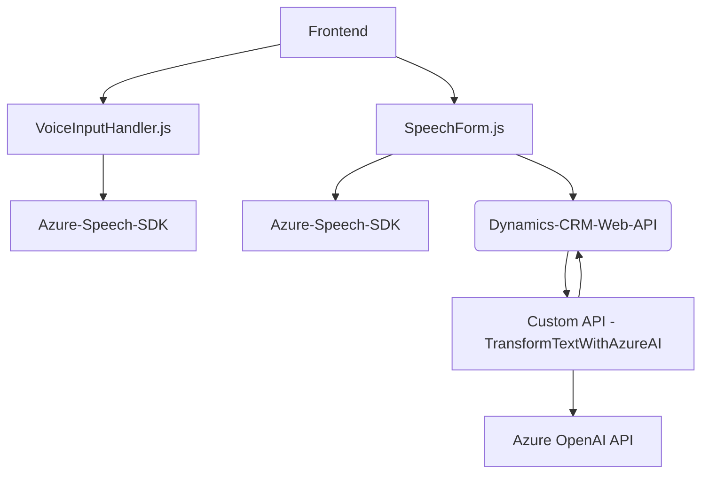

### Breve resumen técnico
El repositorio descrito consiste en un sistema integrado que realiza procesamiento de voz y texto en formularios empresariales conectados a Microsoft Dynamics CRM. Se utilizan funcionalidades como síntesis y reconocimiento de audio, además de transformación avanzada de texto mediante inteligencia artificial proporcionada por Azure OpenAI API. 

### Descripción de arquitectura
La arquitectura general sugiere un modelo híbrido basado en **n capas** con conceptos de microservicios. Esto se debe a que la solución está segmentada en:
1. **Frontend:** Implementado en Javascript y con un enfoque modular. Funciona como la capa de presentación interactuando directamente con el usuario para recoger y mostrar datos.
2. **Plugin en Dynamics CRM:** Representa una capa de negocio, encargada del procesamiento de texto con reglas definidas, que a su vez utiliza un servicio externo (Azure API) para obtener datos transformados y devolverlos en formatos específicos.
3. **Servicios externos:** La herramienta interactúa con APIs como el **Azure Speech SDK** y **Azure OpenAI GPT**, que extienden la funcionalidad proporcionando capacidades avanzadas de síntesis de voz y de inteligencia artificial, respectivamente.

### Tecnologías y frameworks usados
1. **Frontend:**
   - **JavaScript** para la implementación de la lógica cliente.
   - **Azure Speech SDK**: Reconocimiento de voz, síntesis de texto a voz.
   - **Dynamics CRM Context API (`Xrm`)**: Para la manipulación de formularios y datos del sistema CRM.
   
2. **API Plugin:**
   - **Microsoft.Xrm.Sdk:** Necesaria para el desarrollo de plugins en Dynamics CRM.
   - **Azure OpenAI GPT:** Servicios de IA para procesamiento avanzado de texto.
   - **System.Net.Http & Newtonsoft.Json.Linq:** Herramientas de comunicación y manipulación de datos JSON, utilizadas en la integración del plugin con Azure OpenAI API.

3. **Patrones de diseño:**
   - **Inyección de dependencias:** Se utiliza en el manejo del Azure Speech SDK.
   - **Patrón adaptador:** Transforma valores obtenidos de los contextos visibles del formulario para que puedan ser manipulados o utilizados por las APIs integradas.
   - **Patrón de plugin:** Implementación de `IPlugin` para integración con Dynamics CRM.
   - **Facade Pattern:** Para encapsular la lógica de síntesis y reconocimiento de voz en funciones individuales dentro del frontend.
   - **Event-Driven Programming:** Uso de eventos para procesar datos asíncronos (como la transcripción de voz).

### Dependencias o componentes externos presentes
1. **Azure Speech SDK** para el procesamiento y síntesis de audio.
2. **Azure OpenAI GPT API** para generar textos con reglas.
3. **Dynamics CRM Web API** para acceder y manipular datos del CRM empresarial.
4. **Third-party libraries**:
   - `Newtonsoft.Json.Linq` para manipulación avanzada de JSON.
   - `System.Text.RegularExpressions` y `System.Net.Http.Headers` para comunicación HTTP y procesamiento de texto.

### Diagrama Mermaid

### Conclusión final
La solución presentada es un sistema para procesamiento de voz y texto aplicado a formularios en el entorno de Dynamics CRM. La arquitectura utiliza un enfoque **n capas** integrado con servicios de Azure, habilitando funcionalidades avanzadas de reconocimiento de voz y transformación de texto mediante inteligencia artificial. 

El frontend, desarrollado con **JavaScript**, actúa como puente entre los usuarios, el sistema Dynamics CRM y Azure. Por su parte, el plugin sobre Dynamics CRM utiliza el patrón de integración con servicios externos para transformar texto con reglas definidas. Los archivos presentan un diseño modular y coherente, con patrones de arquitectura modernos como inyección de dependencias y programación orientada a eventos, que aseguran una alta escalabilidad y fácil integrabilidad con otros sistemas.