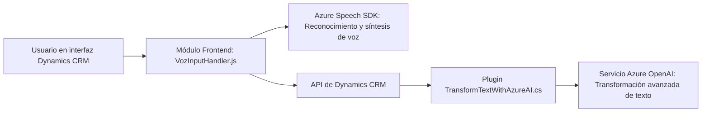

### Resumen técnico
Este repositorio tiene una arquitectura orientada a la integración de servicios externos, específicamente servicios de Azure, para extender la funcionalidad de Dynamics CRM. El objetivo principal es enriquecer la experiencia del usuario mediante capacidades de voz y procesamiento avanzado de texto usando inteligencia artificial.

---

### Descripción de arquitectura
1. **Tipo de solución:**  
   Principalmente es una implementación híbrida que incluye:
   - **Frontend:** Archivos JavaScript que gestionan la interfaz interactiva del formulario.
   - **Backend:** Plugins que actúan como microservicios y extensiones para Dynamics CRM mediante Azure OpenAI y APIs disponibles en CRM.

2. **Tipo de arquitectura:**  
   Este repositorio sigue una **arquitectura en capas**, donde cada componente tiene responsabilidades claras:
   - **Frontend:** Conecta directamente con el usuario mediante manipulación de formularios.
   - **Backend:** Funcionalidad y lógica extendida en Dynamics CRM mediante plugins .NET.

3. **Patrones utilizados:**  
   - **Lazy loading:** Carga dinámica del Azure Speech SDK solo cuando es necesario.
   - **Plugin Pattern:** Uso del contrato `IPlugin` para la ejecución de eventos en Dynamics CRM.
   - **Command Pattern:** Interpretación de comandos textuales mediante IA y actualización de formularios en Dynamics CRM.
   - **Microservicio externo:** Dependencia del servicio Azure OpenAI para transformación de texto.

4. **Interacción y componentes externos:**  
   Los principales componentes externos son:
   - **Azure Speech SDK:** Para síntesis y reconocimiento de voz en el navegador.
   - **Azure OpenAI:** Para procesamiento avanzado de texto y reglas específicas.
   - **Dynamics CRM APIs:** Para el manejo y actualización de datos relacionados con el formulario.

---

### Tecnologías usadas
1. **Frontend:**  
   - **JavaScript:** Manipulación de UI y comunicación con el SDK y API externas.
   - **Azure Speech SDK:** Reconocimiento y síntesis de voz.

2. **Backend:**  
   - **Microsoft Dynamics CRM SDK (Microsoft.Xrm.Sdk):** Integración con servicios de CRM.
   - **Azure OpenAI API:** Procesamiento y transformación de texto estructurado en JSON.
   - **Newtonsoft.Json / System.Text.Json:** Para serialización y manejo de respuesta JSON.

3. **Comunicación:**  
   - **HTTP REST:** Para interacción con servicios externos (Azure OpenAI).

---

### Diagrama Mermaid

---

### Conclusión final
Esta solución híbrida combina elementos de frontend interactivo con extensiones backend en Dynamics CRM, todos potenciados por servicios de Azure. La arquitectura sigue el principio de separación de responsabilidades y se integra eficientemente con las APIs externas. Es ideal para aplicaciones empresariales que busquen enriquecer la experiencia del usuario con herramientas de voz y procesamiento de IA mientras aprovechan tecnologías de nube como Azure. Sin embargo, la dependencia de servicios externos como Azure puede ser limitante si hay cambios en su disponibilidad o estructura de costos.