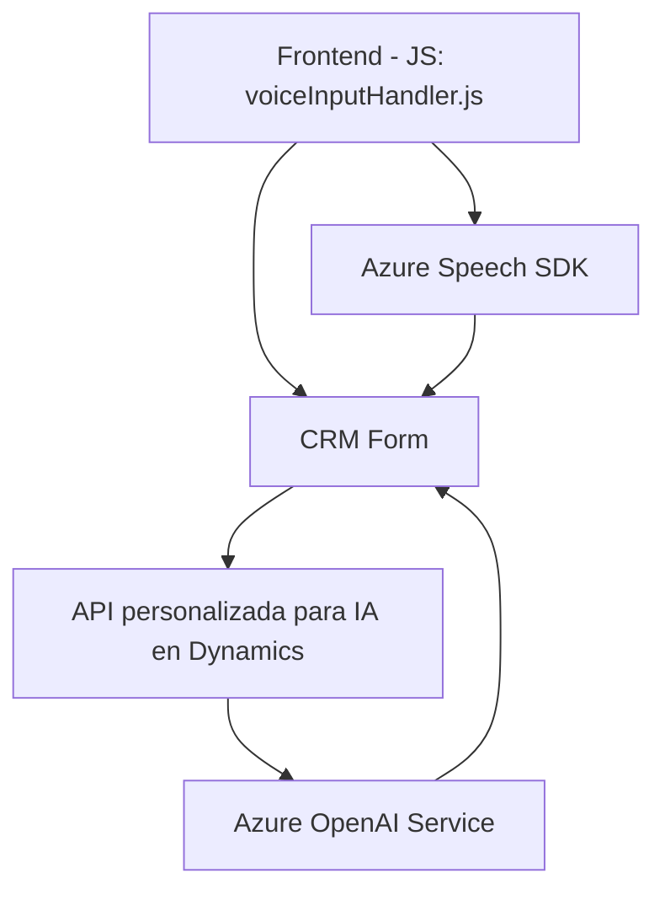

### Breve resumen técnico
El repositorio implementa una solución para integrar capacidades de voz y de inteligencia artificial (IA) en formularios de Dynamics CRM. Utiliza el **Azure Speech SDK** para reconocimiento y síntesis de voz y añade lógica con **Azure OpenAI** para transformar texto estructurado en tiempo real. La solución consiste principalmente en dos segmentos:
1. **Frontend en JavaScript** para manejar formularios y controlar el reconocimiento de voz.
2. Un **Plugin en C#** para integrar la lógica de IA y transformación avanzada en Dynamics CRM.

### Descripción de arquitectura
- **Arquitectura n capas orientada a eventos**: Se divide en capa de frontend (procesamiento de voz), capa de lógica dinámica (JavaScript para la comunicación con APIs y CRM) y capa de integración backend (plugin para interacción directa con el CRM y Azure OpenAI).
- **Patrones utilizados**:
  - **Facade Pattern**: Abstrae la integración con servicios externos (Azure Speech y OpenAI) mediante funciones específicas.
  - **Event-driven Architecture**: El sistema se basa en eventos desencadenados por entrada de usuario.
  - **Dynamic Data Mapping**: Define un sistema flexible para mapear etiquetas visibles de formularios a campos internos del CRM.

### Tecnologías usadas
1. **Frontend**:
   - **Azure Speech SDK**: Para reconocimiento y síntesis de voz.
   - **JavaScript**: Principal lenguaje de implementación.
   - Promesas y métodos asíncronos para flujos de datos.
2. **Backend**:
   - **C#**: Desarrollo del plugin.
   - **Microsoft Dynamics CRM SDK**: Para interacción con los datos del CRM.
   - **Azure OpenAI Service**: Para procesamiento y transformación asistida por inteligencia artificial.
   - **HTTP Client, JSON Processing Tools**: Para consumir servicios externos y procesar respuestas API.

### Dependencias o componentes externos presentes
1. **Microsoft Dynamics CRM**: El corazón del sistema. Proporciona la infraestructura y los datos relevantes del usuario.
2. **Azure Speech SDK**: Integración directa desde un CDN para reconocimiento y síntesis de voz.
3. **Azure OpenAI API**: Servicio de IA para transformar texto según reglas específicas.
4. **JSON Libraries**: Serialización y deserialización de datos JSON.
5. **HTTP Client**: Comunicación entre el plugin y Azure OpenAI.

### Diagrama Mermaid

### Conclusión final
La solución es un híbrido de frontend y backend que integra procesadores de voz y de inteligencia artificial para mejorar la interacción de los usuarios con formularios basados en Dynamics CRM. La elección de tecnologías (Azure Speech SDK, JavaScript, Azure OpenAI y Dynamics Plugin), combinada con patrones arquitectónicos como la modularización y la organización por eventos, ofrece una estructura flexible, escalable y desacoplada. Es evidente el uso de capas para garantizar que cada segmento funcione de forma independiente mientras permite una interacción fluida entre usuario y CRM.