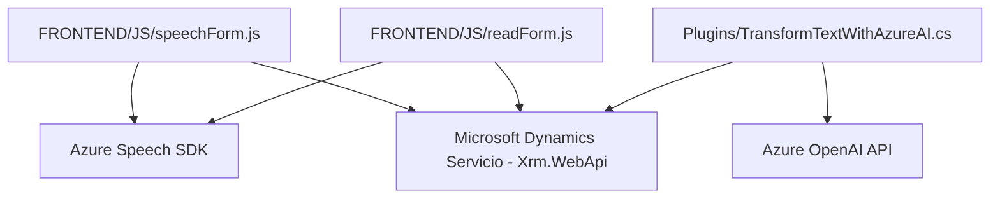

### Resumen Técnico
Este repositorio contiene una solución distribuida con distintos componentes que interactúan entre sí para implementar funcionalidades de síntesis de voz, reconocimiento de voz, y transformación de texto mediante inteligencia artificial. Estas capacidades son integradas con Microsoft Dynamics CRM, un sistema de gestión empresarial.

---

### Descripción de la Arquitectura
La arquitectura del sistema depende de una integración basada en capas y servicios. Podemos clasificarla como una combinación de **Arquitectura en N Capas** con características de **Arquitectura de Microservicios**. Esto se evidencia en la separación funcional de componentes, según las siguientes capas:
1. **Frontend:** Archivos JavaScript encargados de la interacción con Azure Speech SDK y manipulación de datos en el contexto del CRM.
2. **Plugins (Backend):** Implementación de un módulo de lógica del negocio que utiliza el framework de plugins de Microsoft Dynamics CRM integrado con Azure OpenAI vía REST APIs.

---

### Tecnologías y Dependencias Utilizadas
Las tecnologías y dependencias identificadas son:
1. **Frontend:**
   - **Azure Speech SDK:** Para la síntesis y reconocimiento de voz en aplicaciones JavaScript.
   - **JavaScript Vanilla:** Utilizado para la manipulación de datos en formularios, carga dinámica de scripts y configuración de soluciones.
   - **Microsoft Dynamics API:** Con funciones como `Xrm.WebApi.online.execute` para interactuar con el CRM.
   - **CRM Context Management Frameworks:** Usado para acceder a datos, controles visibles, y atributos del formulario.

2. **Backend:**
   - **Microsoft Dynamics SDK (`Microsoft.Xrm.Sdk`)**: Implementación del framework de plugins.
   - **REST Client (`System.Net.Http`)**: Consumo de APIs externas (Azure OpenAI).
   - **Azure OpenAI Service (GPT-4)**: Transformación de texto en JSON siguiendo reglas configurables.

3. **Patrones:**
   - Integración de servicios externos (Speech SDK y OpenAI API).
   - Modularidad para división de responsabilidades.
   - Lazy Loading, comprobando y cargando el SDK cuando es necesario.
   - Uso de SRP (Responsabilidad Única) en funciones específicas.

---

### Diagrama Mermaid válido para GitHub

---

### Conclusión Final
La solución es un **sistema habilitado para la voz e inteligencia artificial**, diseñado para integrarse con Microsoft Dynamics CRM. Utiliza capacidades de síntesis y reconocimiento de voz mediante **Azure Speech SDK** desde su componente frontend y aprovecha **Azure OpenAI** para transformar texto a formatos regulados en el plugin backend. La arquitectura del sistema se puede clasificar como **N-Capas**, con aspectos de microservicios en la interacción entre los diferentes módulos y su dependencia de servicios en la nube. 

Gracias a su modularidad y separación de preocupaciones, la solución es flexible para customizaciones en distintos entornos empresariales. Sin embargo, deberá asegurarse la seguridad en el manejo de claves de Azure y endpoint configuraciones.