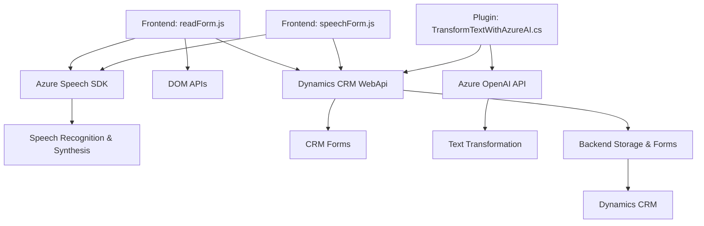

### **Análisis Técnico**

#### **Breve Resumen Técnico**
El repositorio presenta archivos que implementan funcionalidades tanto en el frontend (JavaScript) como en el backend (plugin en C#), lo que sugiere una solución destinada a integrar con formularios en Dynamics CRM. Se utilizan SDKs externos de Azure, tanto Speech como OpenAI, para brindar reconocimiento de voz, síntesis y procesamiento avanzado de lenguaje natural. La arquitectura favorece la accesibilidad, la automatización de tareas y la integración con un sistema CRM empresarial.

---

#### **Descripción de la Arquitectura**
1. **Tipo de Solución**:
   - API, microservicio, frontend asociado a Dynamics CRM, y plugins extendidos para procesamiento de datos en el backend.

2. **Arquitectura Identificada**:
   - Basada en un **modelo de n capas**, donde la capa principal es un CRM, complementado con:
     - **Frontend dinámico**: Scripts que interaccionan con los usuarios y el CRM (form-oriented interaction).
     - **Backend modular**: Plugins diseñados para ejecutar lógica avanzada e interactuar con APIs externas.

     Se favorece una arquitectura orientada a servicios y basada en eventos, con integración directa de SDKs (Azure Speech, OpenAI) y APIs internas/externas.

---

#### **Tecnologías, Frameworks y Patrones Usados**
1. **Frontend**:
   - **Lenguaje**: JavaScript.
   - **Framework Dinámico**: Xrm SDK o APIs web asociadas a Dynamics CRM.
   - **Dependencias Externas**:
     - Azure Speech SDK: Reconocimiento de voz y síntesis.
     - APIs del navegador y manipulación del DOM.

2. **Backend**:
   - **Lenguaje**: C#.
   - **Frameworks**:
     - Microsoft.Xrm.Sdk: Interacción con Dynamics CRM.
     - System.Net.Http y System.Text.Json: Manejo de HTTP y JSON.
   - **Dependencias Externas**:
     - Azure OpenAI API: Transformación de texto mediante procesamiento avanzado.
   - **Patrones Arquitectónicos**:
     - Uso de **Plugins**: Desencadenan eventos contextuales dentro del CRM.
     - **Service Provider Dependency Injection**: Acceso dinámico a los servicios del CRM.

3. **Patrones de Diseño**:
   - Modularidad: Cada archivo contiene funciones enfocadas que integran o extienden funcionalidades específicas.
   - Integración de servicios externos: Eficiente uso de SDKs y APIs (Azure Speech en frontend, OpenAI en backend).
   - Event-driven: Backend y plugins disparan eventos basados en acciones específicas del usuario.

---

#### **Dependencias y Componentes Externos**
- **Azure Speech SDK**: Reconocimiento y síntesis de voz.
- **Azure OpenAI API**: Procesamiento avanzado de texto en backend.
- **Dynamics CRM WebApi**: Operaciones directas sobre datos del CRM.
- **Servicios de Navegador**: Manipulación del DOM y verificación del SDK.
- **Newtonsoft.JSON**: Manejo de JSON en el backend.

---

#### **Diagrama Mermaid**

---

#### **Conclusión Final**
Esta solución implementa una arquitectura de **n capas altamente modular**, orientada al uso de SDKs y APIs externas (Azure) para enriquecer la interacción y accesibilidad de formularios dinámicos en un CRM. La interacción directa con Dynamics CRM sugiere un enfoque corporativo destinado a automatizar procesos y facilitar la experiencia del usuario final, con posibilidades de estandarización y escalabilidad. Además, la integración de servicios como Speech SDK y OpenAI aporta valor al proceso de entrada de datos y su conversión en acciones dentro del sistema.