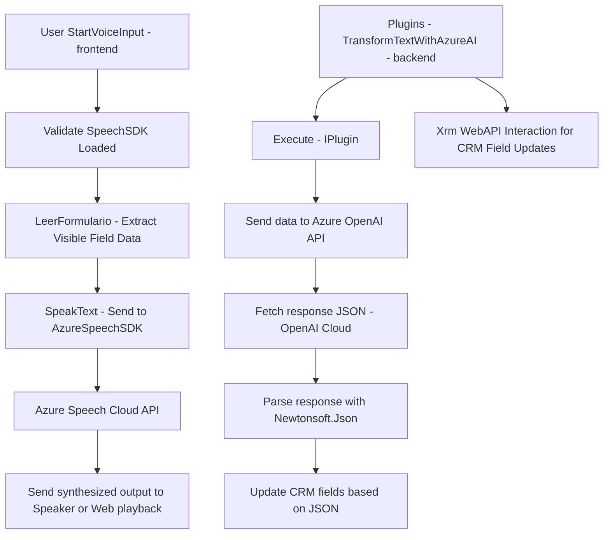

## Breve resumen técnico

El repositorio presentado integra funcionalidades relacionadas con la captura, procesamiento y síntesis de voz en entornos como formularios y CRM, aprovechando tecnologías modernas como Azure Speech SDK y Azure OpenAI API. Se destacan dos principales módulos de frontend en JavaScript para manejo de voz y generación de textos legibles, así como un complemento del lado del backend para aplicar operaciones avanzadas de inteligencia artificial en el contexto de Dynamics CRM.

---

## Descripción de arquitectura

La solución utiliza una arquitectura **mixta** que combina el modelo **n-capas** y **cliente-servidor**. El frontend opera como una capa de interacción en el navegador, cargando y ejecutando scripts de JavaScript en un entorno de cliente. Por otro lado, el **plugin en C#** se integra con Dynamics CRM como una capa de negocio que interactúa con datos y servicios externos.

Además:
- **Modularización:** La lógica está separada en distintas funciones y archivos de código para un enfoque más limpio y mantenible.
- **Patrón event-driven:** El procesamiento se desencadena con llamadas específicas como `startVoiceInput` en el frontend y `Execute` en el backend.
- **Uso de SDKs/API externas:** Utilización de tecnologías de Microsoft como Azure Speech SDK y Azure OpenAI confirma la integración en un modelo cliente-servidor. En el backend, se emplea HTTP para interactuar con servicios de IA generativa cloud.

---

## Tecnologías usadas

1. **Frontend:**
   - **Lenguaje:** JavaScript (ES6).
   - **Frameworks y APIs:** Azure Speech SDK.
   - **HTML/DOM API:** Para manipular formularios y cargar el SDK dinámicamente.
   - **Dynamics CRM JavaScript API:** `formContext`, `executionContext`, etc.

2. **Backend:**
   - **Lenguaje:** C# (.NET Framework presumiblemente).
   - **Microsoft.Xrm.Sdk:** Para manipular el contexto y entidades de Dynamics CRM.
   - **Azure OpenAI API:** Procesamiento de texto con inteligencia artificial.
   - **Newtonsoft.Json:** Manejo de datos en formato JSON.

3. **Patrones:**
   - **Client-Server architecture:** Para comunicar frontend-backend con servicios remotos.
   - **Event-Driven Design:** Activación de funciones disparadas por eventos de usuario o llamadas de CRM.
   - **Modular design principles:** Cada archivo y función tiene un propósito único.

---

## Diagrama Mermaid

---

## Conclusión final

La solución de software presentada tiene como objetivo optimizar la accesibilidad y automatización en aplicaciones centradas en formularios (CRM). El diseño está compuesto por:
1. **Frontend con JavaScript/HTML**: Para interactuar directamente con usuarios a través de formularios, procesar datos visibles, y sintetizarlos en voz usando Azure Speech SDK.
2. **Backend con C# Dynamics Plugin**: Brinda una capa sólida para el procesamiento avanzado de texto a través de la integración con Azure OpenAI API.
3. **Azure Services como núcleo externo**: La conexión a servicios de Microsoft en la nube para gran parte de la lógica avanzada como la generación de voz e IA.

La arquitectura es modular y aprovecha patrones como cliente-servidor y orientado a eventos para asegurar que los procesos sean escalables y fáciles de integrar en sistemas existentes como Dynamics CRM.