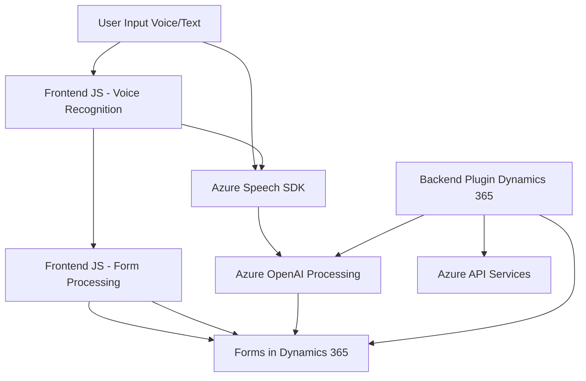

### Análisis técnico del repositorio:

#### **Breve resumen técnico:**
El repositorio maneja la integración de tres componentes principales:
1. **Frontend**: Orientado a la interacción de usuario mediante reconocimiento y síntesis de voz.
2. **Backend Plugin**: Implementado en C#, para integrarse con Dynamics CRM y consumir servicios externos de Azure OpenAI.
3. **Servicios externos**: Uso de Azure Speech SDK (síntesis y reconocimiento de voz) y Azure OpenAI API (transformación de textos).

#### **Descripción de arquitectura:**
La solución utiliza una arquitectura de **n capas** con una clara separación entre:
- **Presentación (Frontend)**: Implementada en JavaScript, interactuando con Dynamics 365 y servicios externos para la funcionalidad de voz.
- **Lógica de negocio (Plugin)**: Desarrollada en C#, alojada como plugin de Dynamics CRM para transformación de texto mediante Azure OpenAI.
- **Servicios externos**: Los servicios de Azure se emplean para la generación y procesamiento de textos hablados, además de datos adicionales a través de llamadas a una API personalizada (probablemente otra capa de servicios).

La integración con los servicios de Azure y Dynamics CRM permite habilitar características basadas en inteligencia artificial que mejoran la experiencia del usuario y el procesamiento de datos.

---

#### **Tecnologías usadas:**
1. **Frontend:**
   - **Lenguaje**: JavaScript.
   - **Framework**: SDK de Dynamics 365/CRM.
   - **Dependencias**: Azure Speech SDK.
   - **Patrones**:
     - Modularidad: División en funciones con roles específicos.
     - Gestión de dependencias dinámicas: Carga condicional de SDK.
     - Procedural: Predominancia de grupos de funciones organizadas por etapas.

2. **Backend Plugin:**
   - **Lenguaje**: C#.
   - **Framework**: Dynamics CRM SDK (Microsoft).
   - **Dependencias**:
     - Azure OpenAI API: Procesamiento de texto.
     - Newtonsoft.Json: Manejo de JSON.
     - HttpClient para comunicación API.
   - **Patrones**:
     - Plugin-Based Architecture: Amplía la funcionalidad del CRM mediante IPlugin.
     - Factory: Creación de servicios del CRM (IOrganizationServiceFactory).

---

#### **Dependencias o componentes externos podrían estar presentes:**
- **Azure Speech SDK**: Para síntesis y reconocimiento de voz.
- **Azure OpenAI API**: Proceso de transformación textual o generación mediante IA.
- **API personalizada**: Para transformaciones o búsquedas adicionales.
- **Dynamics 365 SDK**: Como base de interacción con formularios y entidades.
- **Herramientas de manejo JSON en .NET**: Newtonsoft.Json o System.Text.Json.
- **Servicios de búsqueda interna**: Dynamics CRM podría usarse para búsqueda de registros mediante `searchLookup`.

---

#### **Diagrama Mermaid (compatible con GitHub Markdown):**

---

#### **Conclusión final:**
La solución integra múltiples tecnologías, frameworks y servicios en una arquitectura de **n capas** que conecta el frontend (Javascript) con un backend orientado a Dynamics CRM (en C#). Además, utiliza extensivamente servicios externos (Azure Speech SDK y Azure OpenAI) para habilitar inteligencia artificial en el reconocimiento y transformación de voz y texto. Esta arquitectura resulta flexible y escalable, capaz de abordar necesidades complejas de interacción humano-máquina y de procesamiento de datos estructurados.