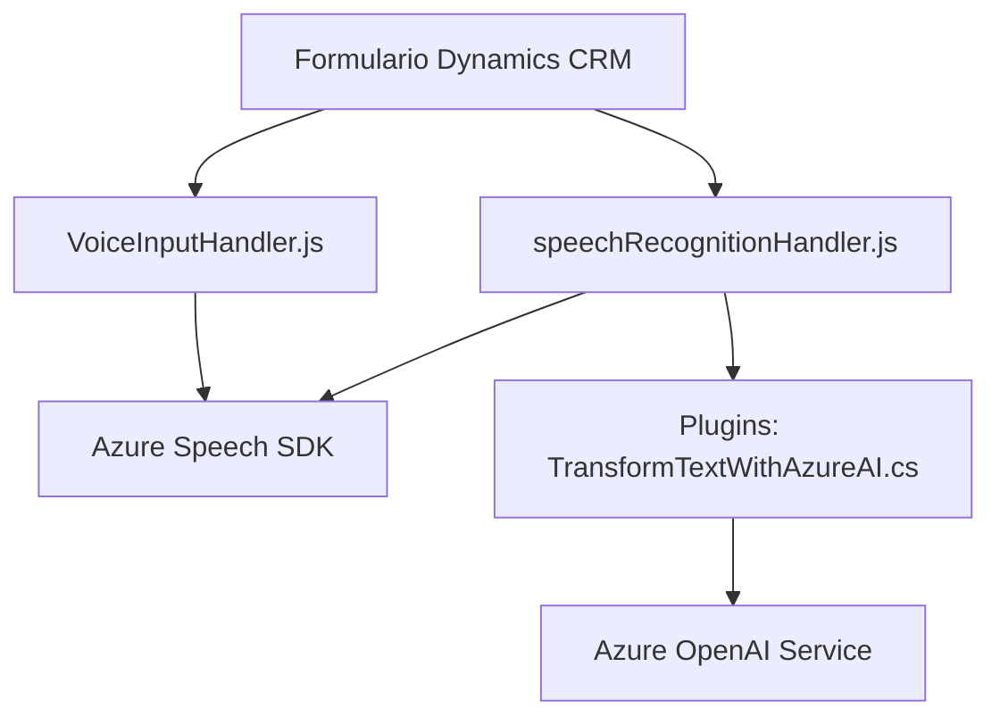

### Breve resumen técnico

La solución consiste en integrar capacidades avanzadas de reconocimiento, síntesis de voz y procesamiento de texto mediante Azure Speech SDK y Azure OpenAI Service dentro de formularios de Dynamics CRM. Se presenta una arquitectura modular que encapsula funciones en scripts frontend y un plugin backend que interactúa con servicios de Microsoft Dynamics y Azure.

---

### Descripción de arquitectura

1. **Tipo de solución**: La estructura indica una solución integrada que combina frontend con funcionalidades de reconocimiento y síntesis de voz (mediante scripts JavaScript) y backend (mediante un plugin .NET). Está orientada a extender formularios de Dynamics CRM con capacidades de interacción por voz y procesamiento avanzado de texto.

2. **Tipo de arquitectura**:
   - **Frontend**: Modular, basado en componentes integrados con dependencias externas como Azure Speech SDK.
   - **Backend**: Plugin-oriented architecture que interactúa con Dynamics CRM e integra servicios externos como Azure OpenAI Service.
   - En conjunto, el sistema sigue una arquitectura **desacoplada n-capas**, donde la capa de presentación (frontend) interactúa con una capa lógica intermedia y un backend (en el plugin) manejando reglas empresariales.

---

### Tecnologías, frameworks y patrones

1. **Tecnologías usadas**:
   - **Frontend**:
     - JavaScript (para lógica de voz y reconocimiento).
     - Azure Speech SDK en el navegador (carga dinámica del SDK).
   - **Backend**:
     - Microsoft Dynamics SDK (`Xrm` para programación CRM).
     - .NET Framework (para plugins).
     - Azure OpenAI Service.

2. **Frameworks usados**:
   - Dynamics CRM SDK.
   - HTTP Client (.NET Framework) para consumir APIs externas.

3. **Patrones de diseño**:
   - **Encapsulación Modular**: Cada funcionalidad se encapsula como métodos o clases independientes, facilitando mantenimiento y expansión.
   - **Delegación de responsabilidad**: Uso de métodos dedicados como `GetOpenAIResponse` en el plugin para consumir APIs externas.
   - **External SDK Integration**: Integración con servicios como Azure Speech SDK y OpenAI en una arquitectura desacoplada.

---

### Dependencias y componentes externos

1. **Frontend**:
   - Azure Speech SDK.
   - Dynamics CRM frontend API (formContext para acceder/modificar datos de formularios).
   - Custom APIs opcionales para procesamiento adicional de texto transcrito mediante IA.

2. **Backend**:
   - Dynamics CRM SDK for Plugins.
   - Azure OpenAI Service (requiere acceso al endpoint, configuración de API key, y modelo como GPT-4o).
   - Librerías estándar para manipulación de texto, HTTP requests, y serialización/deserialización (e.g., `Json.Text`, `System.Net.Http`).

---

### Diagrama Mermaid

---

### Conclusión Final

La solución representa un ejemplo de una arquitectura híbrida que combina una aplicación frontend (JavaScript) con un backend basado en plugins de Dynamics CRM. Aprovecha servicios externos, como Azure Speech SDK para síntesis y reconocimiento de voz y Azure OpenAI para procesamiento semántico de texto. Este diseño es ideal para implementar capacidades avanzadas en aplicaciones empresariales existentes, logrando integración eficaz mediante un diseño modular y orientado a servicios externos.