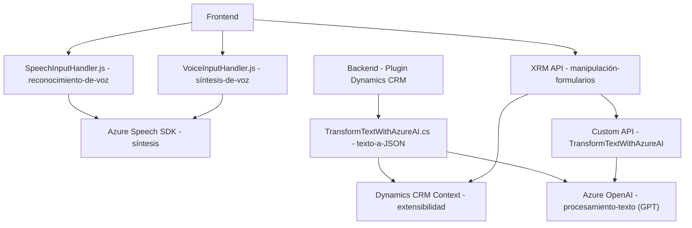

### Breve resumen técnico:
El repositorio contiene componentes que implementan funcionalidades de entrada y salida de voz basadas en formularios, utilizando el **Azure Speech SDK** y **Dynamics CRM**. También incluye un plugin para integrar el procesamiento de texto con **Azure OpenAI**, garantizando una experiencia de usuario mejorada al interactuar con formularios de datos. Las funcionalidades están diseñadas con una arquitectura modular e integran servicios externos.

---

### Descripción de arquitectura:
La solución tiene una arquitectura predominantemente de **n capas** con diseños para integrar funcionalidades específicas, como manejo de formularios en Dynamics CRM y síntesis/reconocimiento de voz. Algunas características del enfoque también se asemejan a **Microfrontends** debido a la división clara entre los diferentes archivos (como `voiceInputHandler.js` para salida de voz y `SpeechInputHandler.js` para entrada de voz). El plugin (.NET) sigue el patrón de extensibilidad de Dynamics CRM basado en **Plugins**, mientras que la integración con servicios externos como Azure OpenAI y Speech SDK actúa bajo un patrón de arquitectura tipo **API Gateway**.

---

### Tecnologías usadas:
1. **Frontend**:
   - **Azure Speech SDK**: Para síntesis y reconocimiento de voz.
   - **JavaScript**: Para manipulación dinámica de formularios y datos.
   - **XRM API (Dynamics 365)**: Interfaz para formularios y datos en CRM.

2. **Backend/Plugins**:
   - **C#**: Utiliza la interfaz `IPlugin` de Microsoft Dynamics SDK para extender funcionalidad.
   - **Azure OpenAI API**: Aplicación de procesamiento de lenguaje natural (GPT Model).
   - **Newtonsoft.Json y System.Text.Json**: Manejo y estructuración de datos JSON en el plugin.
   - **System.Net.Http**: Para solicitudes HTTP con la API externa.

---

### Dependencias o componentes externos:
1. **Azure Speech SDK**:
   - Reconocimiento y síntesis de voz.
   - Clases principales como `SpeechConfig`, `AudioConfig`, y `SpeechSynthesizer`.

2. **Azure OpenAI**:
   - Procesamiento de lenguaje natural (GPT) para la transformación de texto basada en reglas.

3. **XRM Framework**:
   - Funciones relacionadas con la interacción en formularios de Dynamics CRM.

4. **Custom API**:
   - Implementada en el código de frontend para enviar texto a Azure AI y obtener datos procesados.

---

### Diagrama Mermaid válido para GitHub:

---

### Conclusión:
Este repositorio implementa un diseño modular con componentes frontend y backend orientados a la interacción avanzada con formularios. La solución está diseñada alrededor del **Speech SDK de Azure**, el **Dynamics CRM** y un plugin extensible para conectividad con **Azure OpenAI**, utilizando patrones como **N CAPAS**, **API Gateway** y **Integración de SDK externo**. La arquitectura puede escalar fácilmente al incorporar nuevas funcionalidades basadas en inteligencia artificial o capacidades adicionales para formularios dinámicos.