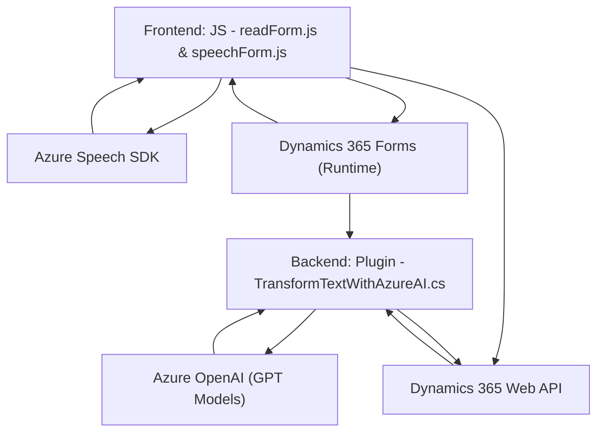

# Análisis técnico del repositorio y descripción arquitectónica

## Breve resumen técnico

El repositorio parece estar centrado en proveer una solución completa integrada con Dynamics 365 CRM para interactuar con formularios utilizando entrada de voz y servicios de inteligencia artificial. Incluye una funcionalidad de síntesis y reconocimiento de voz basada en Azure Speech SDK, además de un plugin desarrollado en C# para transformación de texto mediante Azure OpenAI, lo que lo convierte en una solución híbrida con componentes frontend y backend.

---

## Descripción de arquitectura

Este proyecto sigue una arquitectura de **aplicación en capas** con **patrones de integración con servicios externos**:
1. **Frontend**:
   - Contiene funcionalidades para interactuar con el usuario en tiempo real mediante voz, aprovechando tecnologías web (JavaScript) para extraer y procesar datos de formularios en Dynamics CRM.
   - Uso de SDK de Azure Speech para sintetizar y reconocer voz.
2. **Backend**:
   - Desarrollado en C# como un plugin para Dynamics CRM que interactúa directamente con registros en la base de datos CRM y servicios externos de procesamiento de texto (Azure OpenAI).
3. **Integración**:
   - Utiliza servicios externos como Microsoft Azure Speech y OpenAI para habilitar funcionalidades avanzadas como la generación de voz e inteligencia artificial aplicada a la entrada de texto.

---

## Tecnologías usadas

### Frontend (JavaScript):
- **Azure Speech SDK**: Librería de servicios web para reconocimiento y síntesis de voz.
- **JavaScript ECMAScript**: Implementación estándar en funciones de interacción con los formularios en Dynamics CRM.
- **Promesas y Callback Handling**: Manejo asincrónico de flujos como carga de SDK o consultas API.

### Backend (C#):
- **ASP.NET/C# Plugin Pattern**: Plugin para Dynamics CRM usando interfaces como `IPlugin` y servicios como `IOrganizationService`.
- **Azure OpenAI API**: Integración de servicios GPT para la transformación de texto.
- **Newtonsoft.Json y System.Text.Json**: Manejo de JSON para solicitudes HTTP y respuesta API.
- **Regex (System.Text.RegularExpressions)**: Manipulación textual adicional.

### Patrones usados:
- **Capas**: Cada componente tiene una responsabilidad bien definida: frontend interactúa con el usuario, backend maneja reglas de negocio y procesamiento avanzado.
- **Delegación**: SDK y servicios externos manejan tareas específicas como IA (Azure OpenAI) o voz (Azure Speech).
- **API-Driven**: Integración directa con SDK y APIs externas usando estructuras estándar REST y JSON.

---

## Dependencias o componentes externos

1. **Azure Speech SDK**:
   - URL: `https://aka.ms/csspeech/jsbrowserpackageraw`.
   - Funcionalidad: Reconocimiento y síntesis de voz desde texto.
2. **Azure OpenAI Service**:
   - Procesamiento avanzado de lenguaje natural mediante modelos GPT.
3. **Dynamics 365 Web API**:
   - Manipulación de datos en tiempo real en formularios CRM y consultas.
4. **HTTP & JSON Frameworks**:
   - `System.Net.Http`: Realización de operaciones HTTP desde el backend.
   - `Newtonsoft.Json` y similares: Procesamiento estructurado de datos.
5. **Regex**: Usado para formateo textual avanzado.

---

## Diagrama Mermaid

---

## Conclusión final

Este repositorio implementa una solución técnicamente robusta que permite interactuar con formularios de Dynamics CRM mediante entrada de voz y procesamiento de texto enriquecido con inteligencia artificial (Azure OpenAI). Su arquitectura en capas está diseñada para separar responsabilidades: el frontend se encarga de la interacción del usuario, mientras que el backend maneja las reglas de negocio y el procesamiento avanzado. Las integraciones con servicios externos como Azure Speech y OpenAI aumentan significativamente las funcionalidades del sistema, aunque incrementan la dependencia de servicios externos.