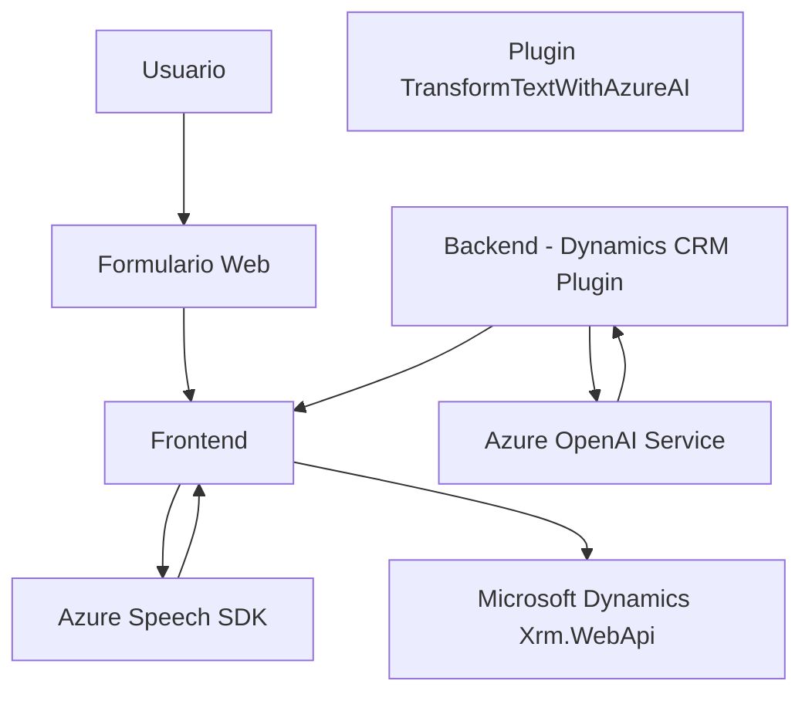

# Breve resumen técnico
El repositorio contiene un sistema que facilita la entrada y salida de voz integrado con formularios en Dynamics CRM, utilizando los servicios **Azure Speech SDK** y **Azure OpenAI Service**. Está compuesto por múltiples componentes, incluidas funciones JavaScript para el frontend y un plugin C# para el procesamiento de datos según normas específicas.

# Descripción de arquitectura
1. **Tipo de solución**: La solución implementa una **API ampliada** en formato plug-in para Dynamics CRM en el backend (`TransformTextWithAzureAI.cs`) y un **frontend modularizado** en JavaScript (`readForm.js` y `speechInputHandler.js`).
2. **Arquitectura empleada**: 
   - El sistema está basado en una **arquitectura N capas**:
     - **Capa de presentación (Frontend)**: Archivos `readForm.js` y `speechInputHandler.js`, que interactúan directamente con los usuarios y con los servicios externos.
     - **Capa de negocio (Dynamics CRM y plugin)**: Lógica personalizada implementada en `TransformTextWithAzureAI.cs`, que maneja las transformaciones de texto.
     - **Capa de integración con servicios externos**: Interacción directa con Azure Speech SDK y Azure OpenAI.
   - El plugin utiliza aspectos del **patrón plugin** para integrarse con Dynamics CRM.

# Tecnologías usadas
1. **Frontend**:
   - **Azure Speech SDK**: Para síntesis de voz y reconocimiento de voz.
   - **JavaScript**: Lógica de interacción con formularios y SDK externo.
2. **Backend/Integración**:
   - **Microsoft Dynamics CRM Plugin Framework**: Manejo de lógica empresarial.
   - **Azure OpenAI Service**: Para procesamiento avanzado de texto mediante modelos GPT.
   - **Newtonsoft.Json**: Procesamiento de JSON en .NET.
   - **HTTPClient**: Integración con servicios REST de Azure.

# Dependencias externas y componentes presentes
1. **Azure Speech SDK**: Biblioteca para síntesis y reconocimiento de voz.
2. **Azure OpenAI**: Servicio de IA para transformación avanzada de texto.
3. **Dynamics CRM (Xrm.WebApi)**: Interacción con datos y formularios del sistema.
4. **Newtonsoft.Json**: Librería para manejar estructuras JSON en .NET backend.
5. **Servicios de red**: Integración con APIs REST (servicios externos de Azure).

---

# Diagrama Mermaid válido para GitHub

---

# Conclusión final
La solución presentada es una integración avanzada de **Azure Speech SDK** y **Azure OpenAI Service** en un contexto Dynamics CRM, diseñada para facilitar la entrada de voz procesada, síntesis de voz, y mapeo dinámico en formularios. Su arquitectura modular, combinada con patrones de diseño como plugins y separaciones en capas, muestra una implementación robusta y flexible. Sin embargo, se podría mejorar la gestión de errores en los servicios externos y optimizar la compatibilidad futura con nuevas versiones de los SDK utilizados.