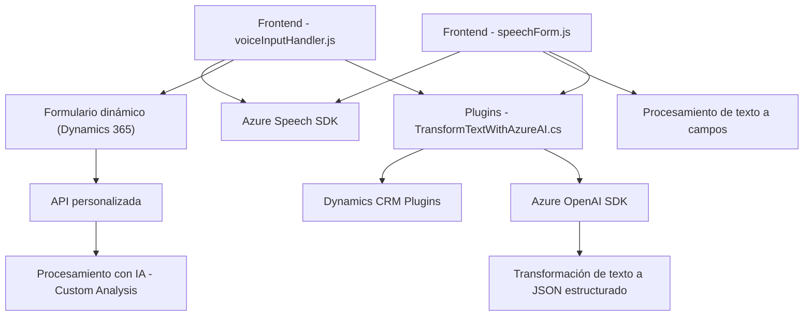

### Breve resumen técnico:
El repositorio parece estar diseñado para emitir funciones conectadas a formularios web/dinámicos dentro de un entorno de Dynamics 365. Combina reconocimiento de voz, síntesis de voz y transformación de datos en JSON estructurado, integrando tecnologías externas como Azure Speech SDK y Azure OpenAI.

#### Descripción de arquitectura:
El sistema implementa una arquitectura modular y en capas. Por un lado, se observa una integración con APIs externas (Azure Speech SDK y OpenAI) para habilitar funcionalidad de texto a voz, reconocimiento de voz y transformación avanzada de datos. Por otro lado, utiliza la arquitectura de **plugins** de Dynamics CRM para extender su funcionalidad en casos específicos de interacción de usuario.

La arquitectura sigue principios de separación de responsabilidades:
1. **Capas de negocio y servicios** (en plugins de C#).
2. **Frontend dinámico interactivo** con SDK y eventos acoplados.
3. Procesamiento asincrónico de datos mediante APIs (modo IA o manual).
4. Uso de patrones como **adapter**/proxy para integrar servicios remotos.

#### Tecnologías usadas:
- **Frontend**:
  - Lenguaje: JavaScript (modular).
  - Framework: Dynamics 365 Xrm API.
  - Modelo SDK: Azure Speech SDK (para reconocimiento y síntesis de voz).
  - Servicios de IA: Custom API para análisis semántico de texto.
  
- **Backend**:
  - Lenguaje: C# (.NET).
  - Arquitectura: Plugin basado en Dynamics CRM.
  - APIs externas: Azure OpenAI para procesamiento de texto.
  
- **Dependencias externas**:
  - **Azure Speech SDK**
  - **Azure OpenAI** (endpoint `gpt-4.0` utilizado por TransformTextWithAzureAI).
  - Servicios de Dynamics CRM: WebApi y lookup modules.

#### Diagrama Mermaid válido para GitHub Markdown:

#### Conclusión final:
La solución muestra un enfoque maduro organizando las responsabilidades en diferentes capas. Su arquitectura puede clasificarse como **modular con integración a APIs externas** y potencia funcionalidades avanzadas (como accesibilidad, síntesis y análisis de texto). Sin embargo, un desafío evidente es la dependencia fuerte de servicios externos como Azure SDK y OpenAI, lo cual hace que la solución sea inmensamente dependiente de una conexión a la red y controles apropiados en API keys.