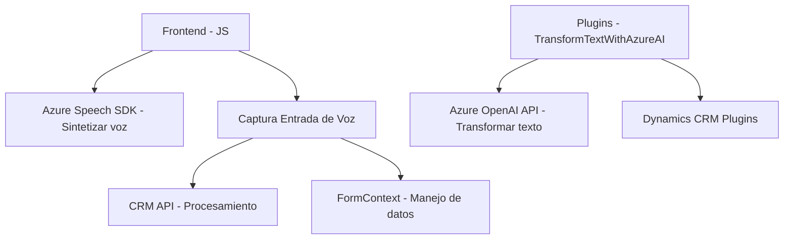

### Breve Resumen Técnico
El proyecto consiste en una solución que integra funcionalidades de procesamiento de formularios y gestión de voz, creación de transcripciones de entrada, y transformación de texto mediante inteligencia artificial. Está diseñado para integrarse principalmente en sistemas CRM (Dynamics 365) y utiliza tecnologías como **Azure Speech SDK** y **Azure OpenAI**.

### Descripción de Arquitectura
La solución está construida como una plataforma híbrida que usa una arquitectura de **n capas**.  
1. **Frontend/Javascript**: Manejo de DOM, entrada/salida de voz a partir de formularios, y comunicación con servicios CRM.
2. **Backend/Plugin**: Provee lógica para la transformación avanzada de texto usando Azure OpenAI.
3. **Integración con servicios externos**: Utiliza Azure Speech SDK y Azure OpenAI para procesar texto y voz, además de APIs personalizadas dentro de Dynamics CRM.

### Tecnologías Usadas
1. **Frontend:**
   - **Javascript** con enfoque modular para el manejo de lógica.
   - **Azure Speech SDK**: Para entrada y salida de voz.
   - **Xrm.WebApi**: Para interactuar con el API de Dynamics CRM.
2. **Backend (Plugin de Dynamics CRM):**
   - **Azure OpenAI**: Transformación de texto mediante GPT.
   - Framework: **Microsoft Dynamics SDK**.
   - Manejo avanzado de JSON (Newtonsoft Json).
   - **ASP.NET (modelo basado en clases)** para implementar la lógica de plugins.
3. **Dependencias externas:**
   - Conexión a servicios de Azure mediante HTTP.

### Diagrama Mermaid (Válido para GitHub Markdown)

### Conclusión Final
La solución combina diversas tecnologías y servicios de Microsoft Azure junto con un enfoque modular en frontend y extensiones backend para Dynamics CRM. Su estructura apunta hacia una integración orientada a servicios con conexión directa a SDKs/Azure APIs, permitiendo el manejo de voz, transcripciones y transformación avanzada de datos mediante inteligencia artificial. Se puede considerar una arquitectura **mixta** basada en componentes n-capas con integración de *aplicaciones SaaS* como Azure. Ideal para entornos altamente dinámicos como sistemas CRM corporativos.