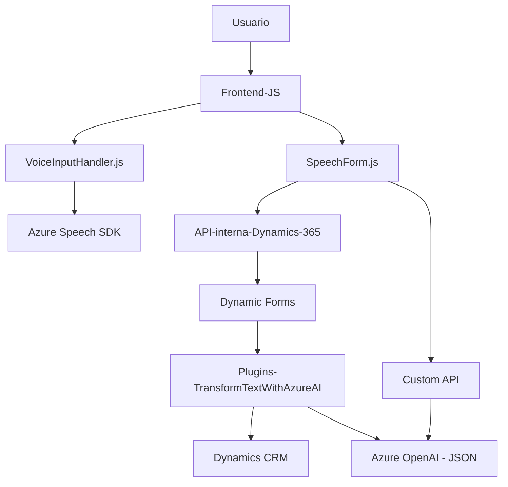

### Breve resumen técnico
Con base en el contenido proporcionado, el repositorio implementa una solución híbrida que integra **frontend** y **backend** para facilitar interacciones entre usuario y APIs externas en un entorno empresarial. Las funcionalidades principales giran en torno a capturar y sintetizar voz (Azure Speech SDK en el frontend) y procesar texto mediante inteligencia artificial (Azure OpenAI en el backend). El sistema está diseñado para trabajar en conjunto con formularios dinámicos dentro de **Dynamics 365**.

### Descripción de arquitectura
La solución presenta una arquitectura modular con división clara entre:
1. **Frontend** (JS/Plugins): Procesamiento local como síntesis de voz, interacción dinámica y integración con APIs.
2. **Backend** (con `TransformTextWithAzureAI.cs`): Implementación de un plugin destinado a Dynamics CRM que conecta datos recopilados hacia y desde Azure OpenAI mediante REST APIs.

Aunque no se expone una arquitectura distribuida como **microservicios**, el diseño sigue principios como **modularidad** y **orientación a servicios (SOA)**, facilitando mantenimiento y escalabilidad. En términos prácticos, podría clasificarse como una arquitectura **n-capas (3 capas)** con:
- **Capa de Presentación**: Código JS manipula la interacción visual/voz y los datos.
- **Capa de Integración**: Comunicación con APIs externas y Dynamics 365.
- **Capa de Lógica y Datos**: Plugin (backend) para enriquecer datos con intervenciones relacionadas con IA (Azure OpenAI).

### Tecnologías utilizadas
1. **Frontend**:
   - **Azure Speech SDK**: Sintetización de voz y reconocimiento.
   - **JavaScript**: Funciones específicas para manejar formularios y asignar datos dinámicamente.
   - **Dynamics 365 Web API**: Integración de datos en el contexto de formularios.

2. **Backend**:
   - **C# (.NET Framework)**: Implementación del plugin para Dynamics CRM.
   - **Azure OpenAI**: Procesa texto y lo convierte a datos estructurados.
   - **Newtonsoft.Json**: Manejo de estructura JSON.
   - **Dynamics CRM SDK**: Extensión del comportamiento nativo mediante la interfaz `IPlugin`.

### Dependencias o componentes externos
1. **Servicios de Azure**:
   - Azure Speech SDK (para síntesis y reconocimiento de voz).
   - Azure OpenAI (para procesamiento de datos con IA).
2. **Custom API**:
   - API personalizada adaptada para Dynamics 365 (`callCustomApi()`).
3. **Dynamics 365 Web API**:
   - Comunicación directa con formularios y entidades del sistema.
4. **Externas**:
   - `Newtonsoft.Json` para serialización/deserialización de datos JSON.

---

### Diagrama Mermaid válido para GitHub

### Conclusión final
La solución es un sistema *habilitado para voz e inteligencia artificial*, diseñado para integrarse profundamente en una plataforma empresarial como Dynamics CRM. Utiliza herramientas modernas: Azure services, APIs internas y externas, y extensiones backend con plugins, lo que le confiere un estilo modular y adaptable.

Si bien está orientada a Dynamics 365, podría exportarse o adaptarse a otras plataformas de formularios o entornos empresariales similares gracias a su orientación hacia **modularidad y diseño orientado a servicios**. Sin embargo, sería recomendable externalizar la configuración de claves y endpoints para cumplir con buenas prácticas de seguridad.