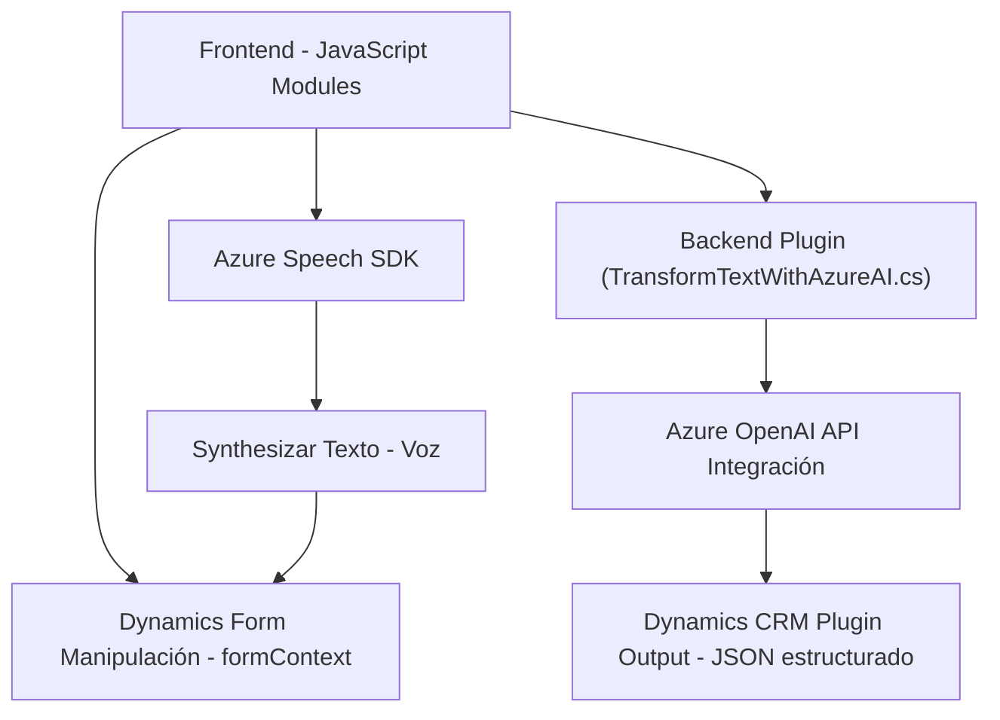

### Breve resumen técnico
El repositorio contiene múltiples archivos orientados a la interacción entre formularios en Dynamics 365, la síntesis de voz mediante Azure Speech SDK y el procesamiento de texto con Azure OpenAI. Las soluciones son módulos y plugins que trabajan en conjunto para ofrecer funcionalidad adicional a los usuarios del CRM, como reconocimiento y síntesis de voz, y transformación de texto mediante IA.

---

### Descripción de arquitectura
La arquitectura es **modular y basada en integración**, utilizando un enfoque de *plugin-layered architecture* para comunicar los elementos del frontend y backend. Los archivos afrontan necesidades específicas:

1. **Frontend:** 
   - Funciones que interactúan con formularios en Dynamics 365.
   - Integración directa con Azure Speech SDK mediante programación asíncrona usando funciones JavaScript.
   - Backend-for-Frontend: El frontend actúa como mediador y presenta funcionalidades al usuario.

2. **Plugin:**  
   - Código backend que extiende las funcionalidades de Dynamics 365.
   - Utiliza Azure OpenAI para procesar texto retornando una respuesta en formato JSON.
   - Integración con servicios externos (Azure OpenAI y Open AI GPT-4).

---

### Tecnologías usadas
1. **Lenguajes:**
   - **JavaScript (Frontend)**: Para interactuar con Dynamics CRM.
   - **C# (Backend)**: Plugin que extiende Dynamics CRM.

2. **Frameworks y servicios de terceros**:
   - **Azure Speech SDK**: Para reconocimiento de voz y síntesis.
   - **Azure OpenAI API**: Para transformar texto con GPT-4.

3. **Patrones de diseño**:
   - **Cargador dinámico de recursos**: En el frontend (`ensureSpeechSDKLoaded`).
   - **Plugin Pattern**: En el archivo `TransformTextWithAzureAI.cs`.
   - **Integration Layer**: Comunicación con APIs externas tanto en frontend como en el plugin.
   - **Event-driven programming**: Uso constante de callbacks y eventos (en frontend).

---

### Dependencias o componentes externos presentes
1. **Azure Speech SDK**:
   - Cargado dinámicamente desde URL externa (`https://aka.ms/csspeech/jsbrowserpackageraw`).

2. **Azure OpenAI API (GPT-4)**:
   - Integración en el plugin para transformación de texto.

3. **Microsoft Dynamics CRM**:
   - Dependencia del plugin y también del módulo frontend.
   - Uso extensivo de objetos como `formContext` y `Xrm.WebApi`.

4. **Claves y configuración sensible**:
   - Es necesario generar y manejar el acceso seguro a `azureSpeechKey`, `azureRegion`, y **API Keys** de Azure OpenAI.

---

### Diagrama Mermaid válido para GitHub

---

### Conclusión final
La solución presenta una arquitectura ideal para sistemas que requieren extensibilidad modular y trabajo integrado entre diversos servicios en la nube. Utiliza bien los servicios de Azure (Speech SDK y OpenAI API) para agregar funcionalidades avanzadas a Dynamics CRM como interactividad por voz y procesamiento inteligente del texto.

Sin embargo, es crítico trabajar en problemas de seguridad como el uso de claves codificadas directamente en el código fuente. También se recomiendan pruebas adicionales para manejar excepciones y desbordamientos, especialmente en las áreas relacionadas con la deserialización de JSON y los errores de respuesta HTTP.