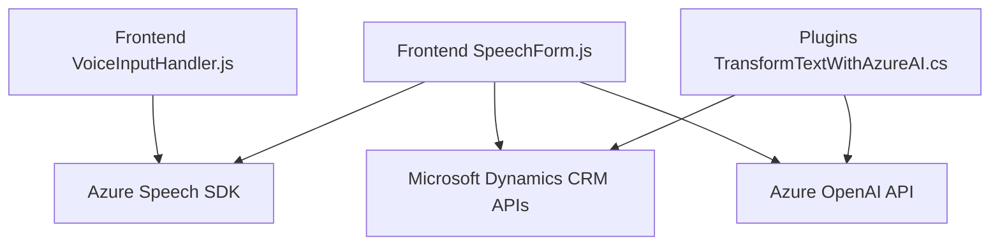

### Breve resumen técnico

El repositorio describe una solución con varios componentes integrados diseñados para una aplicación que se conecta con Microsoft Dynamics CRM y utiliza la capacidad del **Azure Speech SDK** y **Azure OpenAI API** para convertir texto visible del formulario en voz, interpretar comandos hablados y transformar los datos mediante técnicas de inteligencia artificial. El código se encuentra organizado en dos áreas principales: **frontend** (JS) y **backend** (plugin .NET).

---

### Descripción de la arquitectura

**Arquitectura de la solución:**
- **Tipo de solución:** *Sistema híbrido para interacción por voz con formularios en la interfaz de Dynamics CRM.*  
  Incluye una configuración cliente-servidor en la que el frontend maneja el reconocimiento de voz y la síntesis de texto, y el backend (plugin .NET) gestiona la lógica avanzada para transformaciones de texto usando Azure OpenAI.
  
- **Tipo de arquitectura:**  
  - Para el frontend: *n capas*, con separación de responsabilidades en funciones.  
  - Para el plugin: *Plugin-based architecture*, adecuado para extensiones en Dynamics CRM donde los eventos y lógica se encapsulan en componentes que se suscriben a eventos del sistema.  

- **Integración con servicios externos:** Las funciones del sistema dependen significativamente de servicios de Microsoft Azure (Speech SDK, OpenAI) y APIs de Dynamics CRM.

---

### Tecnologías usadas

1. **Frontend (JavaScript):**
   - **Framework:** Ninguno explícito, pero está estructurado para trabajar en entornos como Dynamics CRM.  
   - **Librerías externas:**  
     - **Azure Speech SDK**: Sintetizador y reconocimiento de voz.  
   - **Patrones:**  
     - Modularización con funciones independientes.  
     - Uso de *callbacks* para la inicialización.  
     - Orientación a eventos y datos (voz y datos del formulario).  

2. **Backend (.NET Plugin - C#):**
   - **Framework:** Dynamics CRM SDK (Microsoft.Xrm.Sdk).  
   - **Servicios externos:**  
     - **Azure OpenAI API**: Transformación y manipulación avanzada de texto.  
     - HttpClient para solicitudes API.  
   - **Patrones de diseño:**  
     - Plugin-based architecture para integración en Dynamics CRM.  
     - Cliente de API HTTP.  

---

### Dependencias o componentes externos

1. **Microsoft Dynamics CRM APIs:**  
   Permite obtener datos de formularios y realizar operaciones con entidades.

2. **Azure Speech SDK:**  
   Utilizado tanto para la síntesis de voz como para el reconocimiento de comandos hablados.

3. **Azure OpenAI API:**  
   Utilizado en el plugin para transformar el texto basado en las normas predefinidas.

4. **JavaScript dinámico:**  
   El SDK de Speech es cargado según demanda usando dependencias que no están empaquetadas con el código base.

---

### Diagrama Mermaid válido para GitHub

---

### Conclusión final

Esta solución implementa una interacción avanzada entre componentes frontend y backend en el contexto de Dynamics CRM. Utiliza voz como principal mecanismo de entrada y salida, apostando por integraciones con tecnologías de Azure como Speech SDK y OpenAI para extender funcionalidades hacia la inteligencia artificial en reconocimiento, síntesis y transformación de texto. Técnicamente, está bien diseñada con una arquitectura modular y escalable, aunque depende fuertemente de servicios externos (Azure).