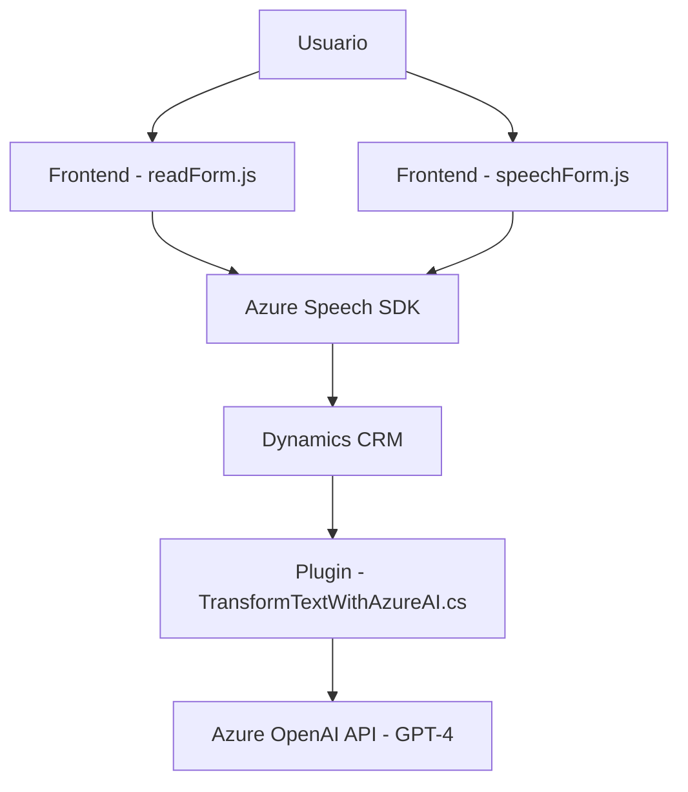

### Breve resumen técnico
El repositorio está orientado a integrar herramientas de asistencia vocal y procesamiento de datos vinculadas a Microsoft Dynamics CRM, un sistema de gestión empresarial. Se apoya en tecnologías externas como Azure Speech SDK y Azure OpenAI para la captura de voz, transcripción, síntesis de texto y transformación basada en un lenguaje modelo.

---

### Descripción de arquitectura
El diseño sigue una **arquitectura de capas integradas**, donde los componentes del frontend interactúan con servicios externos (Azure APIs) y el backend que implementa plugins personalizados para el CRM. La arquitectura incluye las siguientes capas:
1. **Frontend (Javascript)**: Maneja la interacción del usuario con formularios dinámicos y realiza procesos de síntesis y reconocimiento de voz.
2. **Backend (Plugins en C#)**: Implementa lógica de negocio personalizada mediante plugins para Dynamics CRM, conectándose a recursos de IA en Azure.
3. **Servicios externos**: Integración directa con Azure Speech SDK y Azure OpenAI para operaciones especializadas.
4. **CRM**: Actúa como núcleo organizativo, proporcionando acceso al contexto de entidades y datos.

Se observa un enfoque modular y orientado a servicios, aunque sigue las restricciones del entorno de Dynamics CRM (limitación de plugins, interacción directa con XRM API).

---

### Tecnologías usadas
1. **Frontend**:
   - **JavaScript**: Para la orquestación de síntesis de voz, transcripción y actualizaciones en formularios.
   - **Azure Speech SDK**: Reconocimiento de voz y síntesis de texto a voz.
2. **Backend**:
   - **Microsoft Dynamics CRM API**: Exposición de datos y entidades del sistema.
   - **C#**: Desarrollo de plugins personalizados.
   - **Azure OpenAI API**: Procesamiento de texto basado en GPT-4.
   - **Newtonsoft.Json**: Manejo de datos JSON.
3. **Patrones presentes**:
   - Dependencia de servicios externos (Speech SDK y OpenAI).
   - Modularidad de funciones en el frontend.
   - Encapsulación en clases y métodos estáticos en el plugin.

---

### Diagrama Mermaid válido para GitHub

---

### Conclusión final
El repositorio implementa una solución compatible con sistemas CRM en una arquitectura integrada de procesamiento de voz y datos. La solución utiliza servicios externos para sintetizar y analizar datos mediante un flujo modular y dinámico. Aunque no implementa una arquitectura compleja como microservicios o sistemas distribuidos, la integración de múltiples tecnologías en capas proporciona claridad y enfoque directo hacia las necesidades del usuario final, como la interacción vocal en formularios.

Podría mejorarse fortaleciendo la seguridad en el manejo de claves API y optimizando las dependencias externas para mayor portabilidad. Su diseño es efectivamente adecuado para sistemas basados en Dynamics CRM y aplicaciones de asistencia basada en IA.