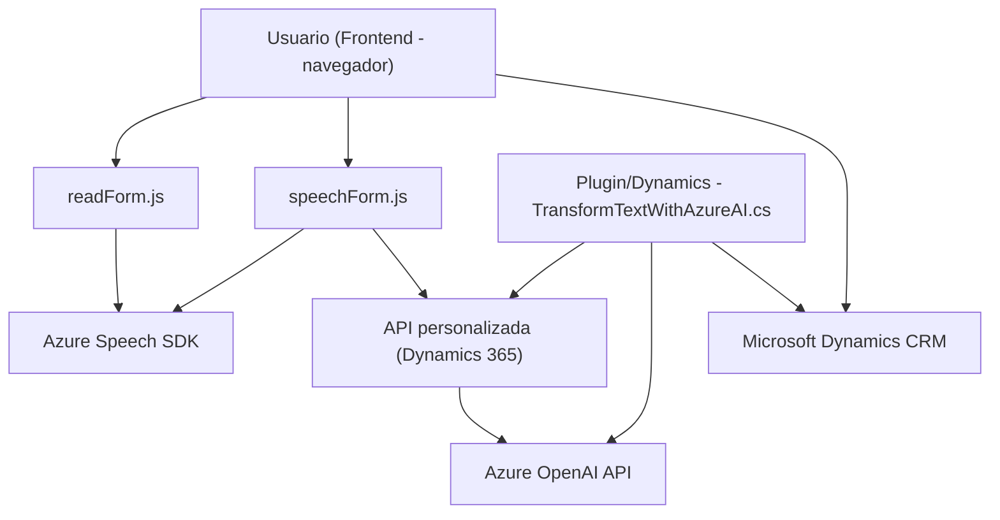

### Breve Resumen Técnico
El proyecto integra varias funcionalidades relacionadas con reconocimiento y síntesis de voz utilizando **Azure Speech SDK**, procesamiento de formularios, y transformación de texto mediante **Azure OpenAI**. Adicionalmente, conecta dichas herramientas con **Microsoft Dynamics 365** para manipulación de datos y automatización de procesos en formularios.

### Descripción de Arquitectura
La solución consiste en tres componentes principales:
1. **Frontend:** Contiene dos archivos: `readForm.js` y `speechForm.js`. Ambos están orientados al manejo de datos de formularios, aprovechando JavaScript y Azure Speech SDK para interacción por voz.
2. **Backend - Plugin para Dynamics CRM:** Un CS file denominado `TransformTextWithAzureAI.cs`. Este archivo es un plugin que opera como middleware, conectando Dynamics CRM con Azure OpenAI para transformar texto y devolver datos estructurados.
   
#### Arquitectura:
El sistema utiliza una **híbrida de tres capas:**
- **Capa de presentación (Frontend):** Utiliza JavaScript para interacción directa con el usuario en la interfaz de formularios, con funciones como el reconocimiento de voz, síntesis de texto y manipulación reactiva del formulario.
- **Capa de lógica de negocio (Plugin para Dynamics CRM):** Implementa funcionalidades específicas para el entorno Dynamics CRM integradas con Azure OpenAI.
- **Capa de servicios externos:** Aprovecha APIs y SDKs externos, como Azure Speech y Azure OpenAI, para ejecución de las lógicas de síntesis y transformación de texto.

Adicionalmente, se utilizan **patrones de microservicios e integración de APIs** para conectar la funcionalidad entre la capa de presentación y los servicios externos.

### Tecnologías Usadas
1. **Frontend:**
   - **JavaScript**: Desarrollo de las funcionalidades del cliente.
   - **Azure Speech SDK**: Síntesis y reconocimiento de voz en tiempo real.
   - **Dynamic Loading**: Carga de scripts dinámicos para integración del SDK en el navegador.
   - **Xrm.WebApi y Microsoft Dynamics SDK**: Interacción con la plataforma CRM.
   
2. **Backend:**
   - **Microsoft Dynamics SDK y Plugin Design**: Extiende la funcionalidad del CRM utilizando C# y el framework de plugins de Dynamics.
   - **Azure OpenAI API**: Generación de texto procesado por modelos AI de Azure.
   - **JSON serialization libraries**: Inclusión de Newtonsoft.Json y System.Text.Json para manejo del procesamiento de datos estructurados.

### Dependencias y Componentes Externos
1. **Azure Speech SDK:** Para reconocimiento de voz y síntesis de texto en el frontend.
2. **Microsoft Dynamics 365 SDK:** Para manipulación de formularios y creación de plugins.
3. **Xrm.WebApi:** Para consumir el API interno de Dynamics 365.
4. **Azure OpenAI API:** Servicio para transformación de texto utilizando Inteligencia Artificial.
5. **Library: Newtonsoft.Json**: Para manejar datos JSON en el plugin del backend.
6. **HTTP Client**: Para realizar peticiones HTTP al API de Azure OpenAI.

### Diagrama Mermaid

### Conclusión Final
La solución es un proyecto basado en la interacción entre usuarios y formularios dentro de **Microsoft Dynamics 365**. Utiliza una arquitectura híbrida de tres capas con una fuerte dependencia de servicios externos (Azure Speech SDK y Azure OpenAI API) para proporcionar experiencia de usuario altamente personalizada mediante reconocimiento y síntesis de voz. El diseño es modular, con funciones bien divididas por propósito, y es fácilmente integrable con otros sistemas gracias al uso de APIs y plugins, lo que lo hace ideal para entornos empresariales que requieren conectividad y automatización.