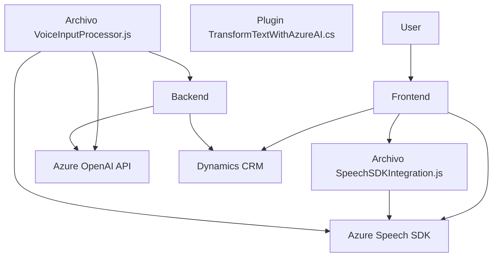

### Breve resumen técnico:
El repositorio contiene tres archivos clave que integran funcionalidades avanzadas mediante el uso de Azure Speech SDK y Azure OpenAI API. Implementa procesamiento de voz, síntesis de voz y transformación contextual de datos en aplicaciones asociadas, probablemente dentro del ecosistema Dynamics 365. Destacan patrones de modularidad, integración con APIs, y arquitectura orientada a servicios.

---

### Descripción de arquitectura:
Basado en la estructura y funcionalidad descrita:
1. **Tipo de solución:** Combinación de una API y un frontend avanzado. Los scripts de JavaScript manejan la integración del SDK de Azure para funcionalidades en tiempo real mientras que el backend soporta una lógica avanzada mediante plugins y transformación de datos. 
2. **Arquitectura:** Modular y orientada a servicios, mostrando un diseño híbrido basado en "SOA" y con componentes distribuidos (Azure Speech SDK, Azure OpenAI API).
3. **Componentes:**
   - **Frontend:** Brinda interacción con formularios mediante voz (procesamiento dinámico).
   - **Backend:** Plugin en .NET conectado directamente a Dynamics 365.
4. La arquitectura puede describirse como **n capas** (frontend, middleware y backend).

---

### Tecnologías usadas:
1. **Frontend:**
   - **JavaScript ES6+:** Modularidad en funciones.
   - **Azure Speech SDK:** Para reconocimiento y síntesis de voz.
   - **Dynamics 365 WebAPI:** Manipulación de formularios y atributos.

2. **Backend (Plugin en C#):**
   - **Azure OpenAI:** Transformación avanzada de texto mediante modelos AI.
   - **Newtonsoft.Json:** Manejo de estructuras JSON.
   - **Dynamics SDK:** Plugins estándar para procesamiento de eventos.

3. **Patrones de diseño:**
   - **SOA (Service-Oriented Architecture):**
     - Componentes conectados por servicios externos (Speech SDK, OpenAI).
   - **Modularización:** Divisiones claras de funcionalidad en funciones.
   - **Callback Pattern:** Para garantizar la carga dinamizada del Speech SDK.
   - **DTO (Data Transfer Object):** Utilizado en el mapeo de datos entre atributos.

---

### Diagrama Mermaid:
El diagrama simplifica la interacción entre los componentes y tecnologías descritas.

---

### Conclusión final:
El repositorio implementa una solución integral orientada al reconocimiento y síntesis de voz, complementada con transformación AI en un backend conectado a Dynamics 365.  
1. Su arquitectura de **n capas** divide responsabilidades entre frontend y backend, mientras que las dependencias externas (Azure Speech SDK y OpenAI API) gestionan tareas específicas de procesamiento.  
2. La modularidad y la integración hacen que la solución sea escalable y adaptable para aplicaciones empresariales dinámicas.