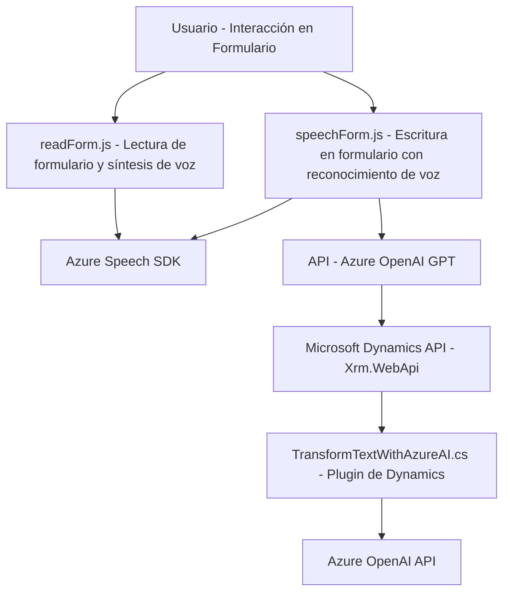

## Resumen Técnico
El repositorio analiza tres archivos (`readForm.js`, `speechForm.js`, y `TransformTextWithAzureAI.cs`) que implementan funcionalidades enfocadas en la integración de formularios dinámicos en un entorno como Dynamics 365 con tecnologías de reconocimiento de voz (Azure Speech SDK) y procesamiento de lenguaje natural (Azure OpenAI). Estas soluciones están orientadas hacia la lectura y escritura en formularios mediante voz y procesamiento de texto estructurado.

## Descripción de Arquitectura
La arquitectura combinada del repositorio presenta las siguientes características:
1. **N-Capas:** Hay una clara separación entre las capas de interacción con el usuario (JavaScript en el frontend para manejar formularios y voz) y las capas de procesamiento lógico/servicios (C# para plugins).
2. **Integración de Servicios Externos:** Tanto el frontend como el servidor están estrechamente acoplados a servicios externos: Azure Speech SDK, Dynamics SDK, y Azure OpenAI.
3. **Plugin-Based Architecture:** El plugin en C# se ajusta al modelo extensible y estándar de Dynamics 365.
4. **Patrón Adaptador:** Varias funciones convierten datos (formularios, voz o texto JSON) en formatos compatibles con los servicios externos.

## Tecnologías Usadas
1. **Frontend:**
   - **JavaScript**: Lenguaje principal para manejar lógica del cliente.
   - **Azure Speech SDK**: Para síntesis y reconocimiento de voz en tiempo real.
   - **Dynamics 365 SDK (Xrm.WebApi)**: Para manipular formularios y datos relacionados.

2. **Backend:**
   - **C#:** Implementación del plugin en Dynamics.
   - **Microsoft.Xrm.Sdk y Newtonsoft.Json:** Para interactuar con Dynamics 365, consultar registros, y trabajar con datos JSON.
   - **Azure OpenAI API:** Uso de GPT-4 para transformar texto y realizar análisis lingüístico avanzado mediante llamadas HTTP.

## Diagrama Mermaid

## Conclusión Final
El repositorio configura una solución híbrida que combina un **frontend** basado en JavaScript para la interacción del usuario, el reconocimiento y síntesis de voz con Azure Speech SDK, y un **backend** que utiliza plugins de Dynamics 365 en C# para la integración y procesamiento de texto con Azure OpenAI. 

La arquitectura modular permite escalabilidad, mientras que la integración con servicios externos ofrece un excelente potencial para extender funcionalidades mediante la nube. Las tecnologías elegidas están ampliamente soportadas y ofrecen una solución robusta y moderna. Doparse estas herramientas con un enfoque modular también garantiza que sean fácilmente mantenibles y mejorables.