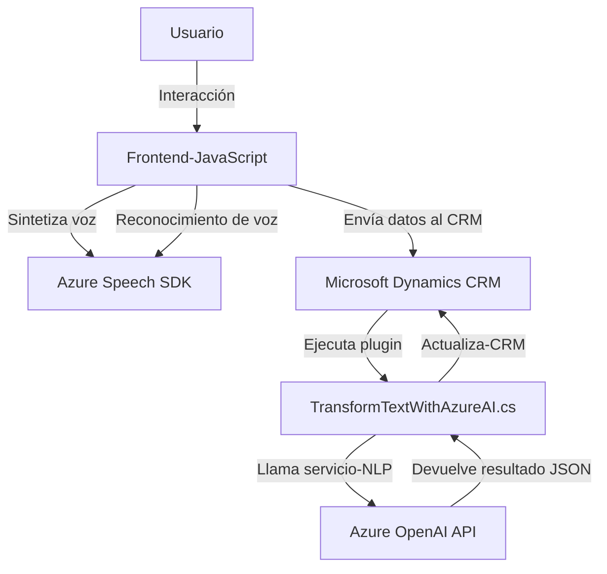

### Breve resumen técnico

El repositorio representa una solución que integra un **frontend en JavaScript** con capacidades de síntesis y reconocimiento de voz, y una **extensión de CRM basada en plugins** para la transformación de texto utilizando **Azure OpenAI**. Además, utiliza el **Azure Speech SDK** para la interacción de voz en tiempo real. Todo esto sugiere una integración efectiva entre servicios de nube y lógica empresarial.

---

### Descripción de arquitectura

1. **Tipo de solución**: La solución es una combinación de tres componentes principales: 
   - **Frontend basado en JavaScript**, que incluye archivos como `readForm.js` y `speechForm.js`, orientados a la síntesis y reconocimiento de voz, y procesamiento de formularios.
   - **Plugin de Microsoft Dynamics CRM**, que extiende la funcionalidad del CRM mediante la transformación del texto usando IA (Azure OpenAI).
   - **Conexión con servicios externos (Azure Speech SDK y Azure OpenAI)**, que facilitan funcionalidades como la síntesis y reconocimiento de voz y el análisis avanzado de lenguaje natural.

2. **Arquitectura**: 
   - Mayormente sigue un **modelo de capas**. El Frontend maneja la interfaz de usuario y lógica de interacción con formularios, mientras que el plugin actúa como una capa de acceso a servicios externos mediante la lógica de negocio enfocada en CRM. Simultáneamente, la interacción con APIs como Azure OpenAI y Speech SDK muestra que la arquitectura se beneficia de una **arquitectura orientada a servicios**.
   
3. **Patrones utilizados**:
   - **Modularidad**: Los archivos de JavaScript están divididos en funciones pequeñas y reusables.
   - **Delegación**: Funciones específicas para manejar datos del formulario y comunicarse con servicios externos.
   - **Estrategia / Factory**: Métodos como `processTranscriptIA` y `applyValueToField_IA` indican la separación de lógica según el flujo y fuente de datos.
   - **Plugin architecture**: Implementación de extensiones en Dynamics CRM, ligando servicios y APIs externos para expandir funcionalidades.

4. **Dependencias externas identificadas**:
   - **Azure Speech SDK**: Para síntesis y reconocimiento de voz.
   - **Azure OpenAI**: Para procesamiento avanzado del lenguaje (texto a JSON).
   - **Microsoft Dynamics CRM SDK (`IPlugin`, `Xrm.WebApi`)**: Para la interacción con CRM.
   - **JavaScript** en la parte del frontend.
   - Framework y herramientas específicas no mencionadas, pero que posiblemente incluyen módulos como `npm` o similares para manejar dependencias en el código JavaScript.

---

### Tecnologías usadas
1. **Frontend (JavaScript)**:
   - Sintaxis de ES6+.
   - Dependencias dinámicas con SDK externo (carga condicional del Azure Speech SDK).
   - Posible uso de otras librerías/modulos no mencionados explícitamente.

2. **Backend/Plugins (C#)**:
   - Framework .NET mediante integración de Microsoft Dynamics CRM.
   - `Newtonsoft.Json.Linq`, `System.Text.Json`: Para manejo y serialización de JSON.
   - `System.Net.Http`: Realiza solicitudes HTTP hacia servicios externos.

3. **Servicios externos**:
   - **Azure Speech SDK**: Para la síntesis y reconocimiento de voz.
   - **Azure OpenAI**: Procesamiento NLP/IA avanzado mediante GPT para convertir texto en JSON.

---

### Diagrama Mermaid

---

### Conclusión final

Este repositorio implementa una solución de **arquitectura orientada a servicios (SOA)** que conecta un **frontend de interacción usuario-voz** con una extensión de **Microsoft Dynamics CRM**. La solución aprovecha la potencia de dos servicios de Azure: **Speech SDK y OpenAI**, para proporcionar accesibilidad (síntesis de voz) y capacidades avanzadas de inteligencia artificial (procesamiento de texto). La estructura del código sigue principios de modularidad, delegación, y eventos, asegurando una separación clara de responsabilidades y una integración eficiente con servicios externos.