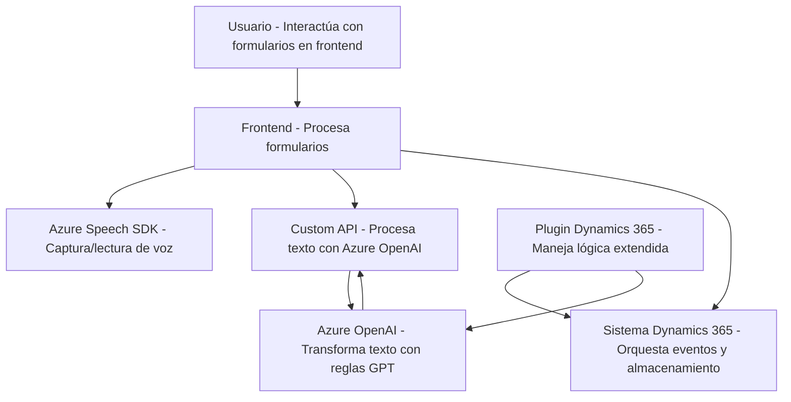

### Análisis técnico del repositorio

---

#### **1. Tipo de solución**
El repositorio evidencia una solución **híbrida centrada en Microsoft Dynamics 365**, donde:
1. El frontend **interactúa con formularios de Dynamics 365** y utiliza el **Azure Speech SDK** para procesamiento de voz (lectura y transcripción).
2. Un **plugin en C#** actúa dentro del sistema Dynamics CRM para transformar texto utilizando el servicio **Azure OpenAI**.

Esto categoriza la solución como una integración orientada a **formularios inteligentes**, que combina:
- Lógica de frontend con herramientas basadas en formularios y audio.
- Procesamiento asincrónico mediante servicios en la nube para voz y texto.

---

#### **2. Tecnologías, frameworks y patrones observados**
**Frontend (JavaScript):**
- **Azure Speech SDK**: Proporciona lectura y transcripción de voz desde el cliente.  
- **Microsoft Dynamics 365 Form API** (`executionContext`, `Xrm.WebApi`): Manejo de estructuras y datos de formularios del CRM.

**Backend (C#, Plugin):**
- **Microsoft Dynamics CRM SDK**: Framework para creación de plugins nativos en Dynamics 365.
- **Azure OpenAI**: Usado para transformar texto basado en normas especificadas (modelo `GPT-4o`).
- **.NET Framework**: Utilizado para programación del plugin.
- **Newtonsoft.Json** y componentes estándar (`System.Linq`, `System.Text.Json`) para manipulación de JSON.

**Patrones observados:**
- **Desacoplamiento funcional**: En ambos contextos (frontend y backend), las funciones están divididas por propósito.
- **Integración asincrónica**:
  - Funciones en el frontend que garantizan carga dinámica del Azure Speech SDK.
  - Plugins en el backend usan solicitudes HTTP para interactuar con el servicio Azure OpenAI.
- **MVC-like (Frontend)**: Procesa datos en el modelo del formulario (`executionContext`) y actualiza la vista del usuario.
- **Hook-based plugin (Backend)**: El plugin se ejecuta como una acción de Dynamics CRM, reaccionando a eventos del sistema.

---

#### **3. Tipo de Arquitectura**
- **Frontend (JavaScript)**:
La arquitectura es una variación de una arquitectura **n-capas** o **modular**, donde:
  - Las responsabilidades son compartidas entre:
    1. Captura y procesamiento de voz.
    2. Manipulación de datos del formulario.
    3. Envío a APIs externas como Azure AI para procesamiento avanzado.
  - Promueve reutilización de código y extensibilidad con funciones desglosadas por objetivos claros.

- **Back-end (C# Plugin)**:
El plugin adopta:
  - Un patrón de **gestión de eventos** dentro del ecosistema Dynamics CRM.
  - **Cliente-servidor**: Donde la lógica de transformación de texto se delega a Azure OpenAI mediante protocolos HTTP REST.

En conjunto, la solución se orienta hacia una **arquitectura híbrida**, integrando componentes monolíticos (plugin CRM) con servicios externos basados en APIs REST (Azure Speech SDK y OpenAI).

---

#### **4. Dependencias externas y componentes**
**Externas:**
1. **Azure Speech SDK**:
   - Captura y síntesis de voz.
   - Enlace a SDK dinámico desde `https://aka.ms/csspeech/jsbrowserpackageraw`.
2. **Azure OpenAI**:
   - Transformación avanzada de texto.
   - Utiliza modelo GPT específico para la lógica del plugin.
3. **Dynamics CRM Framework** (`Xrm.WebApi`):
   - Extensión del cliente y manipulación de datos/contexto Dynamics 365.
4. **Newtonsoft.Json**:
   - Para parsing y manejo de JSON en el plugin.

**Internas:**
- **Custom APIs propias**: API específica mencionada como "trial_TransformTextWithAzureAI".

---

#### **5. Diagrama Mermaid**

El siguiente diagrama representa la interacción global de los componentes del repositorio:

---

#### **Conclusión final**
Este repositorio implementa una **solución inteligente orientada a formularios** donde la interacción de voz y texto se potencia con servicios en la nube como **Azure Speech SDK** y **Azure OpenAI**. La arquitectura es modular, con integración directa de frontend a APIs externas y backend CRM mediante un modelo de eventos plugin.

La elección de servicios externos como OpenAI y Speech SDK reflejan una estrategia técnica enfocada en delegar procesos intensivos a plataformas especializadas, ofreciendo flexibilidad y escalabilidad para el sistema Dynamics 365.