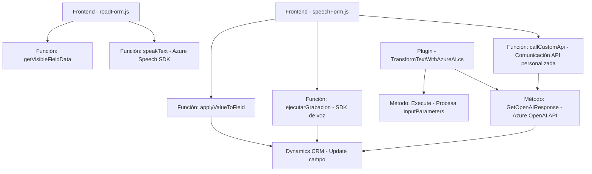

### Breve resumen técnico

El repositorio describe una solución híbrida que conecta interfaces de usuario (formularios basados en Dynamics CRM en el frontend) con servicios de voz e inteligencia artificial proporcionados por Microsoft Azure. Hay tres componentes principales:
1. **Frontend:** Manejo de interacción con formularios (entrada/salida de voz).
2. **Backend/plugin:** Transformación del texto mediante Azure OpenAI (lógica de negocios avanzada).

---

### Descripción de arquitectura

La solución sigue una arquitectura **n-capas orientada a servicios**, con separación de responsabilidades entre:
- **Capa de presentación:** Formularios integrados en Dynamics CRM para manejo de voz y mapeo de datos.
- **Capa de procesamiento/intermediaria:** SDK de Azure Speech para reconocimiento y síntesis.
- **Capa de negocio/servicio:** Plugin en Dynamics CRM para transformar texto usando la API de Azure OpenAI.

El diseño se apoya fuertemente en la comunicación entre capas mediante APIs públicas, especialmente desde Azure. Además, las funcionalidades están claramente orientadas al contexto de Dynamics CRM (`executionContext`).

---

### Tecnologías usadas

#### Frontend
- **JavaScript DOM**: Manipulación de formularios (campos visibles, mapeo de valores, eventos).
- **Azure Speech SDK**: Reconocimiento y síntesis de voz utilizando servicios en la nube.
- **CRM Dynamics Framework (Xrm.WebApi)**: Interacción directa con entidades del CRM y API personalizada.

#### Backend/plugin
- **C# y Dynamics SDK**: Estructuración y ejecución de plugins (`IPlugin`) como extensiones a Dynamics.
- **Azure OpenAI API**: Procesamiento avanzado del texto, con el modelo GPT-4 y soporte para generación de JSON.
- **JSON Handling Libraries**: Integración con `Newtonsoft.Json` y `System.Text.Json`.

#### Patrón de diseño
- **Modularidad:** Uso de funciones y métodos especializados. Ej: `speakText` y `GetOpenAIResponse` enfocan procesamiento en tareas individuales.
- **Gestión dinámica de dependencias:** Integración de servicios como el Azure Speech SDK de manera condicional al contexto.
- **Plugin-based Architecture:** Implementación del patrón estándar de plugins dentro de Dynamics CRM.
- **Interoperabilidad con servicios externos:** API de Azure OpenAI y SDK de Azure Speech implementados como capa transversal.

---

### Diagrama Mermaid válido para GitHub

---

### Conclusión final

La solución presentada es una **arquitectura n-capas orientada a servicios**, diseñada para realizar la integración eficiente entre formularios en Dynamics CRM y servicios avanzados de inteligencia artificial y voz desde Azure. Utiliza principios de modularidad y delegación para garantizar un flujo de procesamiento claro, escalable y adaptable. 

No obstante, las dependencias codificadas directamente, como las claves API, podrían generar vulnerabilidades de seguridad y dificultad en el manejo de cambios. Se recomienda implementar un sistema para manejar configuraciones de manera más segura, como Azure Key Vault para almacenar las claves de acceso.