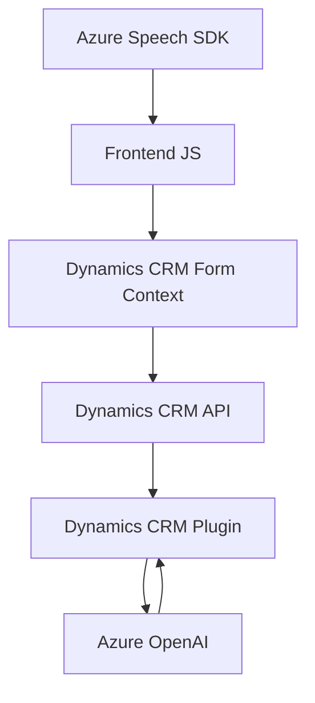

### Resumen Técnico General

El repositorio contiene tres archivos principales que definen una solución orientada a la interacción entre sistemas y servicios externos mediante formularios web dinámicos y servicios de inteligencia artificial ofrecidos por **Azure Speech SDK** y **Azure OpenAI**. Se centra en integrar sistemas existentes, principalmente **Microsoft Dynamics CRM**.

---

### Descripción de Arquitectura

La arquitectura sigue un enfoque **client-server con integración de servicios externos**:

1. **Frontend dinámico**: Scripts JavaScript interactúan con formularios en Dynamics CRM para facilitar accesibilidad y actualización en tiempo real.  
2. **Backend extensible vía plugins de CRM**: Plugins en .NET procesan datos y coordinan la interacción con la nube (Azure OpenAI).  
3. **Integración con servicios en la nube**: Uso de Azure Speech SDK y Azure OpenAI para convertir datos en texto hablado, transcribir grabaciones o transformar texto según reglas específicas.  
4. **Patrón Event-driven**: Los callbacks y eventos se encuentran fuertemente utilizados tanto en el frontend como en el backend para la interacción en tiempo real con datos.

---

### Tecnologías, Frameworks y Patrones Utilizados

#### Tecnologías
- **Frontend (JS)**:
  - Azure Speech SDK para reconocimiento de voz y síntesis de texto a voz.
  - APIs JS basadas en Dynamics CRM (form context, WebAPI).

- **Backend (C#)**:
  - **Microsoft Dynamics CRM SDK**: Para creación de plugins y manipulación de formularios y entidades en el CRM.
  - **Azure OpenAI**: Utilizado para transformar texto mediante modelos GPT integrados en servicios de AI.
  - **Newtonsoft.Json.Linq** y **System.Text.Json**: Para preprocesar y estructurar datos en JSON.
  - **System.Net.Http**: Comunicación vía RESTful API.

#### Patrones
- **N-Capas + Client-Server**: Separación estructurada de frontend y backend.
- **Integración con servicios externos**: Uso extensivo de SDKs y APIs (Azure Speech, Dynamics).  
- **Event-driven programming**: Callbacks en el frontend y la lógica en los plugins backend.
- **Formularios dinámicos**: Actualización en tiempo real de datos de UI basados en reconocimiento de voz y texto procesado por AI.
- **Plug-in extensibility**: Extensión de lógica estándar de Dynamics CRM mediante plugins en C#.

---

### Diagrama Mermaid (válido para GitHub Markdown)

---

### Conclusión Final

La solución presentada en el repositorio implementa una arquitectura **n-capas** con integración de servicios en la nube y extensibilidad a través del SDK de Dynamics CRM. Utiliza tecnologías modernas como **Azure Speech SDK** y **Azure OpenAI** para operaciones avanzadas relacionadas con accesibilidad y procesamiento inteligente de texto. Esto la hace adecuada para escenarios centrados en accesibilidad, automatización de tareas y enriquecimiento de datos en sistemas empresariales (CRM). Sin embargo, el fuerte acoplamiento con Azure y Dynamics CRM puede requerir mantenimiento constante y restringir su uso fuera de estas plataformas.