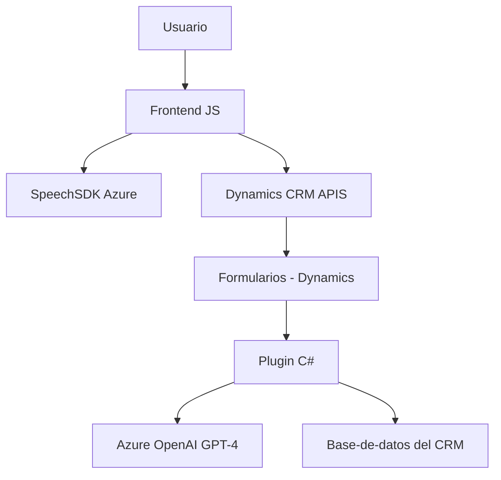

### Breve resumen técnico:
El repositorio está orientado a la integración de un sistema que combina entrada por voz y procesamiento de texto utilizando Azure Speech SDK y Azure OpenAI GPT para su uso en entornos empresariales, específicamente en formularios de una plataforma CRM, como Microsoft Dynamics 365. Está compuesto por un frontend basado en JavaScript y un plugin escrito en C#.

---

### Descripción de arquitectura:
La solución está diseñada con una **modular arquitectura en capas**, donde cada componente está claramente diferenciado:
1. **Frontend**: Contiene lógica para interacción del usuario, reconocimiento de voz, extracción y síntesis de datos de formularios.
2. **Integración CRM**: Realiza transformaciones de texto y sincronización mediante plugins y APIs internas del CRM.
3. **Servicios de terceros**: Utiliza servicios cloud como Azure Speech SDK para reconocimiento y síntesis de voz y Azure OpenAI para procesamiento inteligente de texto.

El diseño favorece la extensibilidad y desacoplamiento mediante la división del procesamiento de voz y transformación en capas diferenciadas. Puede ser clasificado como una arquitectura `n capas` (frontend, negocio y servicios externos).

---

### Tecnologías usadas:
1. **Frontend:**
   - **HTML/JS**: Resolución en el navegador.
   - **Azure Speech SDK**: Reconocimiento y síntesis de voz.
   - **APIs de Dynamics**: Interacción con el contexto de formularios y entidades (Dynamics Web API).
   - **Event-Driven Programming**: Manejo de eventos de voz y datos en tiempo real.  

2. **Backend:**
   - **C#/.NET Plugin**: Lógica empresarial en Dynamics CRM.
   - **Azure OpenAI Service**: Procesamiento inteligente de texto con GPT-4.

3. **Patrones identificados**:
   - **Modular Design**: División por funcionalidades específicas.
   - **API Gateway**: Gestión de servicios externos.
   - **Plugin Architecture**: Extensiones del flujo en el CRM.
   - **Carga dinámicas de SDK**: Validación al inicio para integrar librerías externas en tiempo de ejecución.

---

### Dependencias y componentes externos:
1. **Internos:**
   - Dynamics CRM APIs (`formContext`, `Xrm.WebApi.online`, `IPluginExecutionContext`).
   - JavaScript y C# como lenguajes clave.

2. **Externos:**
   - **Azure Speech SDK**: Funcionalidad de síntesis y reconocimiento de voz para las partes del frontend.
   - **Azure OpenAI GPT-4**: Procesamiento de texto en la parte backend, utilizada con librerías HTTP para llamadas REST.
   - **JSON (System.Text.Json, Newtonsoft.Json)**: Deserialización y serialización de datos en formato JSON.

---

### Diagrama Mermaid:

---

### Conclusión final:
El repositorio implementa una solución robusta orientada al reconocimiento de voz y la transformación de texto en un sistema CRM como Dynamics 365, utilizando Azure Speech SDK y Azure OpenAI. La arquitectura modular y en capas facilita futuras integraciones y mantiene el desacoplamiento de componentes clave. Aunque está optimizado para su objetivo actual, puede beneficiarse de una mayor parametrización de claves de API y una gestión más avanzada de dependencias externas.