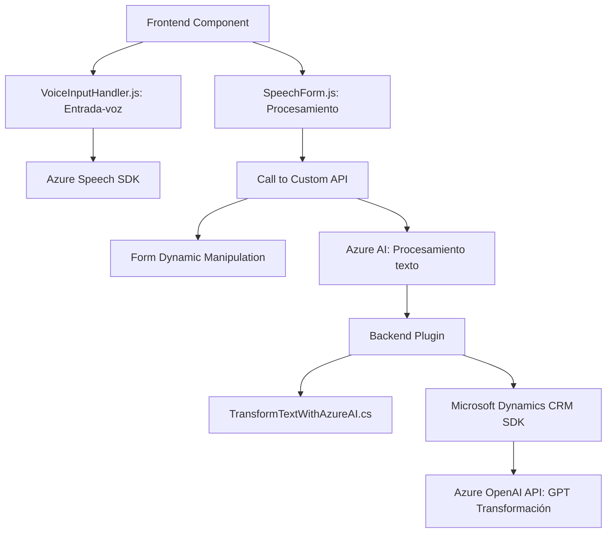

### Breve Resumen Técnico

El repositorio describe una solución que integra capacidades avanzadas de interacción vocal y procesamiento de lenguaje natural con formularios dinámicos en un contexto CRM. Esto se realiza mediante dos principales componentes:
1. **Frontend (JavaScript)**: Implementa la interacción con Azure Speech SDK para lectura y entrada de voz que se aplica en formularios dinámicos.
2. **Backend (C#)**: Procesa texto mediante la API de Azure OpenAI usando un plugin desarrollado para Microsoft Dynamics CRM.

---

### Descripción de Arquitectura

La solución sigue un **arquitectura de n capas**:
1. **Frontend (Presentación)**: Encapsula procesos para transformar entrada de voz en interacción directa con formularios y APIs de CRM.
2. **Backend (Lógica de negocio y acceso a datos)**: Extiende Dynamics CRM mediante un plugin para transformar texto usando Azure AI.

Adicionalmente, el diseño emplea conceptos como:
- **Integración por API**: Conexión con servicios externos (Azure Speech SDK y Azure OpenAI).
- **Modularización**: Implementación lógica dividida en funciones reutilizables.
- **Plugin-based Architecture**: Uso de plugins en Dynamics CRM.

---

### Tecnologías, Frameworks y Patrones Usados

1. **Frontend**:
   - **JavaScript (ES6)**.
   - **Azure Speech SDK**: Interacción voz a texto y texto a voz.
   - **DOM Manipulation**: Para carga dinámica de dependencias y acceso a elementos del formulario.
   - **Async/Promise Pattern**: Para manejar operaciones asíncronas con el SDK y servicios remotos.
   - **Facade Pattern**: Centralización de llamadas al SDK de Azure y su abstracción.

2. **Backend**:
   - **Lenguaje**: C#.
   - **Framework**: Microsoft Dynamics SDK.
   - **Libraries**: System.Net.Http, Newtonsoft.Json.
   - **Azure OpenAI API**: Integración REST para procesamiento de lenguaje natural.
   - **Patrón Plugin**: Extiende eventos y lógica dentro de Dynamics CRM desde una estructura modular y reusable.

3. **Ambiente de ejecución**:
   - Microsoft Dynamics CRM.
   - Azure Cloud Services (Speech SDK, OpenAI, etc.).

---

### Dependencias Externas y Componentes

1. **Azure Speech SDK**: Para la interacción vocal y detección de entrada de voz.
2. **Azure OpenAI API**: Procesamiento avanzado de lenguaje con modelos GPT.
3. **Microsoft Dynamics CRM SDK**: Framework para construir plugins de Dynamics.
4. **Newtonsoft.Json y System.Text.Json**: Manejo de datos JSON.
5. **Custom API (Xrm.WebApi.online API)**: Llamadas internas a APIs personalizadas de Dynamics.

---

### Diagrama Mermaid

---

### Conclusión Final

Esta solución es una **arquitectura de n capas**, diseñada para gestionar la interacción de formularios mediante voz y procesamiento avanzado de lenguaje natural en un entorno CRM. Utiliza tecnologías modernas como JavaScript, Azure Speech SDK, y Dynamics CRM Plugins en C#. Su diseño y patrones reflejan un enfoque modular y escalable. Sin embargo, la seguridad y eficiencia pueden mejorarse en la configuración de credenciales (evitando hardcoded API keys) y añadiendo validaciones robustas a los parámetros de ejecución.