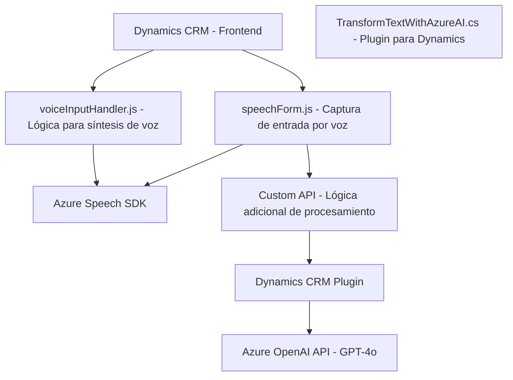

### Breve resumen técnico

El repositorio estructura la implementación de funcionalidades avanzadas para **integrar un front-end basado en JavaScript con servicios de voz e inteligencia artificial de Azure**, así como extender la funcionalidad de Microsoft Dynamics CRM mediante un plugin en .NET. Los archivos sugieren un enfoque híbrido que combina el front-end, el consumo de APIs externas y la extensión con plugins personalizados.

---

### Descripción de arquitectura

El sistema está diseñado como una arquitectura **orientada a servicios** (SOA) que conecta diferentes componentes a través de APIs y SDKs. La arquitectura utiliza un enfoque modular, donde cada parte tiene una responsabilidad específica: 
- Integración con servicios en la nube, como **Azure Speech SDK** y **OpenAI**.
- Captura y procesamiento de datos del formulario en Dynamics CRM.
- Extensión de funcionalidad mediante un plugin en Dynamics que consume Azure OpenAI vía HTTP.

El front-end parece seguir un patrón de **n capas**, separando la lógica de presentación, las interacciones con las APIs y el procesamiento de datos. El plugin en .NET utiliza un enfoque basado en el **Facade Pattern** para gestionar las interacciones entre Dynamics 365 y Azure OpenAI.

---

### Tecnologías usadas

1. **Frontend:**
   - **JavaScript**:
     - Implementación dinámica de funcionalidades como síntesis de voz y transcripción.
   - **Azure Speech SDK**:
     - Para reconocimiento y síntesis de voz.
2. **Backend/plugin:**
   - **Microsoft Dynamics CRM SDK**:
     - Extensiones de formularios y lógica a través de plugins y Custom APIs.
   - **.NET con C#**:
     - Codificación del plugin con interacción directa usando APIs de Dynamics CRM.
   - **Azure OpenAI**:
     - Consumo vía HTTP para procesamiento de texto.
3. **Dependencias externas:**
   - `Azure Speech SDK` para síntesis y reconocimiento de voz en la parte front-end.
   - `Azure OpenAI API` para procesamiento de texto.
   - `System.Net.Http`, `Newtonsoft.Json.Linq`, y `System.Text.Json` para manipulación y envío de solicitudes HTTP del plugin.

---

### Diagrama Mermaid válido para GitHub Markdown

---

### Conclusión final

Este repositorio integra eficientemente herramientas avanzadas de Microsoft Dynamics CRM con servicios de inteligencia artificial y voz basados en Azure. Al emplear patrones como **SOA**, **Facade**, y **Modularización**, el sistema asegura flexibilidad y escalabilidad. Sin embargo, la solución debe gestionar de manera segura las claves y endpoints sensibles en un almacén seguro como **Azure Key Vault**, y contemplar mejores prácticas en torno a la carga dinámica de SDKs y manejo de dependencias. La estructura es ideal para empresas que trabajan en ecosistemas Microsoft y buscan mejorar la automatización y funcionalidad de formularios en entornos corporativos.