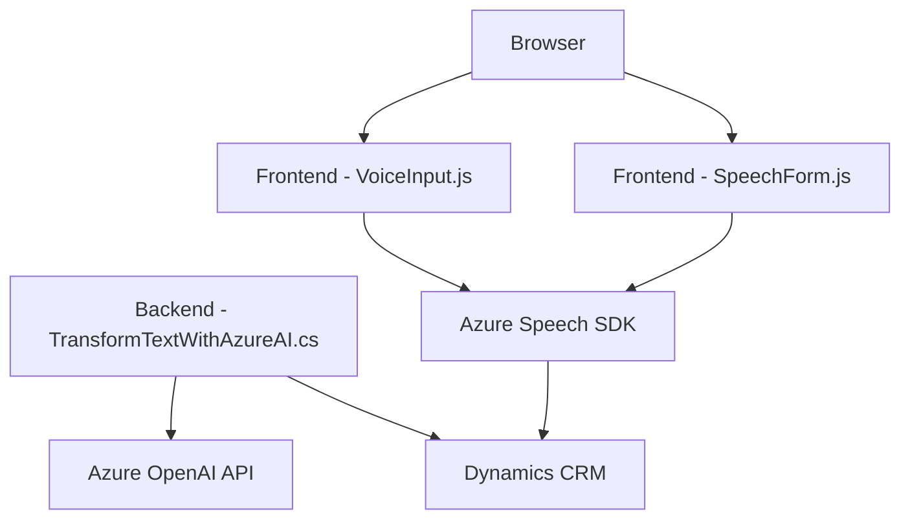

### Breve resumen técnico:

El repositorio parece implementar soluciones para integraciones basadas en Dynamics 365, usando Azure Speech SDK y Azure OpenAI para reconocimiento de voz, síntesis de voz, transformaciones de texto, y manipulación de datos en formularios de Dynamics CRM. Se distribuyen en tres áreas clave:
1. **Frontend**: Archivos JavaScript procesan datos en formularios web mediante funcionalidades de voz.
2. **Plugins**: Extensiones para Dynamics CRM usando C# y Azure OpenAI para generar estructura de datos a partir de texto.
3. **Integración con servicios externos**: Se basa en el uso de Azure APIs (Speech SDK, OpenAI).

---

### Descripción de arquitectura:

La solución sigue una **arquitectura híbrida basada en n capas y SOA (Arquitectura Orientada a Servicios)**:
1. **N capas**: 
   - **Capa de presentación**: Frontend con JavaScript para interactuar directamente con los formularios.
   - **Capa de lógica**: Plugins en C# procesan las solicitudes de Dynamics CRM y generan estructura de datos mediante Azure OpenAI.
   - **Capa de integración**: Uso de APIs externas (Azure APIs y Dynamics WebAPI).
2. **SOA**:
   - Dependencias de servicios externos para tareas específicas: reconocimiento de voz, síntesis y transformación mediante Azure.

---

### Tecnologías usadas:

1. **Frontend**:
   - **Javascript**: Procesa datos de formularios y gestiona reconocimiento de voz y síntesis de voz.
   - **Azure Speech SDK**: Para reconocimiento y síntesis de voz.
   - **Dynamics WebAPI**: Manipula formularios en Dynamics CRM.

2. **Backend/Plugins**:
   - **C# (.NET)**: Desarrolla plugins extensibles para Dynamics CRM.
   - **Azure OpenAI API**: Transformación de texto mediante GPT-4 usando solicitudes HTTP.
   - **Newtonsoft.Json**: Para la manipulación estructurada de JSON.
   - **System.Net.Http**: Comunicación con servicios REST externos.

3. **Otros**:
   - **Microsoft.Xrm.Sdk**: Biblioteca estándar de Dynamics CRM para la interacción del plugin con entidades de CRM.

---

### Diagrama **Mermaid** válido para **GitHub**:

---

### Conclusión final:

La solución está diseñada para potenciar la interacción con CRM y formularios mediante voz e inteligencia artificial. Su arquitectura combina n capas (frontend y backend) con servicios SOA (Azure Speech SDK y OpenAI API) para manejar tareas avanzadas de voz y procesamiento de texto. Además, fomenta la modularidad y buenas prácticas de desarrollo, integrándose eficientemente con Dynamics CRM.