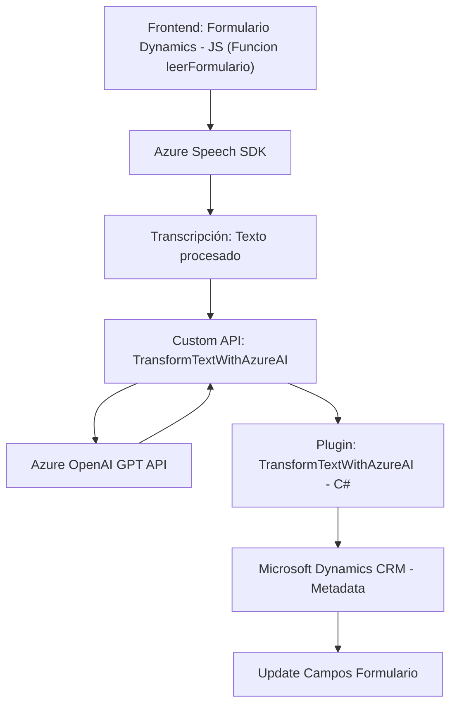

### Breve resumen técnico

El repositorio en cuestión parece ser una solución compuesta por diferentes capas que trabajan en conjunto para habilitar la interacción de un sistema empresarial, específicamente Microsoft Dynamics 365, con dos tecnologías principales: **Azure Speech SDK** y **Azure OpenAI GPT**. La funcionalidad principal incluye la entrada de voz, transcripción, conversión de texto a voz, y procesamiento avanzado de textos mediante inteligencia artificial.

---

### Descripción de arquitectura

1. **Arquitectura**: El sistema utiliza una arquitectura de **capas** con una separación clara entre la capa de presentación (interfaz de usuario), lógica de negocio (Dynamics 365 y plugins de backend), y servicios externos en Azure (Speech SDK y OpenAI).
   - La **capa de presentación** está basada en un frontend que interactúa con formularios y datos empresariales de Microsoft Dynamics CRM utilizando el objeto `formContext`.
   - La **capa de integración** incluye un plugin desarrollado en C# que actúa como puente entre Microsoft Dynamics CRM y los servicios de Azure OpenAI.
   - La comunicación con **Azure Speech SDK** y **Azure OpenAI GPT** configura una arquitectura parcialmente distribuida, dado que el flujo de datos se conecta con APIs externas.

2. **Modularidad**: La solución tiene un diseño bien estructurado. Los principales flujos y tareas están definidos en funciones y métodos separados, haciendo énfasis en la modularidad. Además, se usan patrones como delegación de responsabilidades y encapsulación para mantener un código limpio y de fácil mantenimiento.

3. **Patrones de arquitectura**:
   - **N-capas**: Con una separación entre presentación (frontend y formularios), negocio (interacciones de Dynamics 365 y plugins), y la capa de servicios externos (Azure APIs).
   - **Plugin architecture**: El backend utiliza un plugin (TransformTextWithAzureAI.cs) para habilitar la integración de Dynamics 365 con intelligence services.
   - **Service provider pattern**: Implementado en la ejecución del plugin para abstraer las dependencias del sistema CRM.
   - **SDK loader pattern**: Implementado para cargar dinámicamente el Azure Speech SDK y garantizar su accesibilidad antes de ejecutar tareas.

---

### Tecnologías usadas

- **Frontend (JavaScript):**
  - Manejo de formularios de **Microsoft Dynamics 365**, utilizando `formContext` y `Xrm.Page`.
  - Cargador dinámico para gestionar las dependencias de **Azure Speech SDK**.
- **Backend (C#):**
  - Plugin personalizado que interactúa con **Microsoft Dynamics CRM** mediante el SDK.
  - Comunicación con la API de **Azure OpenAI GPT** para el procesamiento de texto.
- **Externo (Microsoft technologies):**
  - **Azure Speech SDK** para síntesis de voz y transcripción de audio a texto.
  - **Azure OpenAI GPT API** para análisis y transformación avanzada de texto.

---

### Dependencias o componentes externos

- **Microsoft Dynamics CRM**: Base de la solución, permite interacción con entidades empresariales, formularios y datos.
- **Azure Speech SDK** (`@azure/speech-sdk`): Servicio de Microsoft para síntesis y reconocimiento de voz.
- **Azure OpenAI GPT**: API que permite transformar texto según parámetros personalizados definidos en las reglas de negocio.
- **Custom API en Dynamics 365**: Implementación con `Xrm.WebApi.online.execute`, que interactúa con recursos internos del CRM y API externas.
- **Bibliotecas C#:**
  - `Newtonsoft.Json`; `System.Net.Http`; `System.Text.Json`: Para manejo de datos JSON y comunicación mediante HTTP al servicio de OpenAI.

---

### Diagrama Mermaid válido para GitHub

---

### Conclusión final

Este repositorio corresponde a una solución empresarial basada en **Microsoft Dynamics 365**, que permite la interacción con usuarios mediante entrada de datos por voz y transcripción, y que cuenta con servicios avanzados de inteligencia artificial (Azure OpenAI) para realizar procesos de transformación de texto. La arquitectura está diseñada como un sistema de **n-capas** con integración de APIs externas, lo cual mejora su extensibilidad y escalabilidad. 

El diseño está orientado a la modularidad y organiza las responsabilidades por capa. Sin embargo, sería ideal optimizar el manejo de excepciones e incluir mejores mecanismos de monitoreo/logging, especialmente en entornos sensibles como sistemas empresariales. El diagrama proporcionado explica claramente cómo los componentes interactúan entre sí, reflejando la esencia distribuida del sistema.