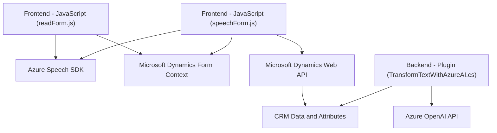

### Resumen técnico:
Este repositorio tiene múltiples archivos que, en conjunto, forman una solución integrada para Microsoft Dynamics CRM. Principalmente se encargan de:
- Capturar datos de formularios visibles en la interfaz (frontend) y sintetizarlos como audio (readForm.js).
- Manejar entradas de voz de usuarios para actualizaciones en un formulario, utilizando reconocimiento y procesamiento de lenguaje natural (speechForm.js).
- Desarrollar un plugin para Dynamics CRM que procesa datos vía la Azure OpenAI API y transforma texto en un formato JSON estructurado (TransformTextWithAzureAI.cs).

---

### Descripción de arquitectura:
La solución utiliza una arquitectura híbrida entre **n capas** y **orientación a servicios externos**:
1. **Frontend**: Scripts JavaScript (readForm.js y speechForm.js) que interactúan con el usuario y capturan/transcriben datos mediante Azure Speech SDK.
2. **Backend CRM**: Plugins programados que integran Dynamics CRM con Azure OpenAI API para realizar procesamientos avanzados.
3. **Servicios externos**: Se conectan con plataformas externas, como Azure Speech SDK para síntesis/reconocimiento de voz y Azure OpenAI API para transformación de texto.

Aunque no es totalmente orientada a microservicios, la solución se beneficia de servicios externos de Azure.

---

### Tecnologías utilizadas:
1. **Frontend (JavaScript):**
   - **Azure Speech SDK**: Para síntesis de voz y reconocimiento de entrada de voz.
   - **Microsoft Dynamics Interface (Xrm API)**: Para manipulación de formularios.
2. **Backend (C# Plugin):**
   - **Microsoft Dynamics CRM SDK**: Integración directa con el entorno CRM.
   - **Azure OpenAI API**: Procesamiento de entrada de texto con GPT-4.
   - **System.Net.Http** y **System.Text.Json**: Comunicación HTTP y manipulación de JSON en el plugin.

---

### Dependencias externas potenciales:
1. **Azure Speech SDK** (JavaScript): Se carga dinámicamente desde la URL:
   - https://aka.ms/csspeech/jsbrowserpackageraw.
2. **Azure OpenAI API** (C# Plugin): Para procesamiento avanzado de texto.
3. **Microsoft Dynamics CRM Web API**: Integración de formularios en el frontend y plugins en el backend.
4. **Otros posibles servicios/sistemas**:
   - Conexión a bases de datos para búsquedas en CRM desde la lógica de plugins.
   - APIs personalizadas en la infraestructura de Dynamics CRM.

---

### Diagrama Mermaid **(GitHub-compatible)**:

---

### Conclusión final:
1. **Solución tipo:** Una integración de frontend y backend que utiliza servicios en la nube (Azure Speech SDK y OpenAI API) para mejorar la experiencia del usuario mediante voz y procesamiento avanzado.
2. **Arquitectura:** Híbrida (n capas con servicios externos). Incluye un frontend que se comunica con Microsoft Dynamics CRM, integraciones con Azure en tiempo de ejecución y procesamiento plugin-based en el backend.
3. **Consideraciones adicionales:** 
   - El uso de APIs externas como Azure Speech y OpenAI requiere una implementación robusta de gestión de errores y supervisión de costos.
   - La arquitectura es escalable tanto en el frontend como en el backend, gracias a la modularización de componentes y funciones.