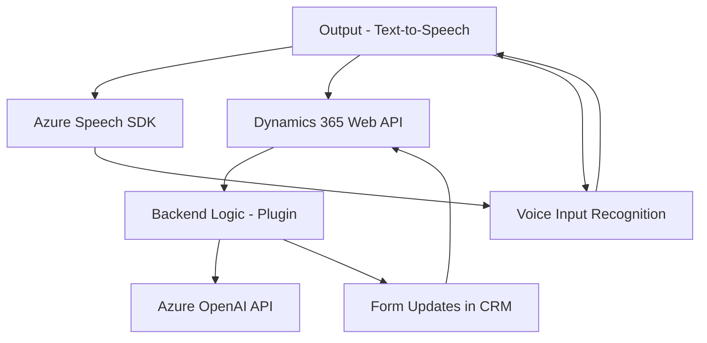

### Breve resumen técnico

El repositorio contiene archivos diseñados para interactuar con **Microsoft Dynamics 365**, por lo que forman parte de una solución empresarial. Los archivos se dividen en tres áreas clave:

1. **Frontend (JS)**: Implementa funcionalidades para interacción del usuario con formularios usando el SDK de Azure Speech (entrada de voz y síntesis de texto).
2. **Frontend/Form Integration**: Configura y actualiza campos de formularios en Dynamics 365 según los datos generados por voz o IA.
3. **Backend Plugin**: Extiende la funcionalidad de Dynamics mediante un plug-in que transforma datos usando Azure OpenAI.

---

### Descripción de arquitectura

La solución se basa en una arquitectura **n-capas**:
1. **Frontend (UI Layer)**: Maneja la interacción directa del usuario, implementando funcionalidades de accesibilidad (sintetización de voz y reconocimiento por voz).
2. **Plugin (Business Logic Layer)**: Extiende la lógica personalizada de Dynamics CRM usando Azure AI para procesar texto.
3. **Microsoft Dynamics CRM and Azure Integration**: Servidor backend donde sucede la gestión de datos y eventos de los formularios y plug-ins, interactuando con servicios externos como Azure.

Entre las capas, los datos se procesan y mapean mediante patrones de integración. Los plug-ins en **Dynamics CRM** actúan como middleware para procesar la lógica con APIs externas (e.g., Azure OpenAI).

---

### Tecnologías utilizadas

1. **Frontend Technologies:**
   - **JavaScript**.
   - **Dynamics CRM Web API** (ej., `executionContext` y `Xrm.WebApi`).
   - **Azure Speech SDK**: Para entrada y síntesis de texto por voz.

2. **Backend Technologies:**
   - **C#** con **Dynamics CRM SDK**.
   - **Azure OpenAI API** para procesamiento de lenguaje natural.
   - Dependencias de .NET: `System.Net.Http`, `Newtonsoft.Json`, y `System.Text.Json`.

3. **Patrones arquitectónicos aplicados:**
   - **Modularización**: Las funcionalidades están divididas en funciones específicas (sólida adherencia al principio de responsabilidad única).
   - **Carga dinámica de SDK**: Permite manejar dependencias externas solo cuando son requeridas (ej., `ensureSpeechSDKLoaded`).
   - **Integración de servicios externos**: Uso explícito de Azure Speech y Azure OpenAI mediante APIs externas.
   - **Extensibilidad del CRM**: Uso de **Plug-ins** para integrar lógica personalizada en eventos del ciclo de vida de registros de Dynamics.

---

### Dependencias externas

El repositorio depende de varios componentes externos:
1. **Azure Speech SDK**: Utilizado tanto para síntesis de voz como para entrada de voz.
2. **Azure OpenAI API**: Ejecuta transformaciones y procesamiento avanzado de texto.
3. **Microsoft Dynamics 365 Web API**: Permite interactuar con los datos y lógica del CRM desde el entorno web o de cliente.
4. **.NET Framework**: Manejo de lo necesario para la integración y automatización mediante plug-ins dinámicos en Dynamics CRM.

---

### Diagrama Mermaid compatible con GitHub Markdown

---

### Conclusión final

La solución presentada en este repositorio implementa una integración completa de servicios externos (Azure Speech y OpenAI) con **Microsoft Dynamics 365**. Está diseñada para aumentar la accesibilidad y la automatización en los procesos empresariales. La arquitectura empleada es **n-capas** con una fuerte separación de responsabilidades entre interacción con el usuario, integración lógica en el negocio, y servicios externos. Esto hace que sea escalable y fácilmente extensible a nuevas funcionalidades.

Algunos puntos destacados son:
- Uso de APIs de Azure para cumplir diferentes propósitos: síntesis de voz y procesamiento de lenguaje natural.
- Modularidad en los scripts JS, asegurando un diseño flexible que puede adaptarse a múltiples formularios y configuraciones.
- Extensibilidad del CRM mediante un plug-in que encapsula lógica avanzada de negocio.

Para incrementar la eficiencia, el diseño futuro puede incluir una arquitectura más compleja como hexagonal o basada en eventos, permitiendo una mayor separación entre sistemas internos y externos.