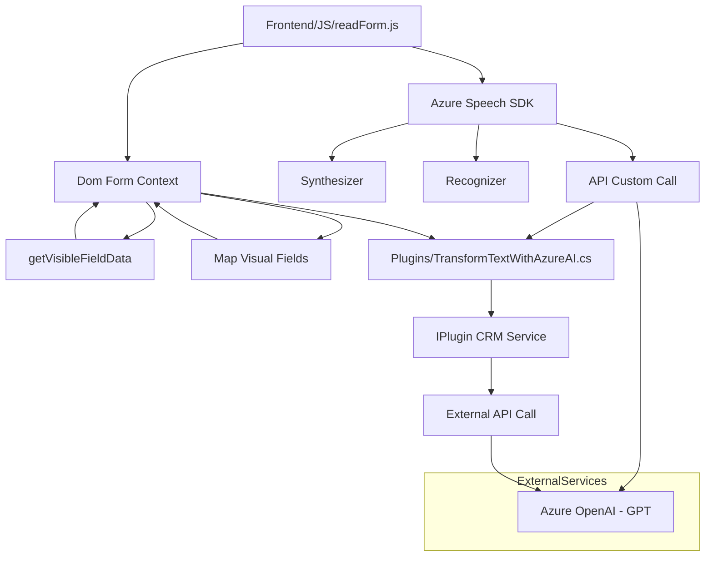

### Breve resumen técnico
Este repositorio parece ser una solución para **CRM dinámico**, que incluye integración entre un frontend basado en reconocimiento y síntesis de voz, APIs personalizadas, y un plugin que utiliza **Azure OpenAI** para transformación avanzada de textos. Utiliza un **SDK de Azure** y servicios de inteligencia artificial para enriquecer un flujo de trabajo relacionado con formularios dinámicos.

---

### Descripción de arquitectura
La arquitectura combina distintos enfoques:
1. **Frontend para interacción vocal y visual** basado en JavaScript, que interactúa con datos en formularios, proporciona síntesis de voz y transcripciones mediante el **Azure Speech SDK**.
2. **Backend mediante Plugins en Dynamics CRM** que aprovechan eventos del sistema y los servicios de Microsoft CRM para lógica integral de transformación.
3. **Integración con servicios externos (Azure/OpenAI)** y APIs personalizadas para extender funcionalidad de reconocimiento de voz y procesamiento de datos.
4. **Arquitectura N capas**: Dividida entre presentación (frontend), lógica intermedia (SDK y plugins), y procesamiento backend con APIs y servicios.

---

### Tecnologías usadas
1. **Frontend**:
   - **JavaScript** para manejo de síntesis y reconocimiento de voz.
   - **Azure Speech SDK** para texto a voz y reconocimiento de voz.
2. **Backend Plugins**:
   - .NET y C# para lógica Dynamics CRM Plugin.
   - APIs externas mediante `HttpClient` con **Azure OpenAI GPT-4** para transformación de datos.
3. **CRM Microsoft Dynamics**:
   - Utiliza interfaces como `IPluginExecutionContext` y funcionalidades como `Xrm.WebApi.online` para procesamiento de registros y atributos en formularios.
4. **Patrones de diseño**:
   - **Callback/event-driven** para carga dinámica de SDK (frontend).
   - **Plugin-based** en Microsoft Dynamics CRM.
   - **Service Factory** y **SDK Integration** en el backend.

---

### Diagrama Mermaid (válido para GitHub Markdown)

---

### Conclusión final
Este repositorio apunta a una **solución para sistemas CRM**, con interacción avanzada mediante reconocimiento y síntesis de voz integrada a una estructura de formularios dinámicos. Además, utiliza Azure OpenAI para generar y procesar datos de manera inteligente en el backend. La arquitectura es moderna, basada en patrones como desarrollo modular, callbacks/event-driven, y plugin-based para el backend.

Se utilizan componentes externos como:
- **Azure Speech SDK** para reconocimiento y síntesis de voz.
- **Azure OpenAI GPT API** para procesamiento de texto.
- **APIs personalizadas y Microsoft Dynamics CRM** para extender puntos de interacción comerciales.

Es una implementación robusta para entornos empresariales que dependen de formularios dinámicos, procesamiento de voz y sistemas de inteligencia artificial.