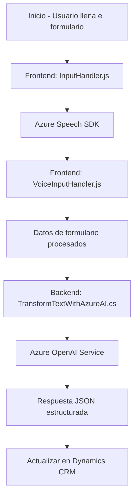

## Breve resumen técnico

El repositorio parece centrado en procesar datos derivados de la interacción usuario-formulario, utilizando servicios de inteligencia artificial con herramientas como el **Azure Speech SDK** y **Azure OpenAI**. Su arquitectura busca integrar tecnologías avanzadas de procesamiento de voz y transformación de texto con sistemas CRM como Dynamics CRM, con orientación hacia accesibilidad y automatización.

---

## Descripción de arquitectura

La solución tiene una arquitectura distribuida con dos componentes principales:
1. **Frontend**: Scripts en JavaScript enfocadas en el procesamiento de entrada y salida de voz. Utiliza el **Azure Speech SDK** para manejar la interacción del usuario con datos en formularios.
2. **Backend/Plugins**: Código C# basado en patrones de **Plugin para Dynamics CRM**, que se conecta al servicio **Azure OpenAI** para transformar texto y datos en estructuras JSON utilizadas por el sistema.

Cada componente encapsula sus funciones específicas conectándose a servicios API externos (**Azure Speech SDK**, **Azure OpenAI**) y sistemas internos (Dynamics CRM vía **Xrm.WebApi.online**).

---

## Tecnologías usadas

1. **Frontend**:
   - **Azure Speech SDK** (JavaScript): Procesamiento de entrada de voz y síntesis en tiempo real.
   - **Dynamics CRM Frontend APIs** (JavaScript): Interacción con formularios contextualizados de Dynamics CRM.
   - **DOM Manipulation**: Para administración y vinculación dinámica de campos en los formularios.

2. **Backend/Plugins**:
   - **Dynamics CRM SDK**: Framework para implementar lógica personalizada como plugins.
   - **Azure OpenAI API**: Servicio de Inteligencia Artificial para transformación de texto en estructuras aplicables.
   - **JSON Libraries**:
     - `System.Text.Json` (C#): Para serialización y deserialización de datos JSON.
     - `Newtonsoft.Json.Linq`: Para manipulación avanzada de estructuras JSON.
   - **HTTP Libraries**:
     - `System.Net.Http` (C#): Manejo de comunicaciones HTTP hacia APIs externas.

---

## Diagrama Mermaid válido para GitHub

---

## Conclusión final

Esta solución se clasifica como una aplicación de **integración avanzada entre AI y CRM**, diseñada para mejorar interactividad y automatización en la entrada y gestión de datos de usuarios. Su arquitectura se asemeja a un modelo **n capas**, con una clara división funcional de los componentes frontend y backend. Los principales beneficios incluyen alta escalabilidad, capacidad de incorporar servicios AI avanzados, y mejor accesibilidad gracias al uso de entrada y salida de voz.

Se identifican como áreas críticas a considerar:
1. Seguridad: La clave API de Azure OpenAI mencionada debería ser gestionada mediante configuraciones seguras o servicios dedicados.
2. Modificaciones futuras: Propósito de extensibilidad clara, permitiendo integrar otras APIs externas o servicios AI.

Propuesta central: La estructura es robusta y modular, pero optimizar dependencias externas y almacenar configuraciones sensibles de forma segura es fundamental.