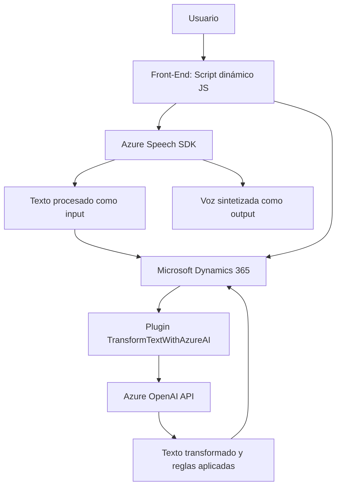

# Análisis técnico del repositorio

## Breve resumen técnico
Este análisis cubre tres componentes principales de un repositorio que implementa soluciones basadas en Microsoft Dynamics 365 y Azure Speech SDK. La solución facilita la integración de voz y procesamiento de texto mediante inteligencia artificial, permitiendo interacción avanzada en formularios dinámicos y operaciones programáticas asociadas.

## 1. Tipo de solución
La solución está estructurada como un **sistema híbrido** compuesto por los siguientes elementos:
- **Front-End:** Scripts en JavaScript que configuran la interfaz para manejo de voz y texto dinámicamente en formularios (ejemplo: `readForm.js`, `speechForm.js`).
- **Plugin Back-End:** Un componente de servidor basado en Dynamics CRM (`TransformTextWithAzureAI.cs`) que integra capacidades de procesamiento de texto con Azure OpenAI.

En conjunto, este repositorio se comporta como un **sistema de extensión para Microsoft Dynamics 365**:
- Adecuado para mejorar la experiencia del usuario en formularios web.
- Potenciado por APIs de terceros como Azure AI y Speech SDK.

---

## 2. Tecnologías, frameworks y patrones usados
### Tecnologías y frameworks
1. **Front-End:**
   - **JavaScript:** Principal lenguaje para manipulación de formularios y lógica previa al envío de datos a servicios externos.
   - **Azure Speech SDK:** Manejo de entrada/salida mediante reconocimiento de voz y síntesis text-to-speech.

2. **Back-End:**
   - **Microsoft Dynamics CRM SDK:** Framework para creación de plugins que interactúan con entidades de Dynamics 365.
   - **Azure OpenAI API:** Procesamiento avanzado de texto (transformación y generación según prompt, mediante lenguaje natural).
   - **HTTP Client:** Manejo de peticiones HTTP hacia APIs externas.
   - **JSON Libraries (Newtonsoft y System.Text.Json):** Serialización y transformación de datos.

### Principales patrones detectados
1. **Arquitectura modular:** Cada script o clase tiene asignada una única responsabilidad, como extracción de datos, síntesis de voz o transformación de texto.
2. **Integración servicios externos:** Uso de APIs de Microsoft y Azure en múltiples puntos dentro de la solución, manteniendo un desacoplamiento lógico entre componentes locales y externos.
3. **Event-driven programming:** Funciones que manejan flujos dependientes de contextos ejecutados sobre eventos específicos (por ejemplo, inicio de grabación de voz).
4. **Plugin-based design:** Extensión del comportamiento de Dynamics CRM mediante plugins construidos con la interfaz `IPlugin`.

---

## 3. Tipo de arquitectura
La solución sigue una arquitectura **n-capas** con una fuerte separación de responsabilidades:
1. **Capa de presentación:**
   - Scripts en JavaScript que interactúan con el frontend de Microsoft Dynamics y manipulan datos locales de formularios.
2. **Capa lógica de aplicación:**
   - Plugins diseñados para transformar datos textuales y manejar lógica especial, utilizando servicios de Azure.
3. **Capa de integración externa:**
   - Explícito uso de APIs externas como Azure Speech y OpenAI para tareas de reconocimiento y procesamiento avanzado.

Esta arquitectura se complementa con un patrón de **integración híbrida**, que combina características monolíticas (Plugins) y servicios desacoplados en el frontend.

---

## 4. Dependencias o componentes externos
### Identificadas
1. **Azure Speech SDK:**
   - Procesamiento de entrada de voz y síntesis text-to-speech.
   - URL del SDK: `https://aka.ms/csspeech/jsbrowserpackageraw`

2. **Azure OpenAI:**
   - Transformación avanzada de texto natural según prompts definidos.

3. **Microsoft Dynamics 365 API:**
   - Contexto de ejecución, entidades CRM, manipulaciones de campos y operaciones específicas del formulario (comandos de `Xrm.WebApi`).

4. **Librerías auxiliares JS y C#:**
   - JSON serialization (Newtonsoft, System.Text.Json).
   - HTTP Clients para solicitudes de API externa.

---

## 5. Diagrama **Mermaid** (100% compatible con GitHub Markdown)

---

## Conclusión final
Este repositorio implementa una solución centrada en mejorar la experiencia de usuario en Microsoft Dynamics 365 mediante tecnologías modernas como Azure Speech SDK y OpenAI. La arquitectura es adecuada para entornos empresariales donde la integración entre voz, inteligencia artificial y CRM es crítica. A pesar de su solidez, sería ideal mejorar la implementación de manejo de errores en casos de fallos de conexión a servicios externos, así como una mayor parametrización en los scripts para facilitar su adaptabilidad en producción.