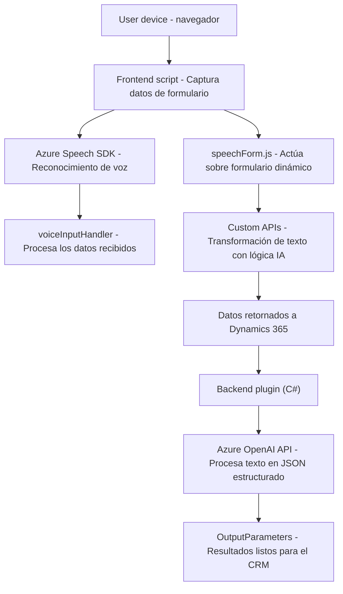

## Breve Resumen Técnico
El repositorio parece ser parte de una aplicación en la nube que utiliza **Dynamics 365** como base para la gestión de datos y servicios empresariales. Se integra con servicios avanzados como **Azure Speech SDK** y **Azure OpenAI** para añadir capacidades como reconocimiento de voz, síntesis de voz, y procesamiento de texto con IA. La solución está estructurada en capas, donde cada archivo implementa funciones específicas. Está diseñada para funcionar como una extensión relacionada con formularios dinámicos en el entorno de Dynamics 365.

---

### Descripción de la Arquitectura

La solución combina componentes backend (plugin en .NET) y frontend (JavaScript), lo que sugiere una separación funcional de la arquitectura, posiblemente adherida al patrón **n-capas**. Sin embargo, debido a la dependencia en Dynamics CRM como una plataforma, se utiliza una arquitectura **extendida basada en servicios**, donde el servidor central de Dynamics actúa como núcleo de la lógica de negocio, ampliado por plugins y scripts personalizados.

1. **Frontend (JS)**: Gestiona la interacción directa con el usuario, capturando datos mediante voz, procesándolos, y actualizando formularios en el cliente. Depende de servicios de backend como APIs de AI y de Dynamics. Usa patrones de procesamiento modular y dinámico.
   
2. **Backend (Plugin en C#)**: Amplía la funcionalidad de Dynamics 365 con un plugin que consume el servicio Azure OpenAI para transformar texto en estructuras JSON. Utiliza un patrón basado en eventos, como es común en plugins de Dynamics.

3. **Servicios externos**:
   - **Azure Speech SDK** para el reconocimiento y síntesis de voz.
   - **Azure OpenAI API** para procesar y transformar texto.
   - **Custom APIs en Dynamics 365** para integrarse con lógica avanzada de negocio.

---

### Tecnologías Utilizadas
1. **Frontend**:
   - JavaScript para la elaboración de scripts que interactúan con formularios de Dynamics CRM.
   - Azure Speech SDK para integración con servicios de voz.
   - Técnica de mapeo dinámico de datos a través de `executionContext`.

2. **Backend**:
   - C# (.NET Framework) para el desarrollo del plugin.
   - Microsoft Dynamics CRM SDK (`Microsoft.Xrm.Sdk`) para ampliar su funcionalidad.
   - Azure OpenAI como servicio externo para realizar transformaciones de texto.
   - Manipulación de datos JSON mediante `Newtonsoft.Json` y `System.Text.Json`.

---

### Diagrama Mermaid
A continuación se presenta el flujo básico de trabajo y las conexiones esenciales entre los componentes principales utilizados en esta solución:

---

### Conclusión Final
La solución presentada:
- **Tipo de solución**: Extensión a una plataforma empresarial (Dynamics 365), con integración de servicios avanzados (reconocimiento de voz y procesamiento de texto).
- **Arquitectura**: Basada en servicios, con patrón **n-capas**. El frontend permite capturar y procesar datos directamente, mientras que el backend amplía las capacidades de Dynamics con lógica personalizada.
- **Uso de tecnologías modernas**: Explotación de servicios Azure como Speech SDK y OpenAI.
- **Seguridad**: Aunque funcional, el diseño actual tiene riesgos como la inclusión explícita de credenciales. La configuración debería ser externalizada.
- **Escalabilidad**: La dependencia con servicios externos como Azure APIs permite capacidad de escalar, aunque la centralización en Dynamics y sus plugins podría limitar la flexibilidad en soluciones que requieran integración desacoplada con otros sistemas empresariales.

Este diseño es adecuado para aplicaciones empresariales específicas que busquen interacciones avanzadas e inteligentes en sus flujos de trabajo, aunque requiere un enfoque más sólido para garantizar seguridad y escalabilidad.