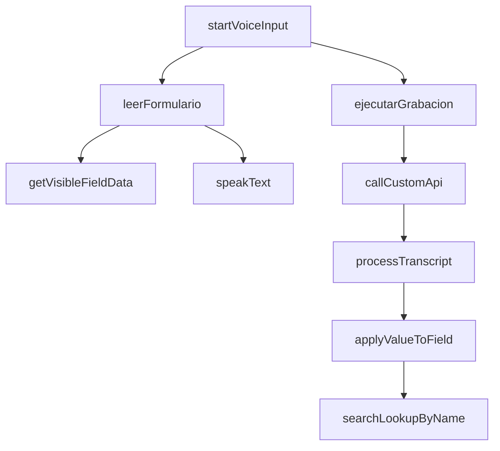
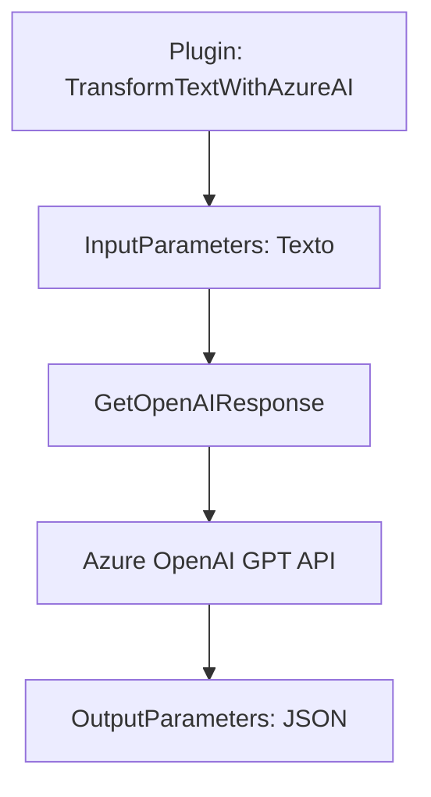

### Breve resumen técnico

El repositorio contiene componentes que integran funcionalidades de interacción vocal y procesamiento de formularios en Microsoft Dynamics CRM mediante Azure Speech SDK y OpenAI GPT API. Se observa una solución híbrida que combina frontend y backend, utilizando integraciones con servicios externos.

---

### Descripción de arquitectura

1. **Tipo de solución**: La solución implementa una arquitectura de integración en Dynamics CRM con un enfoque de **process automation**:
   - **Frontend**: Scripts que interactúan con formularios de Dynamics a través del `executionContext` y actualizan datos en tiempo real mediante interacción por voz.
   - **Backend**: Un plugin (.NET) que transforma texto mediante Azure OpenAI GPT y modifica datos en el CRM.

2. **Patrones de arquitectura**:
   - **API-first**: Integración directa con Azure Speech SDK y servicios OpenAI en Azure para funcionalidades extendidas.
   - **Orientación a eventos**: Dependencia de triggers/contextos dinámicos de Dynamics.
   - **Plugin extensivo**: Extensiones backend reutilizables que acoplan reglas de negocio y servicios externos como Azure GPT.

---

### Tecnologías usadas
1. **Frontend (JavaScript)**:
    - **Azure Speech SDK**: Reconocimiento y síntesis de voz.
    - **Dynamics Web API / Xrm**: Interacción con formularios del CRM.

2. **Backend (.NET)**:
    - **Microsoft Dynamics CRM SDK**: Desarrollo de plugins en C#.
    - **Azure OpenAI Service**: Procesamiento de texto con GPT.
    - **HTTPClient y JSON Libraries**: Manejo de solicitudes a servicios externos.

3. **Patrones utilizados**:
    - Modularización en funciones y clases reutilizables.
    - Gestión de dependencias dinámicas (carga de SDK en tiempo de ejecución).
    - Delegación de lógica compleja hacia servicios externos.
    - Microservicio backend basado en plugins.

---

### Diagramas validos para GitHub Markdown

#### Diagrama Mermaid: Frontend

---

#### Diagrama Mermaid: Backend

---

### Conclusión final

Esta solución representa una arquitectura híbrida de **Frontend-Backend** bien definida y "event-driven" que extiende las capacidades del CRM mediante servicios como **Azure Speech SDK** y **Azure OpenAI API**. Se adoptan patrones que optimizan la experiencia dinámica del usuario (formularios vocales) y el procesamiento de texto (IA). 

Puntos clave:
- Modularización efectiva en el diseño orientado a reutilización y escalabilidad.
- Alta dependencia en servicios externos para funciones críticas.
- Funcionalmente preparada para integrar aplicaciones de automatización basadas en IA y voz.