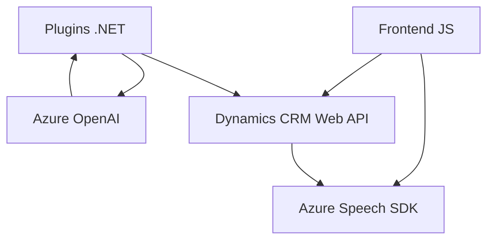

# Análisis técnico

El repositorio reúne varios archivos interconectados que implementan funcionalidades relacionadas con reconocimiento y síntesis de voz, integración con servicios de Azure (Speech SDK y OpenAI), y manipulación de formularios en un contexto de Microsoft Dynamics CRM. La solución abarca tanto el frontend como el backend, junto con una extensión de Dynamics CRM en forma de un plugin.

---

## 1. ¿Qué solución es?

- **Front-end**: `readForm.js` y `speechForm.js` son responsables de la interacción con el usuario mediante reconocimiento de voz, síntesis de texto a voz y manipulación de datos visibles del formulario.
- **Backend/plugin**: `TransformTextWithAzureAI.cs` es una extensión de Dynamics CRM que utiliza Azure OpenAI para procesar cadenas de texto y transformarlas en JSON estructurados.

Por lo tanto, la solución es un sistema híbrido **frontend-backend** orientado a extender y optimizar formularios de Dynamics CRM mediante interacción por voz e IA. Este sistema no es un monolito, ya que distribuye lógica en capas y servicios diferenciados.

---

## 2. Tecnologías, frameworks y patrones:

### Tecnologías utilizadas:
- **Frontend**:
  - JavaScript (vanilla).
  - Azure Speech SDK: API para reconocimiento y síntesis de voz.
  - Dynamics CRM client-side API (`formContext`, `Xrm.WebApi`).
  - DOM manipulación (para interactuar con el script del SDK y el control del interfaz).

- **Backend/plugin**:
  - Microsoft Dynamics SDK: Desarrollo de plugins (`IPlugin`, `IPluginExecutionContext`).
  - Azure OpenAI (GPT-based API) para procesamiento de texto.
  - System.Net.Http para llamadas HTTP (asíncronas).
  - Newtonsoft.Json o System.Text.Json para serialización/deserialización de JSON en C#.

### Patrones de arquitectura:
- **Modularidad**: Separación funcional en diferentes archivos para reducir el acoplamiento, evidenciado por agrupaciones por función (reconocimiento, síntesis, plugin).
- **Cargador dinámico de recursos**: Uso explícito de la función `ensureSpeechSDKLoaded` para carga del SDK solo cuando es necesario.
- **Encapsulación funcional**: Cada función tiene un propósito claro y específico (e.g., `getVisibleFieldData` extrae atributos visibles del formulario).
- **Event-driven**: Respuesta en tiempo real a eventos del usuario (reconocimiento de voz y síntesis con SDK de Microsoft).
- **Orientación a servicios externos**: Integración directa con APIs externas (Azure Speech SDK, Azure OpenAI y Dynamics CRM).

---

## 3. Arquitectura:

La solución implementa una arquitectura **n-capas** en su forma más básica:

- **Presentación/Frontend**: Implementado mediante los scripts de JavaScript (`readForm.js`, `speechForm.js`), que interactúan con formularios en Dynamics CRM. Maneja la interfaz de voz y deriva la entrada a las capas internas.
- **Business Logic/Plugin**: El archivo `TransformTextWithAzureAI.cs` encapsula lógica de negocio para manipular texto y transformarlo en JSON mediante servicios de Azure.
- **Integración externa/APIs**: Integración con APIs de Azure (Speech SDK y OpenAI) y Dynamics CRM.

La arquitectura también muestra características de **arquitectura hexagonal**, con dependencias externas claramente agrupadas (SDK, APIs) e interfaces (e.g., `IPluginExecutionContext` en el plugin).

---

## 4. Dependencias o componentes externos:

- **Azure Speech SDK**:
  - Reconocimiento y síntesis de voz.
  - Configuración: clave (`azureKey`) y región (`azureRegion`).

- **Azure OpenAI**:
  - Uso del modelo de lenguaje GPT.
  - Requiere endpoint, clave API y versión del API.

- **Microsoft Dynamics CRM Web API**:
  - Interacciones con formularios, atributos y entidades mediante `Xrm`.

- **Backend .NET Framework**:
  - Requiere el SDK de Dynamics CRM y bibliotecas como `System.Net.Http`.

---

## 5. Diagrama Mermaid

El siguiente diagrama muestra la relación básica entre las capas y los principales componentes del sistema:

---

# Conclusión final

Esta solución permite trabajar con formularios dinámicos en Dynamics CRM integrando tecnologías de reconocimiento y síntesis de voz (Azure Speech SDK), junto con procesamiento avanzado de texto mediante IA (Azure OpenAI). La arquitectura modular, con capas orientadas a integración de APIs externas, facilita la comprensión, el mantenimiento y la extensión del sistema. Se recomienda optimizar ciertos aspectos como la gestión de claves y valores para permitir configuraciones más flexibles, además de considerar el manejo asíncrono en el plugin backend para mejorar el rendimiento en sistemas de alto volumen.