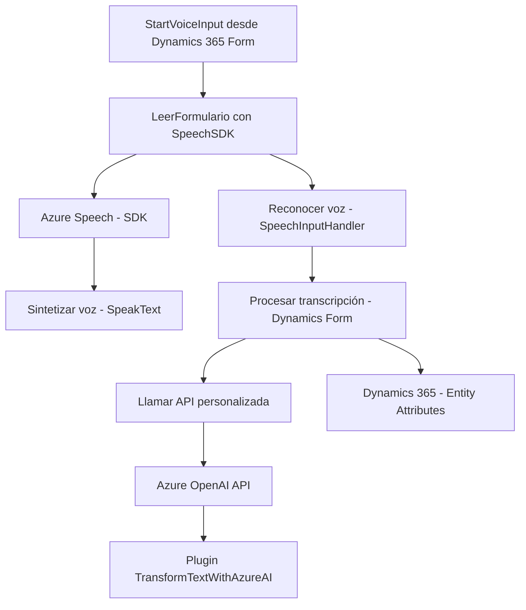

# Breve resumen técnico

El repositorio presenta una **solución híbrida cliente-servidor** que integra servicios de inteligencia artificial y reconocimiento de voz para formularios en Dynamics 365. Utiliza tanto tecnologías de frontend (`JavaScript`) como backend (`C#`) con soporte de servicios externos, como **Azure OpenAI API** y **Azure Speech SDK**. La funcionalidad principal es generar voz desde datos de formularios, procesar entradas de voz y transformar contenido textual mediante inteligencia artificial.

---

# Descripción de arquitectura

## Tipo:
1. **API REST-external**: Usada para interactuar con Azure OpenAI API y Azure Cognitive Services (Speech).
2. **Frontend**: Scripts JavaScript interactúan directamente con los formularios de Dynamics 365.
3. **Plugin de backend para Dynamics CRM**: Implementado en C# bajo la **interfaz IPlugin** de Dynamics 365.

## Arquitectura:
- **Cliente-servidor (n capas):**
  - En el **frontend**, el procesamiento de datos y síntesis de voz se realiza en el cliente del navegador, con acceso dinámico a los scripts de Azure Speech SDK.
  - En el **backend**, un plugin de C# se ejecuta en Dynamics CRM y llama a servicios externos como Azure OpenAI API para delegar tareas críticas.
- **Microservicios ligeros:** El backend hace uso de una API externa (Azure OpenAI), mientras que el frontend interactúa con Azure Speech SDK para reconocimiento y síntesis de voz.

## Componentes relevantes:
1. **Frontend**: Lógica en JavaScript para síntesis de voz, entrada de voz y manejo dinámico del SDK.
2. **Backend**: Plugins en C# para procesamiento avanzado usando APIs.
3. **Azure Speech SDK**: Usado tanto para reconocimiento de voz como para síntesis.
4. **Azure OpenAI API**: Procesamiento y transformación de texto con inteligencia artificial.
5. **Dynamics CRM Web API**: Integración con campos y lógica de entidades dentro de formularios.

---

# Tecnologías usadas

1. **Frontend:**
   - Lenguaje: JavaScript (modular y basado en funciones).
   - SDK: Azure Cognitive Services Speech SDK.
   - Utiliza acceso a DOM para cargar dinámicamente scripts y trabajar con formularios de Dynamics.

2. **Backend:**
   - Lenguaje: C#.
   - Framework: Dynamics 365 SDK.
   - Dependencias: `System.Net.Http`, `System.Text.Json`, `Newtonsoft.Json.Linq`, etc.
   - APIs: Azure OpenAI API, Dynamics CRM Web API.

3. **Patrones**:
   - **Cliente-Servidor:** Procesamiento dividido entre cliente (formulario y reconocimiento de voz) y servidor (transformación avanzada usando plugins y APIs).
   - **SDK Wrapper:** Encapsula interacción con Azure Speech SDK y Dynamics CRM APIs.
   - **Integración de microservicios:** Delegación de tareas al servicio OpenAI y Speech SDK.
   - **Cargador dinámico:** Scripts cargan el SDK de Azure según necesidad.

---

# Diagrama **Mermaid**

---

# Conclusión final

La solución está bien alineada con una arquitectura de **n capas** que despliega funcionalidad tanto en el cliente (formularios y SDK JS) como en el servidor (backend de Dynamics CRM). Aprovecha servicios externos como **Azure Speech SDK** y **OpenAI API** de manera eficiente para complementar las actividades de Dynamics 365. A través de los patrones de integración de servicios y cliente-servidor, el sistema permite una interacción avanzada y dinámica con datos y voz, apuntando a mejorar la experiencia del usuario y la resolución de tareas específicas en un entorno empresarial. Es una solución moderna y extensible que combina **Inteligencia Artificial** y procesamiento de voz.