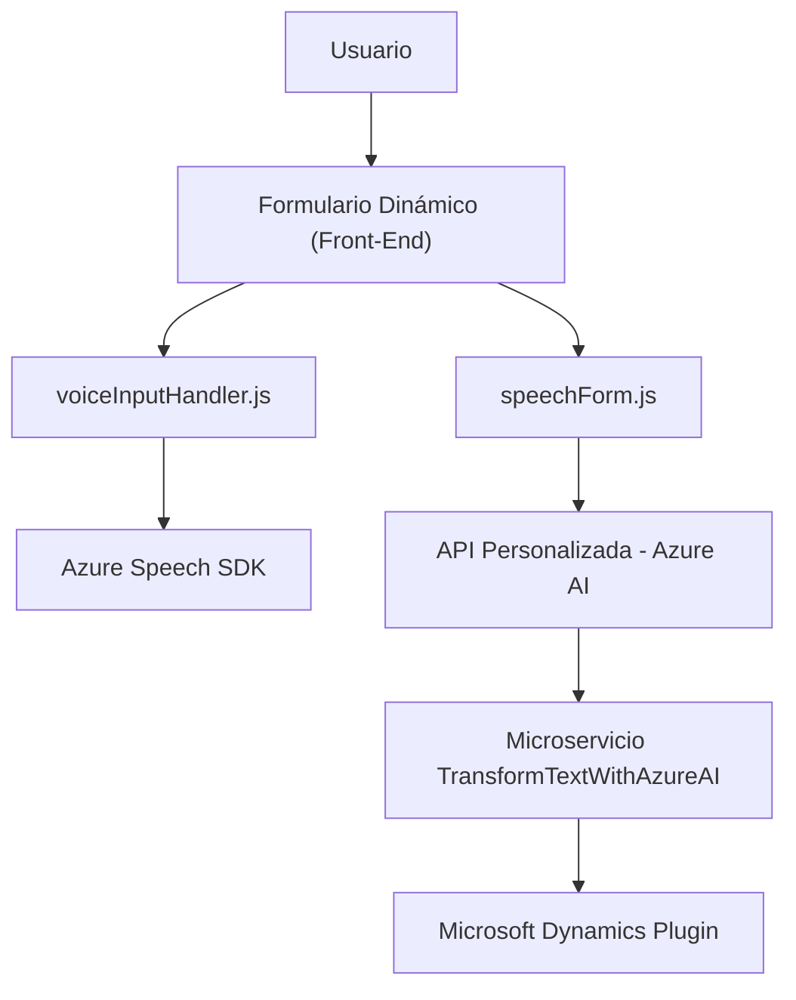

# Breve resumen técnico:
El repositorio incluye archivos destinados al procesamiento de formularios y entrada de voz en el front-end (`readForm.js` y `speechForm.js`), combinados con la integración de procesamiento avanzado basado en Azure OpenAI (`TransformTextWithAzureAI.cs`). El enfoque es proporcionar una solución que pueda capturar datos dinámicos del usuario por voz o texto, transformarlos en información estructurada y aplicarlos a formularios de Microsoft Dynamics CRM.

---

# Descripción de arquitectura:
La arquitectura puede clasificarse como **microservicios acoplados a un front-end dinámico**. Los microservicios son creados en forma de métodos y plugins, interactuando con APIs externas como Azure Speech SDK y Azure OpenAI para la síntesis y reconocimiento de voz y procesamiento de texto. En términos del front-end, se sigue un modelo de arquitectura modular con funciones y no clases, facilitando la ejecución de tareas específicas. En el back-end, se utiliza una estructura de plugins y servicios orientados para extender las capacidades de Microsoft Dynamics CRM, haciendo uso del patrón `IPlugin`.

---

# Tecnologías usadas:
1. **Front-End:**
   - **JavaScript:** Base de toda funcionalidad en el archivo junto con los modules y funciones integradas.
   - **Azure Speech SDK:** Para síntesis de texto a voz y reconocimiento de voz directamente en el navegador.
   - **API personalizada en Azure (para IA y formulación Custom).**

2. **Back-End:**
   - **C# y .NET Framework:** Implementación de plugins mediante la interfaz `IPlugin` en Microsoft Dynamics CRM.
   - **Azure OpenAI (GPT Models):** Proceso avanzado de texto estructurado usando modelos como GPT-4.
   - **Microsoft.Xrm.Sdk:** Para interactuar a nivel programático con CRM.

3. **Dependencias y Herramientas:**
   - `Newtonsoft.Json`: Para el procesamiento de JSON en el plugin.
   - `System.Net.Http`: Para ejecutar solicitudes HTTP.
   - Configuración de API Key y region: Relacionado con Azure Speech/OpenAI.
   - URL dinámico por micro.

---

# Diagrama Mermaid válido:
Este diagrama detalla las interacciones entre los componentes y servicios en el sistema.

---

# Conclusión final:
El sistema está diseñado para facilitar la interacción dinámica entre usuarios y formularios, aprovechando la capacidad de entrada por voz y procesamiento por IA. La combinación de tecnologías como Azure Speech SDK y Azure OpenAI es ideal para construir sistemas inteligentes que transformen datos no estructurados en información útil para la gestión de CRM. Aunque la arquitectura sugiere una estructura de microservicios, el back-end usa un enfoque basado en plugins compatible con Dynamics CRM. Se recomienda renovar la gestión de claves API y parámetros sensibles de manera más segura.