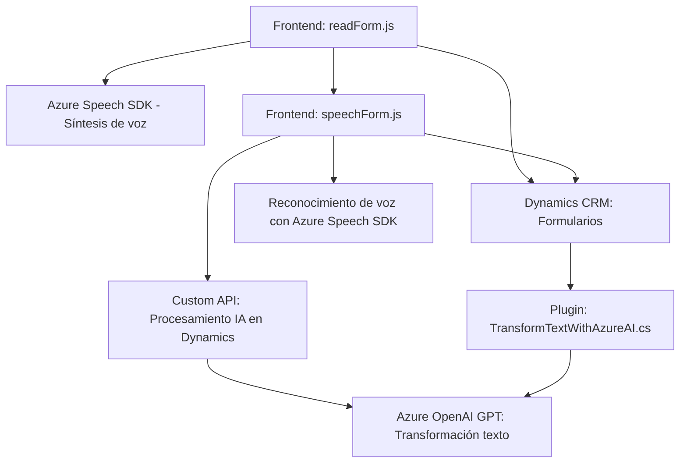

## Breve resumen técnico
El repositorio parece consolidar un sistema que integra las funcionalidades de reconocimiento y síntesis de voz con servicios externos como Azure Speech SDK y Azure OpenAI. Principalmente, el código se orienta en facilitar la interacción mediante voz y transformación de texto en formularios de Microsoft Dynamics CRM.

## Descripción de arquitectura
La arquitectura es híbrida:
1. **N-capas para frontend:** Los archivos `readForm.js` y `speechForm.js` constituyen la capa de cliente interactiva, procesando datos del formulario, realizando llamadas a servicios externos, y modificando los elementos del DOM en Dynamics CRM.
2. **Plugin-based architecture en el backend:** El archivo `TransformTextWithAzureAI.cs` sigue un patrón de arquitectura de plug-ins para Dynamics CRM, actuando como un gateway para interactuar con Azure OpenAI.

Aunque los componentes parecen modulares, estos se unen en torno a una arquitectura monolítica ya que los módulos dependen de dos puntos centrales: Dynamics CRM y las APIs de Azure.

## Tecnologías, frameworks y patrones usados
1. **Frontend:**
   - **Lenguaje:** JavaScript.
   - **SDK:** Azure Speech SDK.
   - **API:** Microsoft Dynamics API.
   - **Patrones:** Modularización, Event-based Programming, Callback y Promesas para asincronía.
   - **Interacción con servicios en la nube:** Llamada a Azure Speech y APIs de Dynamics desde el frontend.

2. **Backend Plugin para Dynamics CRM:**
   - **Lenguaje:** C#.
   - **Framework:** .NET Framework para Dynamics CRM.
   - **Bibliotecas externas:** Microsoft.Xrm.Sdk, Newtonsoft.Json, System.Net.Http.
   - **Servicios externos:** Azure OpenAI API.
   - **Patrones:** Plugin-based Architecture, API Gateway, Input/Output Parameters Handling.

## Dependencias o componentes externos probables
1. **Azure Speech SDK:** Para manejar el reconocimiento y síntesis de voz en el frontend.
2. **Azure OpenAI GPT API:** Usada para transformar texto en el plugin backend.
3. **Microsoft Dynamics API:** Para realizar operaciones en formularios y entidades.
4. **Frontend:** Dependencia implícita de APIs del navegador para manipulación del DOM y grabación de audio.
5. **Backend:** Integración con servicios propios de Dynamics CRM como `IServiceProvider`, `IOrganizationService`, etc.

## Diagrama **Mermaid** (100 % compatible con GitHub Markdown)

## Conclusión final
Este sistema implementa una solución interactiva para formularios basados en Microsoft Dynamics CRM. El frontend aprovecha la síntesis y reconocimiento de voz para facilitar la captura de datos, mientras que el backend utiliza un plugin robusto para transformar texto con inteligencia artificial mediante Azure OpenAI. La arquitectura es funcional, basada en modularización, APIs externas, asincronía, y la integración efectiva de servicios en la nube. Sin embargo, se podría considerar evolucionar hacia una arquitectura más distribuida (como microservicios) para reducir acoplamientos y simplificar la escalabilidad futura.