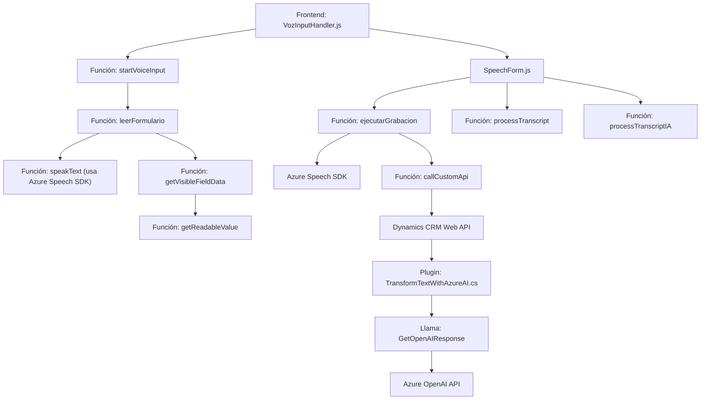

### Breve resumen técnico:
El repositorio presentado incluye dos módulos principales desarrollados en **JavaScript** y un archivo complementario en **C#** utilizado como un **plugin para Dynamics CRM**. Los módulos están enfocados en crear una solución que facilita la interacción con formularios mediante síntesis de voz, captura de transcripciones y procesamientos con inteligencia artificial. También integra servicios externos como **Azure Speech SDK** y **Azure OpenAI API**.

---

### Descripción de arquitectura:
La solución implementa una arquitectura híbrida:
1. **Frontend modular**: Gestiona la interacción y captura de datos mediante voz en un navegador, segmentada en módulos funcionales.
2. **Plugin en Dynamics CRM**: Permite extender funcionalidades del sistema CRM para realizar transformaciones de texto mediante integraciones con **Azure OpenAI API**.

La arquitectura principal se puede definir como **n-capas**:
- **Capa de presentación (JavaScript)**: Interacción directa con el usuario y formularios.
- **Capa de negocio (Dynamics CRM)**: Gestión de solicitudes enviadas al sistema CRM (posteriormente transformadas por el plugin en C#).
- **Capa de servicios externos**: Llamadas a **Azure Speech SDK** y **Azure OpenAI API** para funcionalidad avanzada.

---

### Tecnologías usadas:
1. **Frontend**:
   - **Azure Speech SDK**: Herramienta para síntesis y reconocimiento de voz directamente desde el navegador.
   - **JavaScript**: Lenguaje base para el desarrollo de los módulos frontend.
   - **Dynamics CRM Web API**: Para operaciones CRUD sobre datos del sistema CRM.

2. **Backend/plugin**:
   - **C#**: Lenguaje utilizado para el desarrollo del plugin conectado a Dynamics CRM.
   - **Azure OpenAI API**: Procesamiento de texto avanzado con inteligencia artificial.
   - **Newtonsoft.Json** y **System.Text.Json**: Manejo de respuestas en formato JSON.

3. **Patrones**:
   - **Separación de responsabilidades**: Cada función tiene un objetivo específico (SRP).
   - **Callback/event-driven programming**: Manejo asincrónico en el frontend.
   - **Integración de APIs externas**: Azure Speech SDK y OpenAI API.

---

### Diagrama Mermaid válido para GitHub:

---

### Conclusión final:
Este repositorio representa una solución modular orientada a habilitar experiencias con voz en un entorno Dynamics CRM, integrando capacidades avanzadas de inteligencia artificial mediante Azure Speech SDK y Azure OpenAI API. Su arquitectura en capas favorece una separación clara entre la lógica de presentación, la lógica de negocio y la integración con sistemas externos.

El diseño general sigue principios de modularidad, asincronía y responsabilidad única, lo que facilita mantenibilidad y escalabilidad. Esta solución podría expandirse fácilmente para soportar otros sistemas CRM o integrarse con funcionalidades adicionales tras mejoras como monitoreo en tiempo real y validaciones dinámicas del input del usuario.