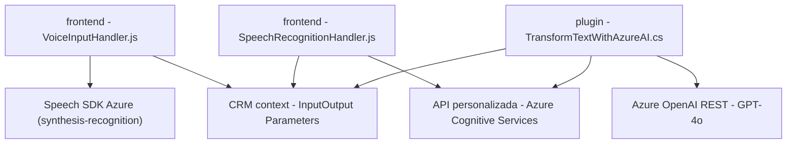

# Análisis Técnico Detallado

### **Breve Resumen Técnico**
Este repositorio representa una solución híbrida orientada a ofrecer servicios de procesamiento de datos para formularios y voz en un entorno Microsoft Dynamics CRM. Se compone de:
1. Un **frontend JavaScript** para la integración con Dynamics CRM, utilizando el SDK de Azure Speech y APIs personalizadas.
2. Un **plugin en C#** diseñado para extender funcionalidades del CRM con procesamiento de texto avanzado mediante Azure OpenAI.

La solución está diseñada para manejar operaciones de conversión de voz y texto en tiempo real y aplicar datos a formularios en un contexto CRM.

---

### **Descripción de la Arquitectura**
La arquitectura del sistema puede ser clasificada como **orientada a servicios**:
- **Microservicios**: Uso de plugins y servicios como componentes aislados que cumplen roles específicos mediante APIs personalizadas y SDKs externos.
- **Capas**:
  - **Presentación**: Código JS que interactúa directamente con Dynamics CRM.
  - **Negocio**: Plugin C# y procesamiento en APIs que estructuran datos según las normas.
  - **Servicios Externos**: SDK de Azure Speech y Azure OpenAI para tareas específicas (reconocimiento de voz, síntesis de texto).

El código parece estar dividido en dos capas principales: frontend (interacción de usuario y sistema CRM) y backend (procesamiento avanzado en plugins y APIs).

---

### **Tecnologías Utilizadas**
- **Frontend**:
  - **JavaScript**: Para integración directa con Dynamics CRM.
  - **Azure Speech SDK**: Para reconocimiento y síntesis de voz.
  - **WebApi Dynamics 365**: Operaciones CRUD en formularios y áreas relacionadas.
- **Backend**:
  - **C#**: Servidores de plugins para CRM.
  - **Azure OpenAI Service**: Procesamiento semántico y generativo avanzado.
- APIs:
  - RESTful API llamada desde el plugin para interactuar con Azure OpenAI.
- **Dependencias externas**:
  - "Newtonsoft.Json.Linq" en el backend para manipulación de JSON.

---

### **Diagrama Mermaid**

---

### **Conclusión Final**
La solución está claramente diseñada para ser una extensión funcional de Microsoft Dynamics CRM, utilizando una combinación de servicios externos como Azure Speech SDK y OpenAI para manejar reconocimiento de voz, síntesis de texto y análisis semántico. Su arquitectura modular y capas separadas la convierte en una implementación flexible y escalable. Sin embargo, queda espacio para mejorar aspectos relacionados con la seguridad y consistencia en el manejo de errores en la interacción con APIs externas.