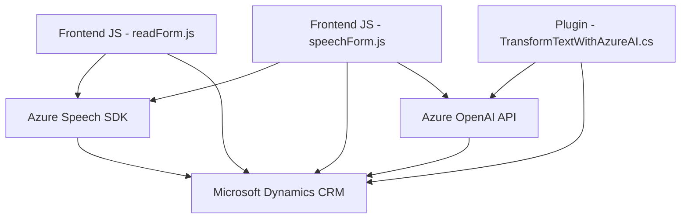

## Resumen técnico

Este repositorio contiene tres archivos que giran en torno a la interacción entre un frontend, Microsoft Dynamics CRM, y servicios de Azure (Speech SDK y OpenAI API). La solución facilita la interacción hombre-máquina mediante síntesis de voz, captura de comandos por voz y transformación de texto utilizando IA. Los archivos implementan funciones para leer y manipular datos de formularios, interactuar con APIs externas, y procesar texto mediante reglas específicas.

---

### Descripción de arquitectura

La solución está estructurada como un sistema modular compuesto por:
1. **Frontend/JS (`readForm.js`, `speechForm.js`)**: Contienen funciones que manejan la interacción del usuario mediante síntesis de voz, reconocimiento de voz y transformación de texto.
2. **Backend (`Plugins/TransformTextWithAzureAI.cs`)**: Plugin de Microsoft Dynamics CRM encargado de procesar texto usando servicios como Azure OpenAI.
3. **Integración con servicios externos**: Uso directo de Azure Speech SDK y OpenAI API para sintetizar, reconocer, y transformar texto.

La arquitectura combina:
- **N-Capas**: Separación entre presentación (mensajes de voz), lógica de negocio (procesamiento de texto/atributos), y datos (Microsoft CRM).
- **Event-Driven**: Uso de eventos y callbacks para manejar la asincronía.
- **Integration Architecture**: Interacción intensiva con APIs externas (Azure Speech SDK y OpenAI).

---

### Tecnologías usadas

1. **Frontend**:
   - Tecnologías: JavaScript, Azure Speech SDK.
   - Patrones: Modularidad, asincronía, delegación, procesamiento de eventos.

2. **Backend**:
   - Lenguaje: C#.
   - Framework: Microsoft Dynamics CRM Plugin Framework.
   - APIs: Azure OpenAI API, Microsoft.Xrm.Sdk.

3. **Servicios Externos**:
   - Azure Speech SDK: Síntesis y reconocimiento de voz.
   - Azure OpenAI API: Procesamiento avanzado de texto.

---

### Diagrama Mermaid

---

### Conclusión final

La solución combina herramientas y servicios avanzados para habilitar una interfaz basada en voz y procesamiento de texto con integración en Dynamics CRM. Sigue patrones de n-capas, modularidad, y delegación de responsabilidades. La dependencia en servicios externos (Azure Speech SDK, OpenAI) implica que la solución es altamente extensible pero dependiente de esos componentes externos. Sin embargo, aspectos como manejo de seguridad (claves API) y modularización detallada podrían mejorarse.