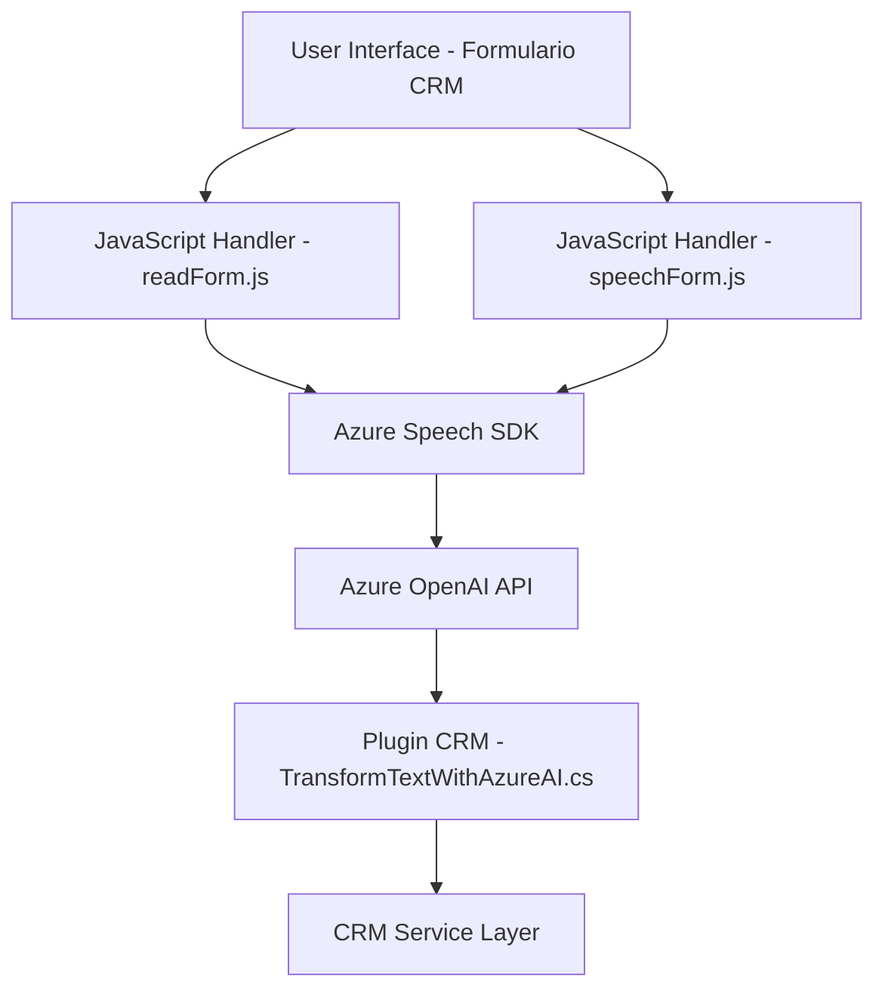

### Breve resumen técnico
El repositorio corresponde a una **solución híbrida** con énfasis en el procesamiento de voz, interacción con un sistema CRM y generación de contenido utilizando servicios de Azure AI. Hay archivos destinados a frontend (interacción con formularios y Azure Speech SDK) y un plugin backend para Dynamics CRM que interactúa con Azure OpenAI.

---

### Descripción de arquitectura:
La solución utiliza una **arquitectura de capas**:

1. **Frontend (capa de presentación):** Scripts diseñados con JavaScript para interacción directa con el usuario mediante formularios, reconocimiento de voz y síntesis de audio. La lógica modular asegura una interacción limpia entre formularios y datos de voz.
   
2. **Backend (lógica empresarial):** Plugin desarrollado en C# bajo el estándar de Dynamics CRM para integración con Azure OpenAI. Este componente maneja el procesamiento del texto estructurado y la interacción con APIs externas.

3. **Servicios externos:** Integración con **Azure Speech SDK** para procesamiento de voz y **Azure OpenAI** APIs para transformación avanzada de texto.

La arquitectura presenta un enfoque modular basado en separación de responsabilidades y adherencia a patrones del servicio. Podría interpretarse como un **modelo n capas** cuando se administra en un solo sistema o expandirse como **edge microservicios** si el frontend y backend se despliegan de forma separada.

---

### Tecnologías usadas:
1. **Frontend:**
   - **JavaScript:** Comunicación dinámica y manipulación de DOM/formularios.
   - **Azure Speech SDK:** Integración para reconocimiento y generación de voz.
   
2. **Backend:**
   - **C#:** Desarrollo del plugin bajo el framework de Dynamics CRM (`IPlugin`).
   - **Azure OpenAI Rest API:** Comunicación para generación y transformación de texto.
   - **Libraries:** `System.Net.Http`, `Newtonsoft.Json`, `System.Text.Json`.

3. **Frameworks:**
   - Dynamics CRM SDK (estructura estándar).

4. **Patrones:**
   - **Delegación Modular:** Separación de funciones en pequeñas responsabilidades.
   - **Plugin Design Pattern:** Extensiones personalizadas.
   - **Event-driven Programming:** Callbacks y respuestas dinámicas.
   - **Service-Oriented Architecture:** Integración con servicios externos (Azure Speech y OpenAI).

---

### Dependencias o componentes externos:
- **Azure Speech SDK:** Manejo de reconocimiento de voz y síntesis.
- **Azure OpenAI API:** Procesamiento avanzado de texto y generación JSON.
- **CRM APIs:** Interfaz estándar de Dynamics CRM (`Xrm.WebApi`).
- **Complementos y servicios básicos:** 
  - Capa HTTP (`System.Net.Http`) para comunicación con Azure OpenAI.
  - Gestión y transformación JSON (`Newtonsoft.Json`, `System.Text.Json`).

---

### Diagrama Mermaid válido para GitHub Markdown

---

### Conclusión final:
La arquitectura del repositorio refleja un enfoque híbrido basado en la integración de servicios externos (Azure Speech y OpenAI) con Dynamics CRM. La combinación de un frontend dinámico en JavaScript y un backend orientado a plugins en C# ofrece una solución flexible y escalable para sistemas comerciales. La modularidad y adherencia a patrones garantizan claridad y mantenimiento eficiente. Sin embargo, sería recomendable revisar la gestión de seguridad (como las claves de API) y permitir configuraciones externalizadas para entornos de producción.