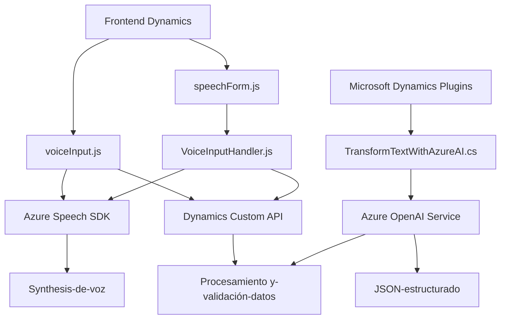

### Análisis Técnico del Repositorio

#### **1. Breve Resumen Técnico**  
El repositorio contiene componentes que integran funcionalidades avanzadas de inteligencia artificial (usando servicios de Azure OpenAI y Speech SDK) con sistemas de manejo de formularios en Dynamics 365 CRM. Incluye scripts para frontend que automatizan la entrada y modificación de datos en formularios, y un plugin para Microsoft Dynamics CRM que transforma texto en JSON estructurado según reglas específicas.

---

#### **2. Descripción de la Arquitectura**
La arquitectura del sistema es una mezcla de las siguientes:

- **Event-driven architecture**: El procesamiento se desencadena mediante eventos en la interfaz del formulario, como el reconocimiento de voz o la manipulación de campos.  
- **SOA (Service-Oriented Architecture)**: Se integran servicios externos como Azure (Speech SDK y OpenAI) para tareas de procesamiento y síntesis de voz.  
- **Modular MVC pattern** (Frontend): Cada archivo organiza su lógica en módulos que interactúan con Dynamics CRM a través de su frontend, asumiendo la función de un controlador entre el flujo de datos y la interfaz del formulario.  
- **Plugin-based Architecture** (Backend): Mediado por plugins extendidos de Dynamics, utiliza un enfoque para ejecutar lógica personalizada como la generación de formularios dinámicos transformados con inteligencia artificial.  

En resumen, la solución tiene características de una arquitectura híbrida con **componentes modulares** y **event-driven gestionados desde el frontend** que interactúan con un **backend orientado a servicios** mediante extensiones de CRM.

---

#### **3. Tecnologías, Frameworks, y Patrones Usados**
**Tecnologías:**
1. **Microsoft Dynamics 365 SDK**: Código relacionado a manejar entidades, campos y formularios.  
2. **Azure Speech SDK**: Usado en los archivos de frontend para síntesis y reconocimiento de voz.  
   - URL del SDK: `https://aka.ms/csspeech/jsbrowserpackageraw`.
3. **Azure OpenAI Service**: Para el procesamiento y transformación de texto en JSON estructurado.
4. **JavaScript (Frontend)** y **C# (.NET Framework)**: Los scripts utilizan JavaScript para manejo del cliente y C# para desarrollo de plugins del backend.

**Frameworks:**  
1. `System.Text.Json`, `Newtonsoft.Json` en C# para serialización y manejo de JSON.  
2. **HTTP API client libraries** (C# y JS): Manejo de solicitudes HTTP (para consumir servicios Azure).

**Patrones:**
1. **Event-driven programming:** Gestiona eventos desencadenados por modificaciones o interacciones en el formulario.
2. **Plugin Design Pattern:** Usa la interfaz `IPlugin` en C# para integrarse con Microsoft Dynamics CRM.
3. **Singleton Pattern:** La función de cargar dinámicamente el SDK asegura una única instancia.
4. **Service-Oriented Architecture (SOA):** Comunica APIs externas (Azure y Dynamics Custom API) para operaciones específicas.

---

#### **4. Dependencias o Componentes Externos Potenciales**
1. **Azure Services:** Speech SDK, OpenAI Integration, y otros recursos configurados como claves API o regiones especificadas.  
2. **Dynamics 365 CRM API:** Manejo de registros, mapeo de campos y actualización dinámica de atributos.  
3. **JavaScript Runtime Environments:** Navegadores en el cliente (con soporte para carga dinámica de SDK).  
4. **Newtonsoft Json + System.Text.Json:** Para serialización/deserialización más eficiente en el backend.  
5. **Custom API de Dynamics:** Los scripts utilizan APIs diseñadas por desarrolladores para transformación de datos.  

---

#### **5. Diagrama Mermaid**

---

#### **6. Conclusión Final**
El repositorio presenta una solución para la validación, transformación y síntesis de datos procedentes de formularios en Dynamics 365 CRM, con soporte para automatización avanzada (reconocimiento de voz y AI integrada).  

- **Beneficios:** Combina tecnologías de IA (como OpenAI), cloud computing con Azure y automatización en CRM para ofrecer una solución moderna e innovadora.  
- **Limitaciones:** La codificación de claves API podría comprometer la seguridad si no se gestionan correctamente. Migrar la configuración API a herramientas de gestión de secretos como Azure Key Vault puede ser una mejora técnica esencial.  
- **Arquitectura en uso:** Se basa en una arquitectura híbrida que combina principios de MVC, SOA, Event-driven programming y Plugin Design Pattern. 

Este repositorio presenta una gran oportunidad para desarrolladores que buscan integrar IA y reconocimiento de voz con soluciones CRM empresariales.