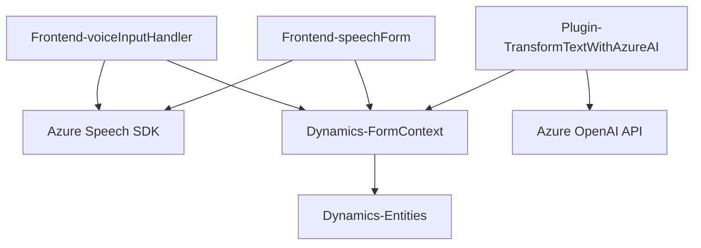

### **Análisis técnico del repositorio**

---

#### **1. Qué tipo de solución es**
El repositorio incluye tres componentes principales:
1. **Frontend**: Implementa la interacción del usuario con formularios, se enfoca en la síntesis y reconocimiento de voz utilizando Azure Speech SDK.
2. **Backend/Plugins**: Extiende la funcionalidad de un sistema Dynamics 365 mediante plugins que realizan tareas específicas con integración a servicios Azure OpenAI.

Este proyecto parece ser una **solución híbrida enfocada en mejorar la accesibilidad y automatización de interacciones en formularios** integrados en una aplicación basada en Dynamics 365 con servicios complementarios de Azure.

---

#### **2. Tecnologías, frameworks y patrones utilizados**
**Tecnologías y frameworks**:
- **Azure Speech SDK**:
  Para síntesis de voz (escritura a audio) y reconocimiento de voz (audio a texto).
- **Azure OpenAI API**:
  Utilizando modelos GPT para procesamiento y transformación de texto.
- **Dynamics 365 SDK**:
  Extensiones específicas para formularios y manipulación de entidades.
- **Newtonsoft.Json** (en el plugin):
  Para manipulación de datos estructurados en JSON.
- **System.Net.Http** (en plugins):
  Para realizar conexiones HTTP a servicios de Azure.
- **Vanilla JavaScript**:
  En archivos frontend para lógica del cliente.

**Patrones utilizados**:
1. **Event-Driven Architecture** (frontend):
   Basado en eventos de carga de SDK y reconocimiento de voz.
2. **Plugin Pattern** (backend):
   Implementación de extensiones de Dynamics CRM siguiendo las especificaciones de Microsoft.
3. **Modular**:
   Funciones y clases bien encapsuladas para mejorar la habilidad de mantenimiento y reutilización.
4. **Facade Pattern** (frontend):
   Simplifica la integración con Azure Speech SDK mediante métodos centralizados como `ensureSpeechSDKLoaded`.
5. **Provider Pattern** (backend plugins):
   Uso de `IServiceProvider` para acceder a recursos relacionados con Dynamics CRM.

---

#### **3. Tipo de arquitectura**
La arquitectura parece ser una **arquitectura n-capas**:
1. **Presentación (frontend/JS)**:
   Interacción con el usuario mediante formularios y voz.
2. **Lógica de negocio (Backend/Plugins)**:
   Manipulación de datos, invocación de servicios remotos e integración con reglas definidas en el plugin.
3. **Servicios externos (Azure)**:
   Integración con el API de Azure Speech SDK y Azure OpenAI para inteligencia artificial y síntesis/reconocimiento de voz.

---

#### **4. Dependencias o componentes externos**
1. **Azure Speech SDK**:
   Utilizado por los componentes frontend para síntesis y reconocimiento de voz.
2. **Azure OpenAI API (GPT-4)**:
   Utilizado por los plugins backend para análisis y transformación de texto.
3. **Dynamics 365 API**:
   Para recuperación y manipulación de datos en formularios y entidades CRM.
4. **Librerías estándar de JavaScript y C#**:
   - Newtonsoft.Json.
   - System.Net.Http.
   - System.Text.Json.

---

### **Diagrama Mermaid**

Representa la relación entre los componentes del sistema y su interacción con dependencias externas:

---

### **Conclusión final**
El repositorio es una solución de integración que optimiza interacciones accesibles y automatizadas en sistemas Dynamics 365 mediante:
1. Sintetización y reconocimiento de voz (frontend).
2. Manipulación de entrada de texto con IA en una arquitectura n-capas conectada a servicios en la nube como Azure Speech y OpenAI.

La modularidad y uso de patrones como *Event-Driven* y *Facade* aseguran escalabilidad y manejo eficiente de servicios externos. Esta arquitectura está diseñada para fomentar la accesibilidad y la automatización en aplicaciones empresariales de Dynamics.