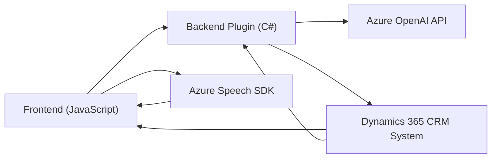

### Breve Resumen Técnico

Este proyecto presenta funciones relacionadas con la **interacción de voz** y **procesamiento de texto estructurado**, integradas en un sistema basado en **Dynamics 365** con soporte de servicios externos como **Azure Speech SDK** y **Azure OpenAI**. Las funcionalidades clave incluyen procesamiento de datos en formularios, síntesis y reconocimiento de voz, así como transformación de texto en estructuras JSON.

---

### Descripción de Arquitectura

La arquitectura sigue un enfoque **modular** y **composable**, utilizando una combinación de manejos locales (en formularios) y servicios externos (Azure Speech y OpenAI) para la entrada, transformación y generación de datos. Es una arquitectura híbrida:

1. **Frontend Modulares:** Con código en JavaScript que interactúa con formularios dinámicos para extracción de datos.
2. **Plugins Backend:** Construidos en .NET, desarrollados para Dynamics CRM y proporcionando extensibilidad mediante APIs y servicios externos.
3. **Integración de Servicios Externos:** Azure Speech para voz y Azure OpenAI para transformación de texto.

Patrones identificados:
- **Integración basada en API:** Los servicios externos como Azure están abstraídos y utilizados como módulos independientes.
- **Event-driven Architecture:** Diseño basado en eventos que requiere la interacción entre cliente y servidor, activada por condiciones específicas.
- **Facade:** Uso de funciones como `applyValueToField` y `getVisibleFieldData` para simplificar la lógica interna de atributos.
- **3 capas:** Aunque el sistema distribuye funciones, se apoya en un modelo básico de capas: presentación (frontend), lógica de negocio (plugins y funciones), y API para acceso a servicios externos.
- **Plugin Architecture en Backend:** Extiende Dynamics CRM mediante plugins que encapsulan responsabilidades específicas.

---

### Tecnologías Usadas

1. **Frontend:**
   - **JavaScript:** Manipulación de DOM, eventos y datos de formularios.
   - **Azure Speech SDK:** Para reconocimiento/síntesis de voz.
   - **AJAX/Http:** Comunicación con servicios externos.

2. **Backend:**
   - **C#:** Desarrollo de plugins para Dynamics CRM.
   - **Microsoft.Xrm.Sdk:** Para integraciones nativas con Dynamics CRM.
   - **Newtonsoft.Json/System.Text.Json:** Serialización para las respuestas JSON de APIs externas.
   - **HttpClient:** Invocación de APIs y control de solicitudes.

3. **Servicios externos:**
   - **Azure OpenAI API:** Conversión de texto en estructuras JSON.
   - **Dynamics Web API:** Manipulación de entidades y datos dentro de la plataforma CRM.

---

### Diagrama Mermaid (compatible con GitHub Markdown)

---

### Conclusión Final

El sistema está diseñado para aprovechar servicios de inteligencia artificial y APIs avanzadas para ofrecer una experiencia más dinámica en la interacción con formularios. Utiliza una arquitectura híbrida de tres capas para aplicar la lógica en el frontend y backend mientras delega tareas computacionales exigentes a servicios externos (Azure Speech/OpenAI). 

El diseño cumple los principios de modularidad al dividir claramente funciones según sus responsabilidades. Sin embargo, la centralización de la lógica alrededor de Dynamics CRM podría limitar su reutilización en otros sistemas, haciendo que el sistema sea altamente específico para ese entorno.