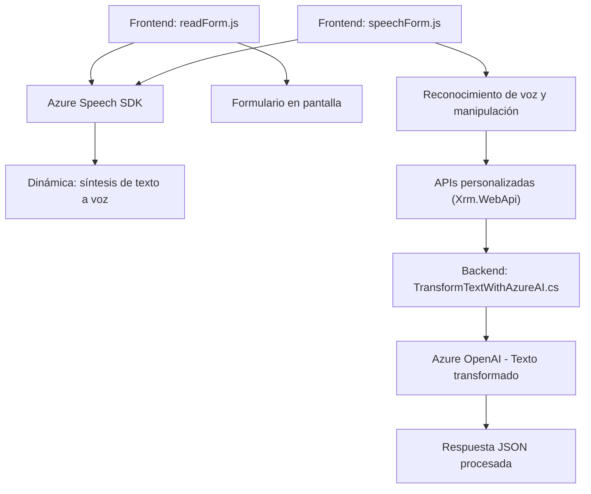

### Resumen técnico de la solución en el repositorio

Este repositorio implementa una solución completa basada en la interacción entre **frontend**, **lógica dinámica para formularios**, y servicios externos como **Azure Speech SDK** y **Azure OpenAI**, dentro de un entorno **Microsoft Dynamics CRM**. La solución está orientada a mejorar las capacidades de voz (entrada y salida) y procesamiento de texto en aplicaciones empresariales.

---

### Descripción de la Arquitectura

La solución está estructurada bajo un esquema **cliente-servidor**, donde el frontend (JavaScript) actúa como interfaz de interacción para el usuario, mientras que el backend (C# para plugins) ejecuta lógica de procesamiento más avanzada mediante integraciones con APIs externas. Las funcionalidades como síntesis de voz, reconocimiento de voz y generación textual son delegadas casi completamente al **Azure Speech SDK** y **Azure OpenAI**, con pequeñas capas de adaptación y manipulación de datos en el código.

La arquitectura principal combina elementos de:
- **Capas N**: Cada módulo del sistema tiene una responsabilidad específica (ej. frontend, procesamiento por plugins, consumo de API).
- **Arquitectura por servicios**: Aunque no es un sistema distribuido de microservicios, se integra con servicios externos como Azure Speech SDK y Azure OpenAI API, lo que hace que la dependencia de estos sea relevante.
- **Modularidad**: El código tiene funciones definidas con responsabilidades específicas, lo que facilita su mantenimiento y escalabilidad.

---

### Tecnologías usadas

1. **Frontend**:
   - **JavaScript**: Para manipulación del DOM, carga dinámica de SDKs y lógica de integración con formularios.
   - Dependencia dinámica: **Azure Speech SDK**.
   
2. **Backend**:
   - **C#**: Para desarrollo de plugins compatibles con Dynamics CRM. Principal librería usada:
     - `Microsoft.Xrm.Sdk`: Para interacción con el CRM.
     - `Newtonsoft.Json.Linq`: Para procesamiento dinámico de datos JSON.
   - Integración externa: **Azure OpenAI API**.

3. **Servicios externos**:
   - **Azure Speech SDK**: Para síntesis de voz y reconocimiento de texto hablado.
   - **Azure OpenAI**: Para transformar texto según normativas específicas.

4. **Entorno y herramientas**:
   - **Dynamics CRM**: Herramienta empresarial donde se integran los plugins y reglas de negocio.
   - **Xrm.WebApi**: Para consumir APIs personalizadas en el contexto CRM.
   - **GitHub**: Alojamiento del código.

5. **Patrones y principios de diseño aplicados**:
   - **Carga dinámica de dependencias**: El SDK se carga solo cuando es necesario.
   - **Desacoplamiento**: Delegación de funciones avanzadas a servicios externos para evitar carga lógica innecesaria en el código interno.
   - **Encapsulación**: Las funciones tienen claras restricciones de acceso (responsabilidad única).
   - **Modularidad**: Separación lógica tanto en frontend como backend (manipulación del DOM, procesamiento textual dinámico).

---

### Diagrama Mermaid válido para GitHub

---

### Conclusión final

El repositorio evidencia una solución robusta orientada al manejo de voz y procesamiento de texto en el contexto de **Dynamics CRM**. Su arquitectura está basada en varias capas (frontend, SDK, APIs personalizadas y plugins backend), lo que le otorga modularidad y escalabilidad. La integración con servicios de **Azure Speech SDK** y **Azure OpenAI** extiende significativamente las capacidades originales del sistema CRM al ofrecer entrada y salida de voz, así como transformación inteligente de texto.

Este diseño resulta óptimo para aplicaciones empresariales que requieren interacción de voz y procesamiento de datos en tiempo real. Sin embargo, la dependencia fuerte en servicios externos podría requerir monitoreo constante de costos (Azure) y gestión de claves de acceso seguro.