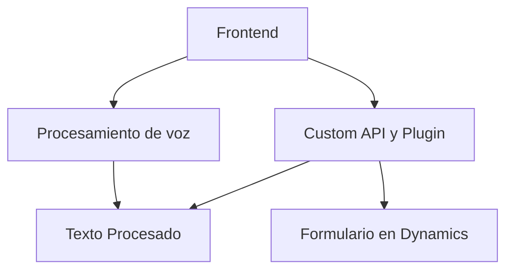

### Resumen Técnico del Análisis

Este repositorio tiene archivos orientados a crear una solución que combina el procesamiento de voz y texto, integrando servicios externos como **Azure Speech SDK**, **Azure OpenAI**, y **Dynamics 365**. Los módulos analizados indican una arquitectura basada en la interacción entre frontend y backend, mediante comunicación entre APIs y servicios que procesan datos.

---

### 1. Descripción de la Solución
Esta solución se puede clasificar como una **aplicación híbrida** que utiliza:
- **Frontend**: Principalmente interactúa con formularios en Dynamics 365 para capturar y procesar la voz (entrada) y generar síntesis de voz (salida).
- **Backend**: Se apoya en un plugin de Dynamics CRM para realizar procesamiento avanzado con Azure OpenAI y manipular objetos JSON basados en reglas predeterminadas.

### 2. Tecnologías, Frameworks y Patrones Utilizados
#### **Frontend (JavaScript):**
- **Azure Speech SDK**: Procesamiento de voz (reconocimiento y síntesis).
- **Dynamics 365 SDK**: Para manipular formularios y realizar operaciones CRUD sobre la plataforma.
- **Custom API**: Interacción con APIs personalizadas que emplean IA para transformar texto.

#### **Backend (C#):**
- **Dynamics CRM Plugins Framework**: Integración con eventos específicos de CRM para ejecutar lógica personalizada.
- **Azure OpenAI**: Proporciona procesamiento de lenguaje natural y generación de contenido.
- **.NET Libraries**: `HttpClient` y `Json` para consumir servicios REST y manejar objetos JSON.

#### **Patrones de Arquitectura:**
1. **Arquitectura Modular**: Cada archivo contiene funciones bien estructuradas con responsabilidades específicas.
2. **Integración con servicios externos**: Los servicios de Azure se integran para el reconocimiento de voz y el procesamiento de texto avanzado.
3. **Cliente-Servidor**: Frontend solicita transcripciones de voz y resultados procesados al plugin en el backend.
4. **Plugin-Event-Driven**: Backend registrable para eventos específicos (/TransformTextWithAzureAI.cs).

---

### 3. Tipo de Arquitectura
- **Integración entre capas cliente-servidor**:
  - ***Frontend***: Procesamiento de voz y dinámica del formulario.
  - ***Backend***: Plugin implementado sobre Dynamics CRM para procesar los datos y realizar transformaciones mediante Azure OpenAI.
- En términos de organización interna:
  - La capa frontend podría clasificarse como una arquitectura **cliente MVC** (funciones independientes forman el controlador).
  - El plugin tiene lógica encapsulada siguiendo el modelo **event-driven**.

---

### 4. Dependencias o Componentes Externos
1. **Microsoft Azure Speech SDK**:
   - Carga dinámica desde JavaScript (`https://aka.ms/csspeech/jsbrowserpackageraw`).
   - Clave y región requeridas.
2. **Azure OpenAI GPT Integration**:
   - Configuración mediante endpoint personalizado en la región de Azure.
3. **Dynamics 365 SDK**:
   - Función crucial en la creación y manipulación de formularios.

---

### 5. Diagrama Mermaid (GitHub Compatible)

---

### Conclusión Final

Este repositorio implementa una solución que combina **procesamiento de voz** y **adaptación dinámica en CRM mediante IA** utilizando servicios de Azure Speech SDK y OpenAI. La arquitectura empleada maximiza la modularidad y la capacidad de integración, haciendo uso de patrones orientados a servicios. Aunque la solución es escalable, aspectos como los valores de transformación "hard-codeados" en el backend ofrecen un área para mejora futura (e.g., parametrización o configuración externa).