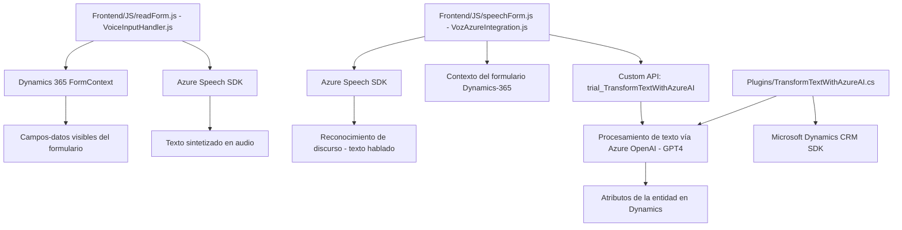

### Breve resumen técnico:
Este repositorio parece estar diseñado como parte de una solución integrada en Microsoft Dynamics CRM, con funcionalidades relacionadas con la entrada y salida de datos en formularios, mediante la síntesis de voz, el reconocimiento de voz y la transformación de texto en JSON usando inteligencia artificial. Las tecnologías principales son Azure Speech SDK para voz y Azure OpenAI para procesamiento avanzado de lenguaje natural.

---

### Descripción de arquitectura:
La arquitectura se divide en tres niveles principales: 
1. **Frontend** (JavaScript en Dynamics 365): Maneja las funcionalidades de entrada y salida de voz desde los formularios interactivos de Dynamics.
2. **Backend con plugins** (C# en Dynamics CRM): Extiende la funcionalidad mediante el diseño de un plugin que gestiona eventos en Dynamics CRM y delega el procesamiento de texto a Azure OpenAI.
3. **Integración de servicios externos**: Azure Speech SDK se integra en el frontend para la síntesis y reconocimiento de voz, mientras que el plugin se conecta a Azure OpenAI API para procesar datos complejos.

La arquitectura tiene características de "Domain-Driven Design" porque se centra en las entidades y contextos propios de Dynamics 365, además de usar extensiones específicas como `IPlugin`. También se aprecia el uso de patrones como la modularidad, separación de responsabilidades y el plugin pattern típico de Microsoft Dynamics CRM.

---

### Tecnologías usadas:
1. **Frontend (JavaScript)**:
   - **Azure Speech SDK**: Para reconocimiento de voz y síntesis de audio.
   - **Dynamics CRM client API**: Para manipulación de formularios, atributos y campos.
  
2. **Backend (C#)**:
   - **Microsoft Dynamics CRM SDK**: Desarrollo de plugins mediante interfaces como `IPlugin` y otras relacionadas.
   - **Azure OpenAI API (GPT-4)**: Procesamiento del lenguaje natural a través de POST requests.
   - **Newtonsoft.Json**: Manejo avanzado de JSON con la API OpenAI.

3. **Integración y servicios externos**:
   - **Custom API en Dynamics CRM**: Integración con servicios internos y externos.
   - **HTTP Client**: Para comunicación con servicios remotos.

---

### Diagrama **Mermaid** válido para **GitHub**:

---

### Conclusión final:
Esta solución es un **integrador de servicios SaaS** para Dynamics 365, diseñado para mejorar la usabilidad de formularios mediante entrada de voz y generación de texto procesado con inteligencia artificial. La combinación de una arquitectura **modular** y el uso de **SDK externos** (Azure Speech, Azure OpenAI API, Dynamics Web API) permite una integración sólida y reutilizable en un entorno corporativo.

Para optimización, sería conveniente explorar aspectos como:
1. **Seguridad**: Asegurar que claves API (como `azureKey`) y endpoints no estén expuestos en el frontend.
2. **Desempeño**: Considerar posibles bloqueos en el flujo síncrono al llamar servicios remotos.
3. **Escalabilidad**: Evaluar la capacidad del sistema frente a múltiples usuarios concurrentes que ejecuten estas funcionalidades basadas en eventos y voz.